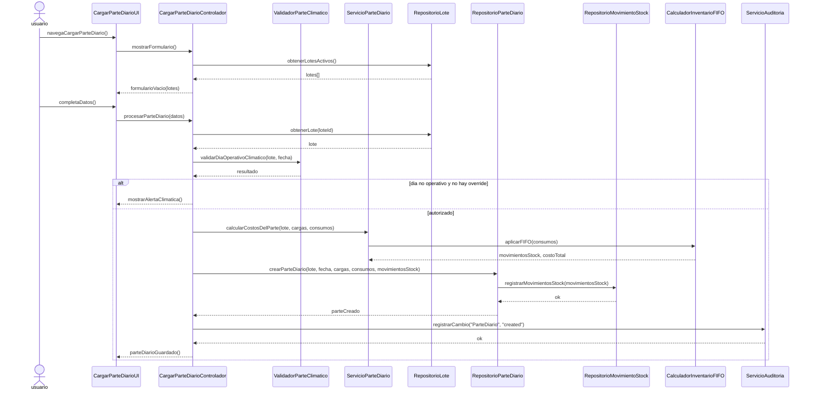
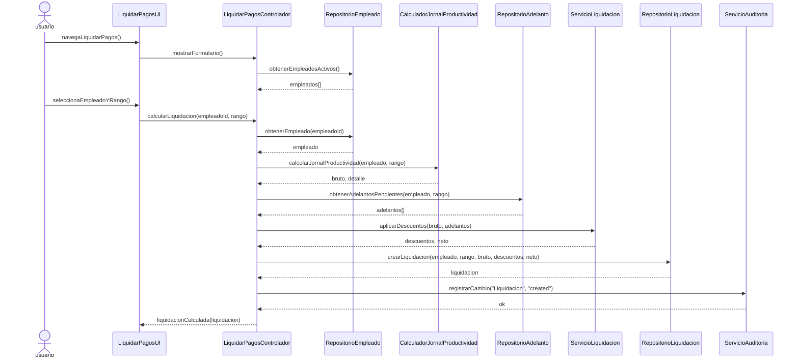
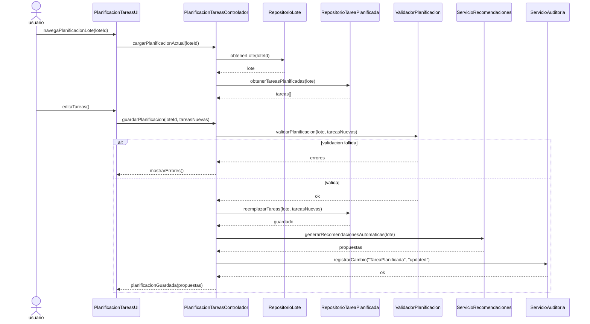
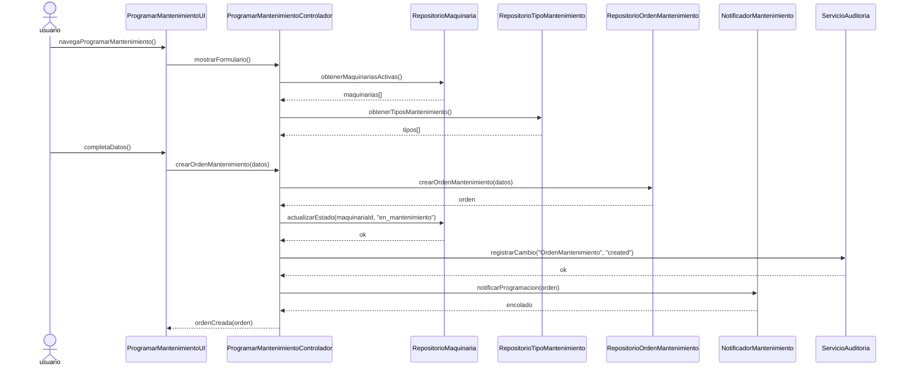
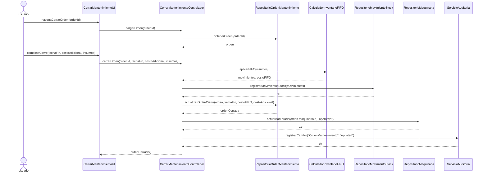
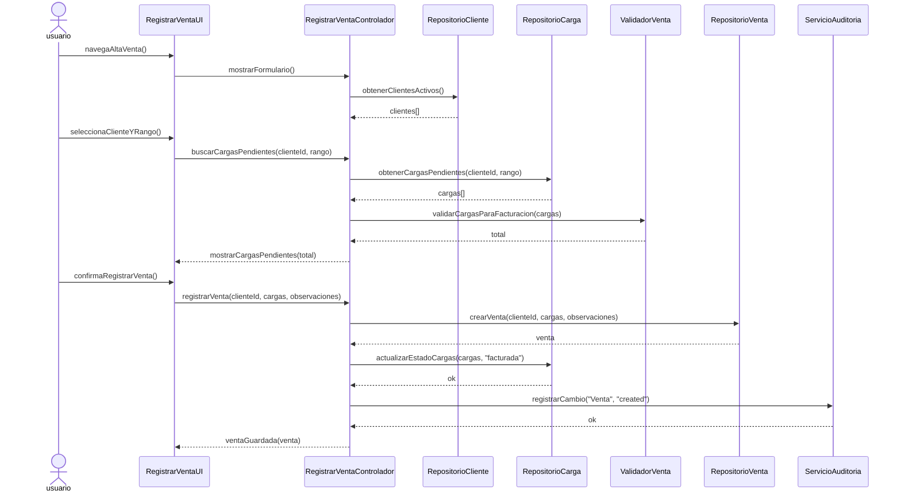
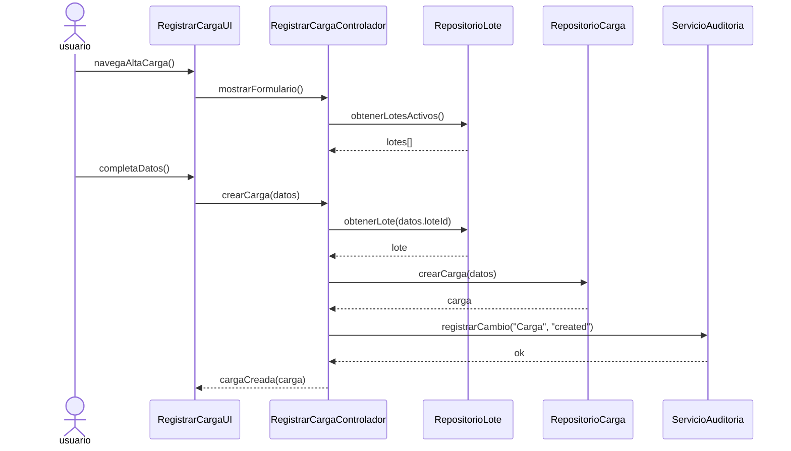
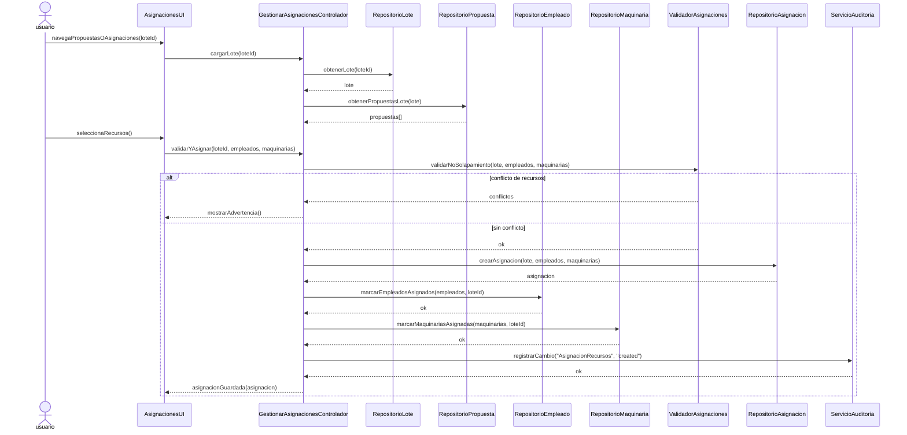
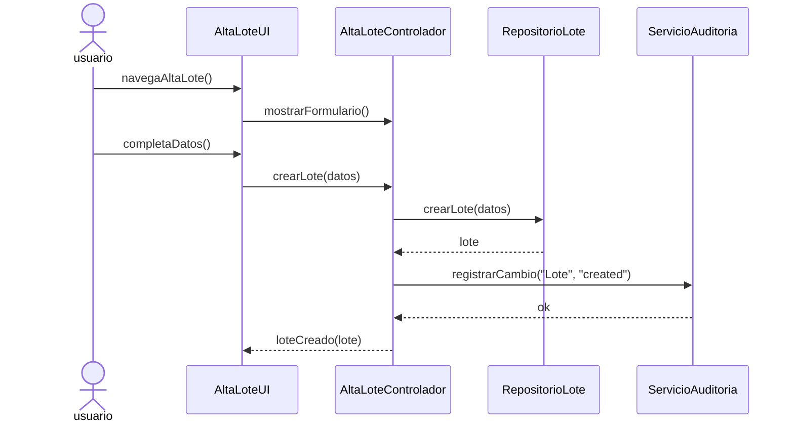
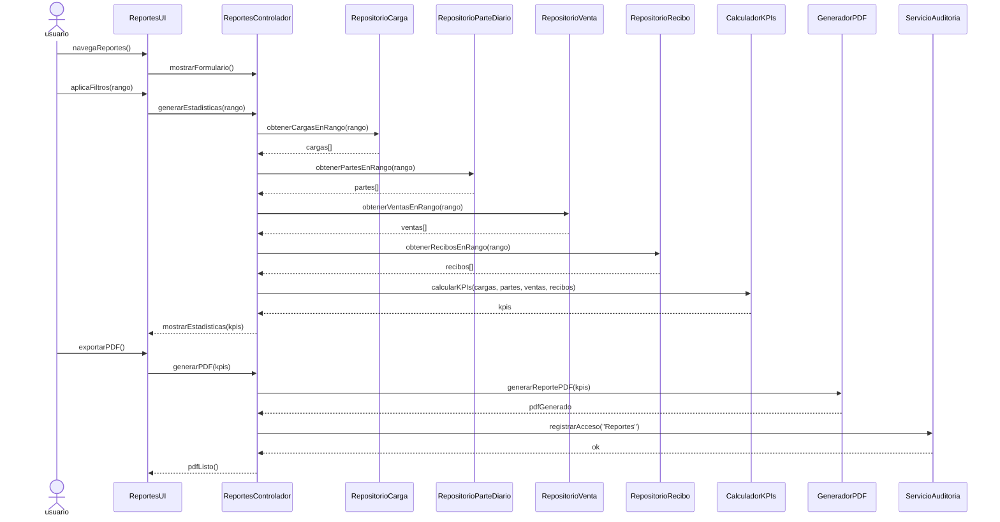

# Diagramas de Secuencia de Diseno - 10 Casos de Uso Criticos

Arquitecto de Software | Principios GRASP (Larman) | Proceso Unificado (UP)
---

## UC-61: Cargar Parte Diario (Operacion Critica de Produccion)

**Nota post-diagrama:**
- Forzado GRASP: `ValidadorParteClimatico` e `CalculadorInventarioFIFO` concentran conocimiento experto y evitan un controlador anemico.
- Concesion pragmatica: `ServicioParteDiario` orquesta los pasos mas largos para no fragmentar una operacion que tiene varias variaciones reales.

---

## UC-59: Liquidar Pagos (Complejidad de Reglas Financieras)

**Nota post-diagrama:**
- Forzado GRASP: `CalculadorJornalProductividad` es el experto en formulas; el controlador solo coordina.
- Concesion pragmatica: `ServicioLiquidacion` concentra descuentos y adelantos porque es una zona de cambio frecuente.

---

## UC-65: Planificacion de Tareas por Lote (Soporte Operativo)

**Nota post-diagrama:**
- Forzado GRASP: `Lote` y `ValidadorPlanificacion` absorben reglas de superficie y consistencia.
- Concesion pragmatica: las recomendaciones se disparan al final para no bloquear la confirmacion del usuario.

---

## UC-63: Programar Mantenimiento (Evento Critico de Recurso)

**Nota post-diagrama:**
- Forzado GRASP: el controlador crea la orden raiz y mantiene el flujo de negocio simple y localizable.
- Concesion pragmatica: notificacion asincrona con un servicio simple, sin introducir infraestructura adicional.

---

## UC-62: Cerrar Orden de Mantenimiento (Cierre Complejo con FIFO)

**Nota post-diagrama:**
- Forzado GRASP: `CalculadorInventarioFIFO` es el experto real en consumo y costo; la orden valida coherencia temporal.
- Concesion pragmatica: la operacion se mantiene en dos bloques claros para facilitar rollback y auditoria.

---

## UC-13: Alta Venta (Facturacion Critica)

**Nota post-diagrama:**
- Forzado GRASP: `Venta` y `ValidadorVenta` concentran las reglas de facturacion y evitan un controlador anemico.
- Concesion pragmatica: no se introduce una fabrica abstracta; la creacion de la venta es directa y suficiente.

---

## UC-41: Alta Carga (Registro de Produccion)

**Nota post-diagrama:**
- Forzado GRASP: el repositorio y la entidad de carga absorben la consistencia del dominio; el controlador solo coordina.
- Concesion pragmatica: validaciones de detalle se mantienen cercanas a la entidad para no inflar el flujo.

---

## UC-66: Gestionar Asignaciones y Propuestas (Orquestacion de Recursos)

**Nota post-diagrama:**
- Forzado GRASP: `ValidadorAsignaciones` contiene la regla de no solapamiento y evita que el controlador concentre todo.
- Concesion pragmatica: asumimos transacciones del repositorio para no modelar infraestructura de compensacion compleja.

---

## UC-01: Alta Lote (Entidad Raiz Fundamental)

**Nota post-diagrama:**
- Forzado GRASP: el controlador actua como Creador de la raiz del agregado `Lote`.
- Concesion pragmatica: se omite un builder porque la construccion es directa y no hay variantes dinamicas relevantes.

---

## UC-57: Informes Generales (Consolidacion Analitica)

**Nota post-diagrama:**
- Forzado GRASP: `CalculadorKPIs` concentra las formulas y deja al controlador como coordinador de consulta.
- Concesion pragmatica: los KPIs se calculan bajo demanda; no se persisten reportes estaticos.

---

## Sintesis de Aplicacion GRASP

- Creador: `Lote`, `Venta`, `OrdenMantenimiento` y `ParteDiario` se crean donde corresponde, sin fabricas abstractas innecesarias.
- Experto: las reglas viven en validadores y calculadores especializados, no en controladores.
- Controlador: uno por caso de uso, facil de localizar y de probar.
- Bajo acoplamiento: repositorios y servicios especializados separan coordinacion de negocio.
