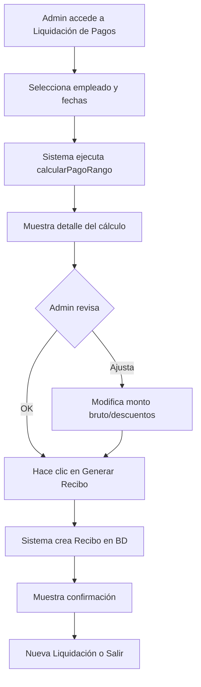

# Documentacion: Sistema de Calculo de Pagos a Empleados

Ultima actualizacion: 8 de febrero de 2026.

## Cambios Realizados (1 Nov 2025)

### Problema Original
El sistema creaba `Recibos` automáticamente al guardar un `ParteDiario`, lo cual causaba problemas de lógica circular: se necesitaban los recibos para calcular pagos, pero los recibos no existían hasta después de guardar.

### Solución Implementada

#### 1. Nuevas Tablas Pivote (Migraciones ejecutadas)

**`carga_empleado`**: Relaciona empleados con cargas (producción)
```php
- id_carga (FK -> cargas)
- id_empleado (FK -> empleados)
- UNIQUE(id_carga, id_empleado)
```

**`parte_diario_empleado`**: Relaciona empleados con partes diarios (días caídos)
```php
- id_parte_diario (FK -> parte_diarios)
- id_empleado (FK -> empleados)
- UNIQUE(id_parte_diario, id_empleado)
```

#### 2. Modelos Actualizados

**`Carga`** (`app/Models/Carga.php`):
```php
public function empleados()
{
    return $this->belongsToMany(Empleado::class, 'carga_empleado', 'id_carga', 'id_empleado');
}
```

**`ParteDiario`** (`app/Models/ParteDiario.php`):
```php
public function empleados()
{
    return $this->belongsToMany(Empleado::class, 'parte_diario_empleado', 'id_parte_diario', 'id_empleado');
}
```

**`Empleado`** (`app/Models/Empleado.php`):
```php
// Nuevas relaciones
public function cargas() { ... }
public function partesDiarios() { ... }
public function recibos() { ... }

// Método principal
public function calcularPagoRango($fechaInicio, $fechaFin)
```

#### 3. Lógica de Negocio Corregida

**Antes**: `PartesDiarios.php` creaba `Recibos` automáticamente al guardar.

**Ahora**: 
- **Al guardar ParteDiario** → Solo guarda relaciones en tablas pivote (NO crea recibos)
  - Si `es_dia_caido = true` → Guarda empleados en `parte_diario_empleado`
  - Si `es_dia_caido = false` → Guarda empleados por carga en `carga_empleado`

- **Cálculo de pagos** → Se hace con `Empleado::calcularPagoRango()`
  - Itera `ParteDiario` en rango de fechas
  - Para días caídos: cuenta empleados en `parte_diario_empleado`
  - Para producción: suma peso_neto de cargas en `carga_empleado` (dividido entre empleados)

- **Creación de Recibos** → Manual/batch usando el resultado del cálculo

## Flujo de Trabajo Nuevo

### 1. Registrar Parte Diario (sin cambios en la UI)
```
Usuario registra parte → Se guardan relaciones en tablas pivote
```

### 2. Calcular Pagos de un Empleado
```php
$empleado = Empleado::find($id);
$resultado = $empleado->calcularPagoRango('2025-10-01', '2025-10-31');

// Retorna:
[
    'cantidad_dias_caidos' => 5,
    'total_peso_neto' => 25.5,  // toneladas
    'valor_jornal' => 15000.0,
    'tarifa_fija_por_tonelada' => 8000.0,
    'total_pagar_jornales' => 75000.0,
    'total_pagar_produccion' => 204000.0,
    'total_pagar_final' => 279000.0
]
```

### 3. Generar Recibo desde la UI (NUEVO)
El sistema ahora incluye una interfaz completa en `/liquidacion-pagos` que permite:

1. **Seleccionar empleado y rango de fechas**
2. **Ver cálculo detallado automático**:
   - Días caídos trabajados
   - Toneladas producidas
   - Subtotales de jornales y producción
   - Total calculado
3. **Modificar datos antes de generar el recibo**:
   - Ajustar monto bruto si es necesario
   - Aplicar descuentos (adelantos, retenciones, etc.)
   - Editar observaciones
   - Ver monto neto en tiempo real
4. **Generar recibo automáticamente** con un clic

**Ruta**: `/liquidacion-pagos`  
**Componente**: `App\Http\Livewire\LiquidacionPagos`

### 3. Crear Recibo Manualmente (alternativa programática)
```php
Recibo::create([
    'id_empleado' => $empleado->id_empleado,
    'fecha_emision' => now(),
    'monto_bruto' => $resultado['total_pagar_final'],
    'descuentos' => 0,
    'monto' => $resultado['total_pagar_final'],
    'observaciones' => "Pago período {$fechaInicio} a {$fechaFin} - {$resultado['cantidad_dias_caidos']} días caídos + {$resultado['total_peso_neto']} ton",
    'activo' => true,
]);
```

## Ejemplo de Uso

```php
// En Livewire o Controller
$empleado = Empleado::with('rolLaboral')->find(1);

// Calcular lo que se debe pagar
$calculo = $empleado->calcularPagoRango('2025-10-01', '2025-10-31');

// Mostrar en UI o generar reporte
return view('reportes.pago-empleado', [
    'empleado' => $empleado,
    'calculo' => $calculo
]);

// Cuando se aprueba, crear el recibo
if ($request->input('aprobar')) {
    Recibo::create([
        'id_empleado' => $empleado->id_empleado,
        'fecha_emision' => now(),
        'monto_bruto' => $calculo['total_pagar_final'],
        'descuentos' => $request->input('descuentos', 0),
        'monto' => $calculo['total_pagar_final'] - $request->input('descuentos', 0),
        'observaciones' => "Liquidación período {$fechaInicio} a {$fechaFin}",
        'activo' => true,
    ]);
}
```

## Archivos Modificados

1.  `database/migrations/2025_11_01_000000_create_carga_empleado_table.php` (NUEVA)
2.  `database/migrations/2025_11_01_000001_create_parte_diario_empleado_table.php` (NUEVA)
3.  `app/Models/Carga.php` (relación `empleados()`)
4.  `app/Models/ParteDiario.php` (relación `empleados()`)
5.  `app/Models/Empleado.php` (relaciones + método `calcularPagoRango()`)
6.  `app/Http/Livewire/PartesDiarios.php` (eliminada creación automática de recibos)
7.  `app/Http/Livewire/LiquidacionPagos.php` (NUEVA - UI de liquidación)
8.  `resources/views/livewire/liquidacion-pagos.blade.php` (NUEVA)
9.  `resources/views/liquidacion-pagos/index.blade.php` (NUEVA)
10.  `routes/web.php` (ruta `/liquidacion-pagos`)
11.  `resources/views/layouts/app.blade.php` (enlace en sidebar)

## Características de la UI de Liquidación

### Pantalla 1: Selección
- Select con todos los empleados activos
- Campos de fecha inicio/fin (por defecto mes actual)
- Botón "Calcular"

### Pantalla 2: Revisión y Edición
**Panel izquierdo - Detalle del Cálculo (solo lectura)**:
- Días caídos trabajados
- Jornal diario
- Subtotal jornales
- Toneladas producidas
- Tarifa por tonelada
- Subtotal producción
- **Total calculado**

**Panel derecho - Datos del Recibo (editable)**:
- Monto bruto (prellenado con total calculado, modificable)
- Descuentos (adelantos, retenciones)
- **Monto neto** (calculado automáticamente)
- Observaciones (prellenadas, modificables)
- Botones:
  -  **Generar Recibo** (verde)
  -  **Cancelar** (gris)

### Pantalla 3: Confirmación
- Mensaje de éxito con número de recibo generado
- Botón "Nueva Liquidación"

## Flujo Completo de Trabajo



## Próximos Pasos Recomendados

1. **Crear componente Livewire para liquidación de pagos**
   - Vista para seleccionar empleado y rango de fechas
   - Mostrar desglose de cálculo
   - Botón para generar recibo

2. **Migrar datos existentes** (si hay recibos antiguos)
   - Script para extraer relaciones de `observaciones` de recibos
   - Poblar tablas pivote con datos históricos

3. **Tests unitarios**
   - Casos con solo días caídos
   - Casos con solo producción
   - Casos mixtos
   - Edge cases (empleado sin rol, sin trabajo en el período, etc.)

## Casos Borde Manejados

-  Empleado sin `rolLaboral` → Devuelve 0 en jornales/tarifas
-  Empleado no trabajó en el período → Devuelve totales en 0
-  Múltiples empleados en una carga → Divide `peso_neto` proporcionalmente
-  Redondeo a 2 decimales en todos los montos

## Notas Importantes

- Los `Recibos` antiguos (creados antes de este cambio) permanecen intactos
- Los nuevos `ParteDiario` ya NO crearán recibos automáticamente
- Es responsabilidad del usuario/admin crear recibos usando `calcularPagoRango()`
- Se puede crear un comando Artisan o proceso batch para generar recibos masivamente
