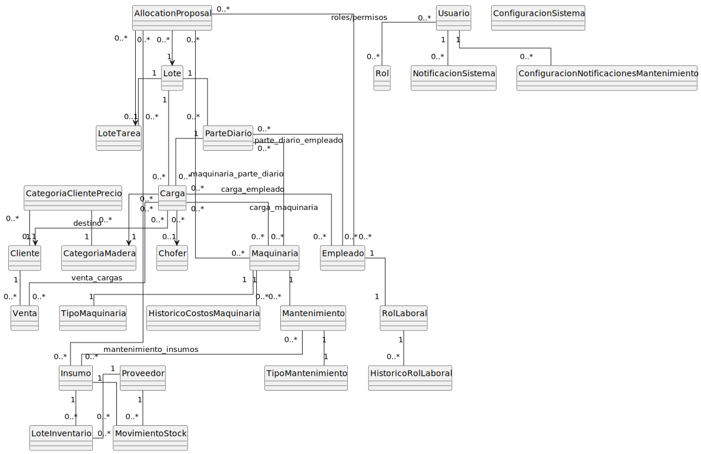
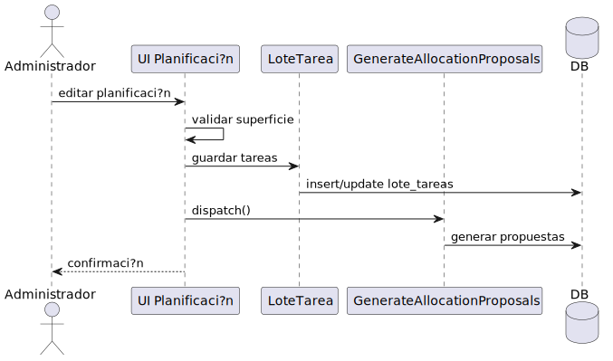
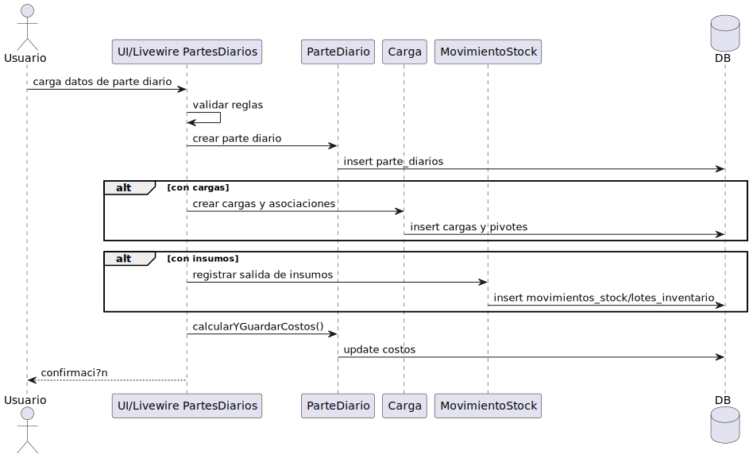
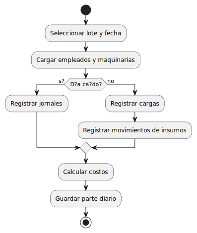
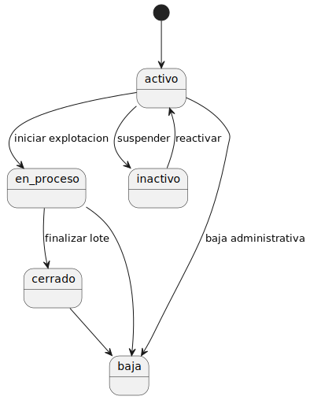
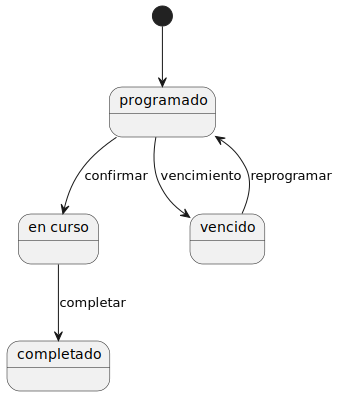
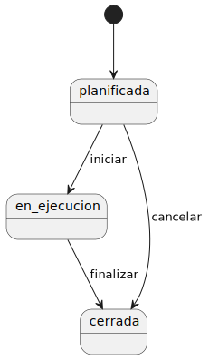

Equipo

Análisis del Modelo Conceptual Fase II
Lista de Concepto
Lista de conceptos idóneos
Relaciones entre los conceptos
Descripción de los Atributos
Diagrama conceptual
Comportamiento del Sistema
Diagrama de Secuencias a Nivel de Sistema

Diagrama de Sistema Para el caso de Uso: Registrar Parte Diario
Glosario
Plan de Iteración – [Codificación]
Equipo
Modelo Conceptual

Lista de conceptos idóneos
Es la lista de conceptos obtenidos de la lista de categorías de conceptos adecuados para incluirlos en la aplicación,
la misma está sujeta a la restricción de los requisitos.

Descripción del concepto
Lote:
Símbolo: LOT
Intención: Representar la unidad de producción forestal, con ubicación, especie,
superficie y estado.
Extensión: Incluye datos de propietario, condición de compra, estado (activo,
cerrado, baja), relación con cargas y partes diarias.
Carga:
Símbolo: CAR
Intención: Representar el transporte de madera desde un lote a un destino.
Extensión: Incluye ticket, peso bruto, tara, peso neto, categoría de madera, chofer y
destino.
Categoría Madera:
Símbolo: CAT
Intención: Clasificar la madera según características biológicas.
Extensión: Asociada a cargas y reportes de producción.
Insumo:
Símbolo: INS
Intención: Representar los materiales necesarios para la operación.
Extensión: Incluye nombre, descripción, unidad de medida, proveedor asociado (FK a
Proveedor, opcional), stock (calculado dinámicamente desde
Movimiento_Stock), consumo por maquinaria (vía
MantenimientoInsumos), consumo por lote (FK a Lote, opcional, si aplica).
Maquinaria/Equipo:
Símbolo: MAQ
Intención: Representar los equipos productivos utilizados en la extracción.

Plan de Iteración – [Codificación]
Equipo
Extensión: Incluye identificador, tipo (Categoría_Tipo), estado operativo (Condición),
Es_Alquilada, Fecha_Inicio_Actividades, relación con partes diarias (vía
Maquinaria_Parte_Diario), costos de alquiler (vía
Historico_Costos_Maquinaria), mantenimientos (vía Mantenimiento).
Mantenimiento:
Símbolo: MAN
Intención: Representar las operaciones de mantenimiento de maquinaria.
Extensión: Incluye órdenes programadas, preventivas o correctivas, con fechas,
costos y estado.
Empleado:
Símbolo: EMP
Intención: Representar al personal de la empresa (operativo o administrativo).
Extensión: Incluye datos personales, historial laboral, rol laboral (FK a Rol_Laboral),
jornales, productividad (vía Asignación y Parte_Diario), sueldos (vía
RolValorHistorico), adelantos (FK a Adelanto).
Chofer:
Símbolo: CHO
Intención: Representar a la persona ajena a la empresa encargada del transporte de
cargas.
Extensión: Asociado a clientes y cargas. Incluye datos personales y laborales.
Cliente:
Símbolo: CLI
Intención: Representar a quienes compran productos.
Extensi?n: Incluye raz?n social, CUIT, direcci?n y contacto.
Proveedor:
Símbolo: PRO
Intención: Representar a quienes suministran insumos o servicios.
Extensi?n: Incluye raz?n social, CUIT, direcci?n y contacto.

Plan de Iteración – [Codificación]
Equipo
Recibo:
Símbolo: REC
Intención: Documento de liquidación generado para empleados o transacciones.
Extensión: Incluye monto, fecha, empleado/cliente, detalle de conceptos.
Adelanto:
Símbolo: ADE
Intención: Registrar pagos parciales realizados a empleados.
Extensión: Asociados a empleados y descontados en liquidaciones posteriores.
Rol:
Símbolo: ROL
Intención: Definir niveles de acceso al sistema.
Extensión: Asociados a usuarios para restringir o habilitar acciones.
Auditoría:
Símbolo: AUD
Intención: Registrar todas las acciones relevantes del sistema.
Extensión: Incluye usuario, fecha/hora, acción, entidad afectada, resultado.
Reporte/Indicador (KPI):
Símbolo: REP
Intención: Representar salidas analíticas para gestión estratégica.
Extensión: Incluye informes financieros, de producción, productividad y comparativas
planificadas vs. reales.
Venta:
Símbolo: VEN
Intención: Transacción comercial de cargas hacia clientes.
Extensión: Incluye cliente, cargas asociadas, fecha, precio, condiciones de pago y
estado.

Plan de Iteración – [Codificación]
Equipo
Parte diario:
Símbolo: PD
Intención: Registro de trabajo operativo de cada jornada.
Extensión: Incluye lotes intervenidos (FK a Lote), toneladas extraídas (calculadas
desde Carga), empleados utilizados (vía Asignación), maquinaria utilizada
(vía Maquinaria_Parte_Diario), Es_Dia_Caido, observaciones.
Usuario:
Símbolo: USU
Intención: Representar a las personas que acceden al sistema.
Extensi?n: Incluye identificador, nombre, email, roles y permisos, estado de cuenta.
Nota: La entidad principal de autenticaci?n es Usuario; el modelo User de Laravel se considera legado y no se utiliza en la aplicaci?n.
Historico_Costos_Maquinaria:
Símbolo: HCM
Intención: Registrar los costos históricos de alquiler por tonelada para máquinas
alquiladas.
Extensión: Incluye identificador, máquina asociada (FK a Maquinaria), costo por
tonelada, fechas de vigencia (Fecha_Inicio_Vigencia,
Fecha_Fin_Vigencia).
Rol_Laboral:
Símbolo: ROL_LAB
Intención: Definir los roles laborales de los empleados (por ejemplo, Motosierrista,
Tractorista) para gestionar pagos.
Extensión: Incluye nombre del rol, relación con empleados (FK en Empleado), costos
históricos (vía RolValorHistorico).
RolValorHistorico:
Símbolo: RVH
Intención: Definir los roles laborales de los empleados (por ejemplo, Motosierrista,
Tractorista) para gestionar pagos.
Extensión: Incluye nombre del rol, relación con empleados (FK en Empleado), costos
históricos (vía RolValorHistorico).

Plan de Iteración – [Codificación]
Equipo
Movimiento_Stock:
Símbolo: MST
Intención: Registrar entradas (compras) y salidas (consumo) de insumos para
gestionar el stock.
Extensión: Incluye identificador, insumo (FK a Insumo), tipo de movimiento
(entrada/salida), cantidad, precio unitario (para entradas), precio total
(para entradas), proveedor (FK a Proveedor, opcional), fecha, usuario (FK
a Usuario), mantenimiento (FK a Mantenimiento, opcional), lote (FK a
Lote, opcional), descripción.

Conceptos adicionales implementados (no incluidos en el an?lisis inicial)
Lote_Tarea:
S?mbolo: LTA
Intenci?n: Representar la planificaci?n de tareas por lote (tipo de tarea y superficie en ha).
Extensi?n: Incluye id_lote, tipo_tarea, superficie_afectada_ha, estado y observaciones.
Lote_Inventario:
S?mbolo: LIN
Intenci?n: Representar lotes FIFO de stock de insumos.
Extensi?n: Incluye insumo, proveedor, cantidad, cantidad_disponible, precio_unitario, fecha_compra y estado de agotado.
Notificacion_Sistema:
S?mbolo: NOT
Intenci?n: Registrar notificaciones internas (por ejemplo, mantenimientos).
Extensi?n: Incluye usuario destino, mensaje, estado de lectura/acci?n y fecha l?mite.
Allocation_Proposal (Propuesta_Asignaci?n):
S?mbolo: AP
Intenci?n: Sugerir asignaci?n de recursos por lote o tarea en base a hist?rico.
Extensi?n: Incluye lote, tarea, empleados, maquinarias, insumos propuestos, estado y m?tricas.
Categoria_Cliente_Precio:
S?mbolo: CCP
Intenci?n: Definir precios por cliente y categor?a de madera.
Extensi?n: Incluye cliente, categor?a_madera, precio_unitario y vigencia.
Tipo_Maquinaria:
S?mbolo: TMAQ
Intenci?n: Clasificar maquinaria y definir umbrales/precios de alquiler.
Tipo_Mantenimiento:
S?mbolo: TMAN
Intenci?n: Clasificar mantenimientos (preventivo/correctivo).
Unidad_Medida:
S?mbolo: UM
Intenci?n: Definir unidades de medida para insumos.
Mantenimiento_Insumo:
S?mbolo: MIN
Intenci?n: Vincular mantenimiento con insumos utilizados y su salida de stock.
Maquinaria_Parte_Diario:
S?mbolo: MPD
Intenci?n: Vincular maquinaria utilizada con partes diarios.
Asignacion:
S?mbolo: ASN
Intenci?n: Vincular empleados con partes diarios (y cargas).
Configuracion_Sistema:
S?mbolo: CFG
Intenci?n: Par?metros generales del sistema.
Extensi?n: Incluye configuraci?n de horarios y reglas del sistema.
Configuracion_Notificaciones_Mantenimiento:
S?mbolo: CNM
Intenci?n: Configurar usuarios y reglas para notificaciones de mantenimiento.
Extensi?n: Incluye usuario, canal, preferencias y vigencia.

Plan de Iteración – [Codificación]
Equipo
Relaciones entre los conceptos
Concepto Ejemplos
Carga se asocia con Lote Cada carga tiene una FK ID_Lote que hace referencia a un lote específico
del que proviene la madera.
Concepto Ejemplos
Categoría de madera clasifica Carga Cada carga tiene una FK ID_Categoría_Madera que referencia una
categoría de madera.
Concepto Ejemplos
Chofer se asocia con Carga El chofer transporta aparentemente la carga
Concepto Ejemplos
Insumo se asocia con
Movimiento_Stock.
Cada insumo tiene movimientos de entrada y salida en
Movimiento_Stock (FK ID_Insumo), y el stock actual se calcula
sumando entradas y restando salidas.
Concepto Ejemplos
Proveedor abastece Insumo Los proveedores suministran insumos para el stock
Concepto Ejemplos
Maquinaria se asocia con
Parte_Diario, Mantenimiento, y
Historico_Costos_Maquinaria.
Cada maquinaria está vinculada a partes diarias (vía
Maquinaria_Parte_Diario, FK ID_Maquinaria), mantenimientos (FK
ID_Maquinaria en Mantenimiento), y costos de alquiler (FK
ID_Maquinaria en Historico_Costos_Maquinaria).
Concepto Ejemplos
Mantenimiento se aplica a
Maquinaria
Cada orden de mantenimiento corresponde a una maquinaria
específica.
Concepto Ejemplos
Empleado se asocia con
Rol_Laboral, Parte_Diario,
Adelanto, y Recibo.
Cada empleado tiene una FK ID_Rol_Laboral (a Rol_Laboral), está
vinculado a partes diarias (vía Asignacion, FK ID_Empleado), recibe
adelantos (FK ID_Empleado en Adelanto), y genera recibos (FK
ID_Empleado en Recibo).

Plan de Iteración – [Codificación]
Equipo
Concepto Ejemplos
Adelanto se asocia con Empleado El adelanto es parte de la liquidación del empleado.
Concepto Ejemplos
Recibo se asocia con Empleado Cada recibo tiene una FK ID_Empleado (para liquidaciones de
empleados), con detalles de monto y conceptos.
Concepto Ejemplos
Venta se asocia con Carga. Cada venta tiene una o más cargas asociadas (FK ID_Venta en Carga).
Concepto Ejemplos
Cliente es parte de una venta Cada venta tiene asociado un cliente
Concepto Ejemplos
Usuario se asocia con Rol y
Auditoría.
Cada usuario tiene una FK ID_Rol (a Rol) para permisos y genera
registros en Auditoría (FK ID_Usuario).
Concepto Ejemplos
Configuracion_Notificaciones_Mantenimiento se asocia con Usuario
Cada configuración referencia al usuario suscripto a notificaciones
de mantenimiento (FK ID_Usuario).
Concepto Ejemplos
Rol se compone de Permisos Cada Rol tiene asignados ciertos Permisos
Concepto Ejemplos
Auditoría se asocia con Usuario. Cada registro de auditoría tiene un FK ID_Usuario que indica quién
realizó la acción.
Concepto Ejemplos
Reporte se asocia con
Categoría_Madera, Carga, Lote,
Empleado, Maquinaria.
Los informes se generan con datos de cargas (FK
ID_Categoría_Madera), lotes (FK ID_Lote), empleados (vía
Asignacion), y maquinaria (vía Maquinaria_Parte_Diario).
Concepto Ejemplos
Parte diario se asocia con Lote,
Empleado, Maquinaria
La parte diario vincula qué lote se trabajó, qué empleado participó y qué
máquina se us.

Plan de Iteración – [Codificación]
Equipo
Concepto Ejemplos
Historico_Costos_Maquinaria
registra costos para Maquinaria.
Cada registro en Historico_Costos_Maquinaria tiene una FK
ID_Maquinaria que referencia la maquinaria alquilada.
Concepto Ejemplos
Rol_Laboral define roles para
Empleado y costos en
RolValorHistorico.
Cada empleado tiene una FK ID_Rol_Laboral. Cada registro en
RolValorHistorico tiene una FK ID_Rol_Laboral.
Concepto Ejemplos
RolValorHistorico registra costos
históricos para Rol_Laboral.
Cada registro en RolValorHistorico tiene una FK ID_Rol_Laboral para
definir costos por tonelada o diario.
Concepto Ejemplos
Movimiento_Stock gestiona el
stock de Insumo, con entradas
desde Proveedor, salidas a
Mantenimiento o Lote, y registros
por Usuario.
Cada movimiento tiene una FK ID_Insumo, una FK ID_Proveedor
(para entradas), FKs ID_Mantenimiento o ID_Lote (para salidas), y FK
ID_Usuario para auditoría.
Concepto Ejemplos
MantenimientoInsumos vincula
Mantenimiento e Insumo, con un
movimiento de salida en
Movimiento_Stock.
Cada registro en MantenimientoInsumos tiene FKs ID_Mantenimiento,
ID_Insumo, y ID_Movimiento
Concepto Ejemplos
Maquinaria_Parte_Diario vincula
Maquinaria a Parte_Diario.
Maquinaria_Parte_Diario vincula Maquinaria a Parte_Diario.
Concepto Ejemplos
Asignación vincula Empleado a
Parte_Diario.
Cada registro tiene FKs ID_Empleado y ID_Parte_Diario.

Concepto Ejemplos
Lote se asocia con Lote_Tarea.
Cada lote puede tener m?ltiples tareas planificadas (tipo_tarea, superficie_afectada_ha).
Concepto Ejemplos
Lote se asocia con Empleado y Maquinaria.
Relaci?n N a N v?a lote_empleado y lote_maquinaria.
Concepto Ejemplos
Carga se asocia con Empleado y Maquinaria.
Relaci?n N a N v?a carga_empleado y carga_maquinaria.
Concepto Ejemplos
Venta se asocia con Carga.
Relaci?n N a N v?a venta_cargas (precio_unitario, peso_toneladas, subtotal).
Concepto Ejemplos
Categoria_Cliente_Precio vincula Cliente y Categoria_Madera.
Define precio por cliente y vigencia.
Concepto Ejemplos
Notificacion_Sistema se asocia con Usuario y Mantenimiento.
Registra alertas y estado le?da/accionada.
Concepto Ejemplos
Lote_Inventario se asocia con Insumo y Proveedor.
Representa lotes de stock con cantidad disponible.
Concepto Ejemplos
Allocation_Proposal se asocia con Lote y Lote_Tarea.
Incluye recursos propuestos (empleados, maquinarias, insumos) y su estado.

Plan de Iteración – [Codificación]
Equipo
Descripción de los Atributos
Concepto Atributo-Descripción
Lote Código de lote (ID único): Identificador interno.
Propietario (texto): Nombre o razón social del dueño.
Ubicación (texto): Localización del lote.
Especie (texto): Tipo de árbol/madera.
Superficie (ha) (número decimal): Tamaño en
hectáreas.
Condición de compra (enum: vuelo forestal, tn, etc.):
Modalidad de adquisición.
Precio por lote (decimal): Valor pactado.
Estado (enum: activo, en_proceso, inactivo, cerrado, baja): Situación del lote.
Fecha de compra (fecha): Momento de adquisición.
Concepto Atributo-Descripción
Carga Número de billete (texto): Identificador del viaje.
Fecha_Carga (fecha): Fecha en que se realizó la carga.
Peso bruto (decimal): Peso total cargado.
Tara (decimal): Peso del camión vacío.
Peso neto (decimal): Diferencia entre bruto y tara.
Categoría de madera (FK a Categoría): Clasificación de
la carga.
Destino (FK Cliente): Lugar donde se transporta la
carga.
Chofer asignado (FK a Chofer): Responsable del
transporte.
Lote de origen (FK a Lote): Relación con el lote del cual
proviene.
ID_ParteDiario(FK parte diario)
ID_Venta (numérico, opcional): Clave foránea que
referencia al ID_Venta de la tabla Venta. Puede ser
NULL inicialmente, ya que las cargas se registran antes
de asociarse a una venta, y se actualiza cuando se
vinculan a una orden de venta.
Plan de Iteración – [Codificación]
Equipo
Concepto Atributo-Descripción
Categoría de Madera ID Categoría (numérico): Identificador único.
Nombre (texto): Ej. Fino, Mediano, Grueso.
Descripción (texto): Detalle adicional de clasificación.
Concepto Atributo-Descripción
Insumo ID Insumo (numérico): Identificador único.
Nombre (texto): Denominación del insumo.
Descripción (texto): Detalles de uso.
Unidad de medida (texto): Ej. litros, kg, piezas.
Stock real (decimal): Cantidad disponible.
Proveedor asociado (FK a Proveedor): Relación con
proveedor.
Concepto Atributo-Descripción
Maquinaria ID_Maquinaria (numérico): Identificador único de la
máquina.
Modelo (texto): Modelo de la máquina.
Año (numérico): Año de fabricación de la máquina.
Tipo (texto): Tipo de máquina.
Condición (enum: activo, inactivo, en reparación): Estado
actual de la máquina.
Fecha_Inicio_Actividades (fecha): Fecha en que la
máquina comenzó a usarse.
Es_Alquilada (booleano): Indica si la máquina es
alquilada (TRUE) o propia (FALSE).
Costos_Alquiler (relación con
Historico_Costos_Maquinaria): Relación con la tabla
Historico_Costos_Maquinaria, que registra los costos de
alquiler por tonelada para máquinas alquiladas, con
fechas de vigencia.Donde cada registro histórico tiene
una clave foránea ID_Maquinaria que referencia a esta
máquina.
Historial_Mantenimientos (relación con Mantenimiento):
Relación con la tabla Mantenimiento, donde cada
mantenimiento tiene una clave foránea ID_Maquinaria
que referencia a esta máquina.
Plan de Iteración – [Codificación]
Equipo
Concepto Atributo-Descripción
Costos históricos Maq
uinar
ID_Costo (numérico): Identificador único del registro de
costo.
ID_Maquinaria (FK): Clave foránea que referencia al
ID_Maquinaria de la tabla Maquinaria.
Costo_Por_Tonelada (decimal): Costo de alquiler por
tonelada producida con la máquina (aplica solo si
Es_Alquilada = VERDADERO).
Fecha_Inicio_Vigencia (fecha): Fecha desde la cual el
costo es válido.
Fecha_Fin_Vigencia (fecha, opcional): Fecha hasta la
cual el costo es válido (NULL si el costo sigue vigente).
Concepto Atributo-Descripción
Maquinaria_Parte_Diar
yo
ID_Maquinaria_Parte (numérico): Identificador único de
la relación.
ID_Maquinaria (FK): Clave foránea que referencia al
ID_Maquinaria de la tabla Maquinaria.
ID_Parte_Diario (FK): Clave foránea que referencia al
ID_Parte_Diario de la tabla Partes_Diarios.
Concepto Atributo-Descripción
Empleado ID_Empleado (numérico): Identificador único del
empleado.
Nombre (texto): Nombre completo del empleado.
Apellido (texto): Apellido del empleado.
DNI : Documento de identidad.
Fecha de nacimiento (fecha): Fecha de nacimiento del
empleado.
ID_Rol (FK): Clave foránea que referencia al ID_Rol de
la tabla RolLaboral. Indica el rol laboral del empleado.
Fecha de ingreso (fecha): Fecha en que el empleado
comenzó a trabajar.
Estado (activo/inactivo): Indica si el empleado está
actualmente activo o inactivo.
Historial de asignaciones (relación con Asignaciones):
Relación con la tabla Asignaciones, que vincula al
empleado con las partes diarias en los que trabajaban.
Plan de Iteración – [Codificación]
Equipo
Concepto Atributo-Descripción
Rol Laboral
I D_Rol (numérico) : Identificador único del rol laboral.
Nombre (texto) : Nombre del rol laboral.
Descripción (texto, opcional) : Detalles adicionales del
rol (por ejemplo, responsabilidades o características).
Concepto Atributo-Descripción
RolValorHistorico
ID_Valor (numérico): Identificador único del registro de
precio.
ID_Rol (FK): Clave foránea que referencia al ID_Rol de
la tabla RolLaboral.
Valor_Por_Ton (decimal): Precio por tonelada para el rol
en un período específico.
Valor_Por_Jornal (decimal, opcional): Precio por diario
para el rol (usado para roles que cobran por jornal en
lugar de por tonelada, o para días caídos).
Fecha_Inicio_Vigencia (fecha): Fecha desde la cual el
precio es válido.
Fecha_Fin_Vigencia (fecha, opcional): Fecha hasta la
cual el precio es válido (NULL si el precio sigue vigente).
Concepto Atributo-Descripción
Asignación ID Asignación (numérico): Identificador único de la
asignación.
ID_Empleado (numérico): Clave foránea que referencia
al ID_Empleado de la tabla Empleados.
ID_Parte_Diario (numérico): Clave foránea que
referencia al ID_Parte_Diario de la tabla Partes_Diarios.
Fecha_Asignación (fecha, opcional): Fecha en la que
se asignó el empleado al parte diario (puede omitirse si
la fecha está en la tabla Partes_Diarios).
Plan de Iteración – [Codificación]
Equipo
Concepto Atributo-Descripción
Chofer ID Chofer (numérico).
Nombre (texto).
Apellido (texto).
DNI (texto numérico).
Teléfono (texto).
Dirección (texto).
Cliente asociado (FK a Cliente).
Concepto Atributo-Descripción
Cliente ID Cliente (numérico).
Razón social (texto).
CUIT (texto numérico).
Dirección (texto).
Teléfono (texto).
Correo electrónico (texto).
Concepto Atributo-Descripción
Proveedor ID Proveedor (numérico).
Razón social (texto).
CUIT (texto numérico).
Dirección (texto).
Teléfono (texto).
Correo electrónico (texto).
Concepto Atributo-Descripción
Venta ID Venta (numérico).
Cliente (FK).
Fecha de venta (fecha).
Condiciones de pago (texto).
Monto total (decimal).
Estado (activa, cerrada, anulada).
Plan de Iteración – [Codificación]
Equipo
Concepto Atributo-Descripción
Recibo ID Recibo (numérico).
Empleado (FK).
Fecha emisión (fecha).
Monto (decimal).
Detalle de conceptos (texto).
Concepto Atributo-Descripción
Adelanto ID Adelanto (numérico).
Empleado (FK)
Fecha (fecha).
Monto (decimal).
Concepto Atributo-Descripción
Mantenimiento ID Mantenimiento (PK, numérico): Identificador único
del mantenimiento.
ID Maquinaria (FK → Maquinaria): Referencia a la
máquina que recibe el mantenimiento.
Tipo (enumeración: preventivo, correctivo, externo):
Clasificación del mantenimiento.
Fecha inicio (fecha): Momento en que comenzó el
mantenimiento.
Fecha cierre (fecha): Momento en que terminó el
mantenimiento.
Descripción de la tarea (texto): Detalle de las acciones
realizadas.
Costo_mano_obra (decimal): Monto abonado por mano
de obra (principalmente externa).
Costo_total (decimal, calculado): Suma de los insumos
usados ​​(desde MantenimientoInsumos) más la mano de
obra.
Estado (enum: programado, en curso, vencido, completado):
Situación del mantenimiento.
Plan de Iteración – [Codificación]
Equipo
Concepto Atributo-Descripción
MantenimientoInsumos ID MantenimientoInsumo (numérico, PK): Identificador
único del registro.
ID Mantenimiento (FK → Mantenimiento): Referencia al
mantenimiento donde se utiliza el insumo.
ID Insumo (FK → Insumo): Tipo de insumo utilizado.
ID Movimiento (FK → MovimientoInsumos, opcional):
Permite vincular el uso de este insumo con el
movimiento de salida de stock correspondiente.
Cantidad utilizada (decimal): Número de
unidades/litros/etc. aplicados en el mantenimiento.
Costo_unitario (decimal): Precio unitario del insumo en
el momento del uso.
Subtotal (decimal): Costo total del insumo en ese
mantenimiento (cantidad × costo_unitario).
Concepto Atributo-Descripción
Usuario ID Usuario (numérico).
Nombre (texto).
Apellido (texto).
Contraseña
Rol asignado (FK a Rol).
Estado (activo/inactivo).
Fecha creación (fecha).
Concepto Atributo-Descripción
Rol ID Rol (numérico).
Nombre Rol (texto).
Permisos asociados (lista de operaciones permitidas).
Plan de Iteración – [Codificación]
Equipo
Concepto Atributo-Descripción
Auditoría ID Acción (numérico).
Usuario responsable (FK).
Fecha y hora (timestamp).
Entidad afectada (texto).
Acción realizada (alta, baja, modificación, consulta).
Resultado (éxito / error).
Concepto Atributo-Descripción
Parte Diario ID_Parte_Diario (numérico): Identificador único de la parte
diario.
Fecha (fecha): Día en que se realizó la operación
registrada.
Lote_Asociado (FK): Clave foránea que referencia al
identificador del lote en la tabla Lotes. indica el lote
sobre el cual se trabajó.
Máquinas_Utilizadas (relación con
Maquinaria_Parte_Diario): Relación con la tabla
intermedia Maquinaria_Parte_Diario, que registra las
máquinas utilizadas en esta parte diaria (relación
muchos a muchos entre Partes_Diarios y Maquinaria).
Toneladas_Extraídas (decimal, calculada): Cantidad de
toneladas producidas en la parte diaria, calculadas como
la sumatoria de Cantidad_Toneladas de las cargas
asociados en la tabla Carga (0 si Es_Dia_Caido = TRUE
o si no hay cargas asociadas).
Cargas_Asociadas (relación con Carga): Relación con
la tabla Carga, donde cada carga tiene una clave
foránea ID_Parte_Diario que referencia a esta parte
diario (relación uno a muchos).
Es_Dia_Caido (booleano): Indica si la parte corresponde
a un día caído por lluvia u otra razón.
Observaciones (texto, opcional): Notas adicionales
sobre la operación.
Plan de Iteración – [Codificación]
Equipo
Diagrama conceptual

Diagrama de Secuencias a Nivel de Sistema (Planificar tareas por lote)

Plan de Iteración – [Codificación]
Equipo
Comportamiento del Sistema

Diagrama de Secuencias a Nivel de Sistema

Diagrama de Sistema Para el caso de Uso: Registrar Parte Diario

Diagrama de Estados - Lote

Diagrama de Estados - Mantenimiento

Diagrama de Estados - LoteTarea

Nombre : registradorParteDiario(idLote entero, fecha fecha, esDiaCaido booleano,
observaciones texto).
Responsabilidades :

Registrar las actividades diarias realizadas en un lote, vinculando los empleados
asignados y las maquinarias utilizadas.
Actualiza el estado operativo del lote y genera los registros asociados en
parte_diario, asignación y maquinaria_parte_diario.
Tipo : Sistema
Referencias cruzadas : Caso de uso Registrar Parte Diario – Funciones del módulo
Producción.
Notas : Permite reflejar la jornada laboral, incluso si no hubo trabajo efectivo (día caído).
Excepciones :
Si el lote está inactivo o cerrado, mostrará error: “El lote seleccionado no se encuentra
disponible”.
Si faltan empleados o maquinarias asignadas, advertir: “Debe asignar al menos un
empleado o maquinaria”.
Salida :
Confirmación de registro exitoso y número de parte diario generado.
Condiciones previas :
El lote existe y está activo.
El usuario cuenta con permisos para registrador partes.
Postcondiciones :
Se crea un registro en parte_diario.
Se generan las asignaciones de empleados (asignacion).
Se asocian las maquinarias utilizadas (maquinaria_parte_diario).
El lote queda marcado como “en seguimiento” para esa fecha.
Responsabilidades: Registrar un movimiento de entrada o salida de insumos, actualizando la disponibilidad del stock y vinculando la operación al proceso correspondiente (mantenimiento, lote o
proveedor ) . Tipo: Sistema Referencias cruzadas: Caso de uso Registrar Movimiento de Stock – Funciones del módulo Inventario. Notas: Admita movimientos automáticos desde mantenimiento o manuales por el administrador. Excepciones: ● Si no existe el insumo indicado, muestre “Insumo no registrado”. ● Si la cantidad supera el stock disponible en una salida, muestre “Stock insuficiente”. Salida: Mensaje de confirmación y número de movimiento generado. Precondiciones: ● El insumo está registrado en el sistema. ● El usuario tiene permisos para movimientos de registrador. Postcondiciones: ● Se crea un registro en movimiento_stock. ● Se actualiza la cantidad disponible del insumo. ● Se vincula el movimiento con mantenimiento, lote o proveedor según corresponda.

Plan de Iteración – [Codificación]
Equipo
Nombre: planificarProduccion(idLote entero, periodo texto, objetivos texto, recursos JSON,
fechaInicio fecha, fechaFin fecha)
Responsabilidades:
Definir el plan de producción para un lote o conjunto de lotes, estableciendo las actividades
previstas, los recursos necesarios (maquinarias, empleados, insumos) y los objetivos
productivos.
Tipo: Sistema
Referencias cruzadas: Caso de uso Planificar Producción Forestal – Funciones del módulo
Producción / Gestión.
Notas: Permite anticipar la demanda de recursos y organizar la ejecución de operaciones.
Excepciones:
● Si no hay lotes activos disponibles, muestre “No existen lotes habilitados para
planificación”.
● Si la fecha de fin es anterior a la de inicio, muestre “Período inválido”.
Salida:
Confirmación de la planificación generada y calendario de ejecución.
Precondiciones:
● Existencia de lotes activos y maquinarias disponibles.
● El usuario posee permisos de planificación.
Postcondiciones:
● Se crea un registro de planificación asociado a los lotes seleccionados.
● Se asignan preliminarmente recursos (empleados, maquinarias, insumos).
● El sistema queda preparado para generar partes diarias conforme al plan.

Plan de Iteración – [Codificación]
Equipo
Nombre: registradorMantenimiento(idMaquinaria entero, tipo enum, fechaInicio fecha, fechaFin
fecha?, costoTotal decimal?, estado enum, insumos JSON)
Responsabilidades:
Registrar la ejecución de un mantenimiento preventivo o correctivo sobre una maquinaria,
incluyendo fechas, estado, costos e insumos utilizados.
Tipo: Sistema
Referencias cruzadas: Caso de uso Registrar Mantenimiento de Maquinaria – Funciones
del módulo Maquinaria y Equipos.
Notas: El mantenimiento puede estar vinculado a movimientos de stock si se consumimos
insumos.
Excepciones:
● Si la maquinaria está inactiva, muestre “Maquinaria no disponible”.
● Si faltan datos de tipo o fecha, muestre “Información incompleta para el
mantenimiento”.
Salida:
Confirmación del mantenimiento registrado y número de mantenimiento generado.
Precondiciones:
● La maquinaria está registrada y activa.
● El tipo de mantenimiento está definido (preventivo/correctivo).
Postcondiciones:
● Se crea un registro en mantenimiento.
● Se asocian insumos utilizados (mantenimiento_insumos).
● Se actualiza el estado de la maquinaria a “en mantenimiento” o “disponible” según
corresponda.

Plan de Iteración – [Codificación]
Equipo
Nombre: generarReporteProduccion(tipo texto, fechaInicio fecha, fechaFin fecha)
Responsabilidades:
Consolidar información de producción (partes diarias, cargas, ventas y mantenimientos) en
un reporte visual o exportable.
Tipo: Sistema
Referencias cruzadas: Caso de uso Generar Reporte de Producción – Funciones del
módulo Administración.
Notas: Los informes se almacenan en la tabla de informes y pueden incluir métricas o gráficos
de desempeño.
Excepciones:
● Si no hay datos en el rango solicitado, muestre “No existen registros para el período
indicado”.
● Si ocurre un error al generar el archivo, muestre “Error al generar informe”.
Salida:
Archivo o vista del informe generado, con resumen de producción y costos.
Precondiciones:
● Existen datos de producción cargados en el sistema.
● El usuario posee permisos de consulta.
Postcondiciones:
● Se crea un registro en reporte.
● Se almacena el contenido (JSONB o archivo exportado).
● Se muestra el resultado al usuario.
