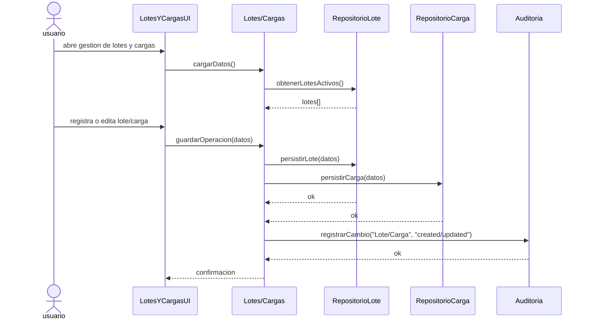
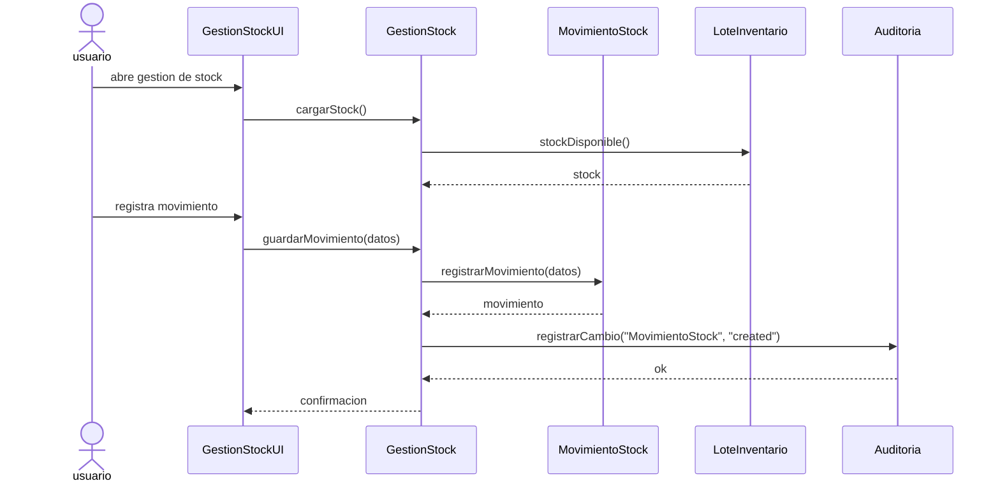
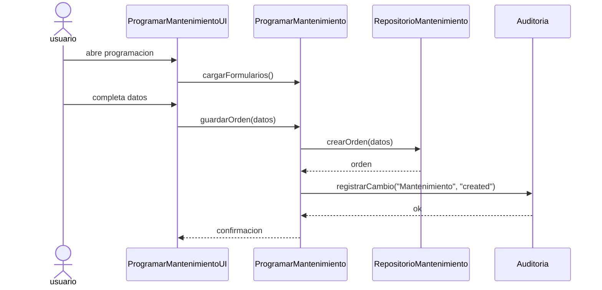
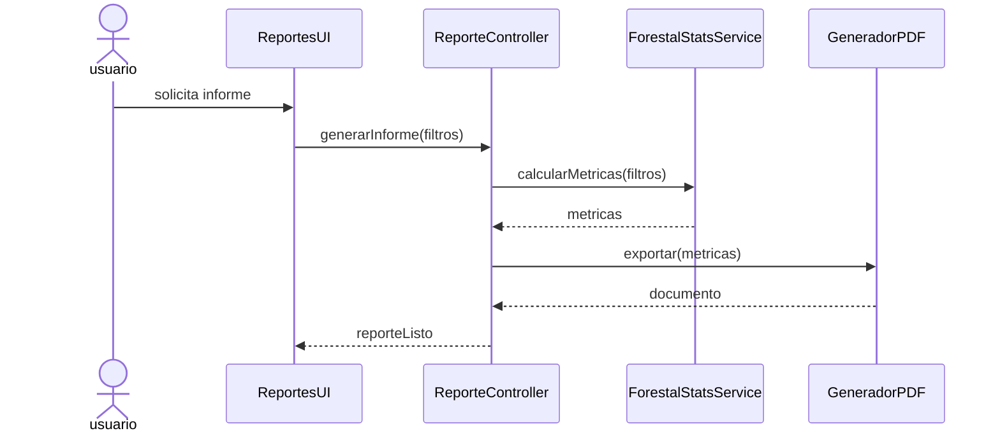
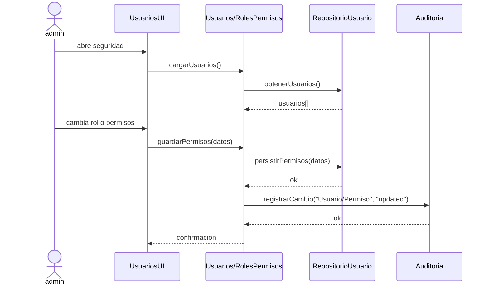
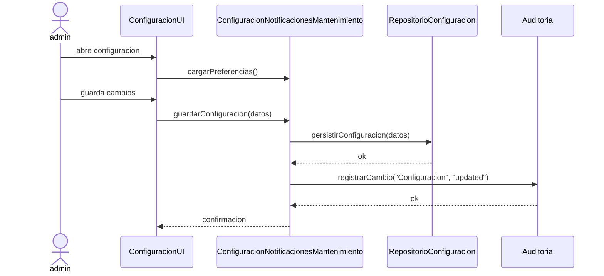
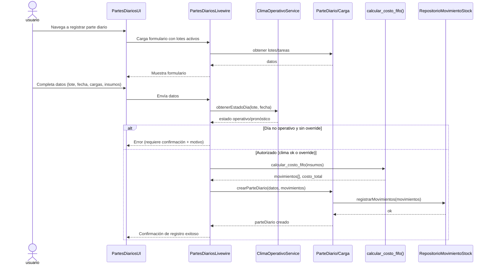
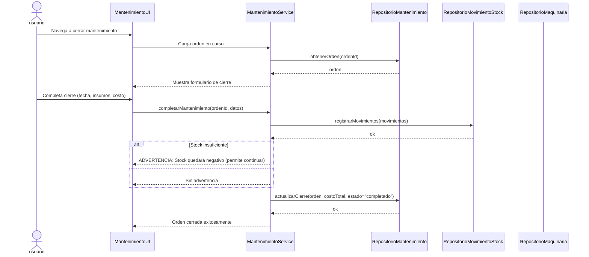
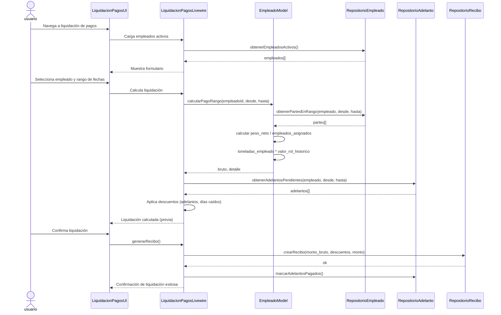
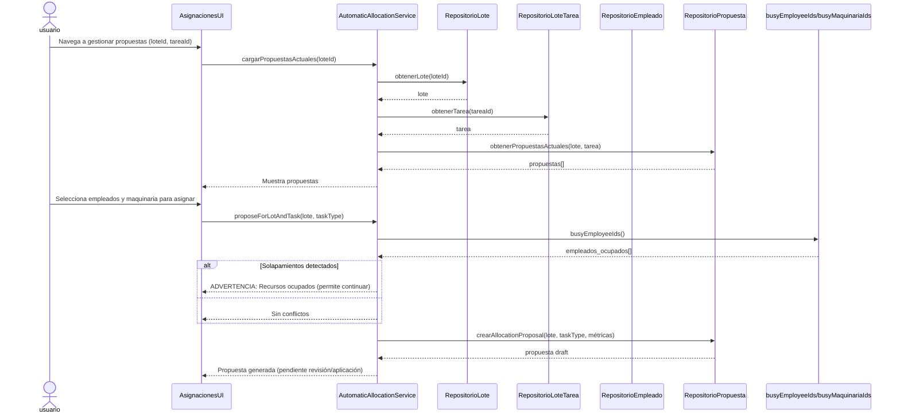

# Gestion Rennova
## Fase II - Analisis del Modelo Conceptual
- Plan de Iteracion: [Codificacion]

**ESTADO:** Documento alineado con implementación actual del código.  
**Correcciones aplicadas:** Mayo 2026 - Validación contra ClimaOperativoService/ClimaDecisionService, MantenimientoService, AutomaticAllocationService, Empleado::calcularPagoRango y app/Http/Livewire/*.

## Indice
- Modelo Conceptual
- Lista de conceptos idoneos
- Relaciones entre los conceptos
- Comportamiento del sistema
- Especificaciones Detalladas de Casos de Uso
- Diagramas de Estados
- Glosario
- Notas sobre Desalineamientos GRASP vs Implementación

## Modelo Conceptual

### Lista de conceptos idoneos
Es la lista de conceptos obtenidos de la lista de categorias de conceptos adecuados para incluirlos en la aplicacion, la misma esta sujeta a la restriccion de los requisitos.

**Lote**
- Simbolo: LOT
- Intencion: Representar la unidad de produccion forestal, con ubicacion, especie, superficie y estado.
- Extension: Incluye datos de propietario, condicion de compra, estado (activo, cerrado, baja), relacion con cargas y partes diarias.

**Carga**
- Simbolo: CAR
- Intencion: Representar el transporte de madera desde un lote a un destino.
- Extension: Incluye ticket, peso bruto, tara, peso neto, categoria de madera, chofer y destino.

**Categoria de Madera**
- Simbolo: CAT
- Intencion: Clasificar la madera segun caracteristicas biologicas.
- Extension: Asociada a cargas y reportes de produccion.

**Insumo**
- Simbolo: INS
- Intencion: Representar los materiales necesarios para la operacion.
- Extension: Incluye nombre, descripcion, unidad de medida, proveedor asociado, stock calculado dinamicamente, consumo por maquinaria y consumo por lote.

**Maquinaria/Equipo**
- Simbolo: MAQ
- Intencion: Representar los equipos productivos utilizados en la extraccion.
- Extension: Incluye identificador, tipo, estado operativo, Es_Alquilada, Fecha_Inicio_Actividades, relacion con partes diarios, costos de alquiler y mantenimientos.

**Mantenimiento**
- Simbolo: MAN
- Intencion: Representar las operaciones de mantenimiento de maquinaria.
- Extension: Incluye ordenes programadas, preventivas o correctivas, con fechas, costos y estado.

**Empleado**
- Simbolo: EMP
- Intencion: Representar al personal de la empresa (operativo o administrativo).
- Extension: Incluye datos personales, historial laboral, rol laboral, jornales, productividad, sueldos y adelantos.

**Chofer**
- Simbolo: CHO
- Intencion: Representar a la persona ajena a la empresa encargada del transporte de cargas.
- Extension: Asociado a clientes y cargas. Incluye datos personales y laborales.

**Cliente**
- Simbolo: CLI
- Intencion: Representar a quienes compran productos.
- Extension: Incluye razon social, CUIT, direccion y contacto.

**Proveedor**
- Simbolo: PRO
- Intencion: Representar a quienes suministran insumos o servicios.
- Extension: Incluye razon social, CUIT, direccion y contacto.

**Recibo**
- Simbolo: REC
- Intencion: Documento de liquidacion generado para empleados o transacciones.
- Extension: Incluye monto, fecha, empleado/cliente, detalle de conceptos.

**Adelanto**
- Simbolo: ADE
- Intencion: Registrar pagos parciales realizados a empleados.
- Extension: Asociados a empleados y descontados en liquidaciones posteriores.

**Rol**
- Simbolo: ROL
- Intencion: Definir niveles de acceso al sistema.
- Extension: Asociados a usuarios para restringir o habilitar acciones.

**Auditoria**
- Simbolo: AUD
- Intencion: Registrar todas las acciones relevantes del sistema.
- Extension: Incluye usuario, fecha/hora, accion, entidad afectada, resultado.

**Reporte/Indicador (KPI)**
- Simbolo: REP
- Intencion: Representar salidas analiticas para gestion estrategica.
- Extension: Incluye informes financieros, de produccion, productividad y comparativas planificadas vs. reales.

**Venta**
- Simbolo: VEN
- Intencion: Transaccion comercial de cargas hacia clientes.
- Extension: Incluye cliente, cargas asociadas, fecha, precio, condiciones de pago y estado.

**Parte diario**
- Simbolo: PD
- Intencion: Registro de trabajo operativo de cada jornada.
- Extension: Incluye lotes intervenidos, toneladas extraidas, empleados utilizados, maquinaria utilizada, Es_Dia_Caido, observaciones.

**Usuario**
- Simbolo: USU
- Intencion: Representar a las personas que acceden al sistema.
- Extension: Incluye identificador, nombre, email, roles y permisos, estado de cuenta. Modelo principal de autenticacion.

**Historico_Costos_Maquinaria**
- Simbolo: HCM
- Intencion: Registrar los costos historicos de alquiler por tonelada para maquinas alquiladas.
- Extension: Incluye identificador, maquina asociada, costo por tonelada, fechas de vigencia.

**Rol_Laboral**
- Simbolo: ROL_LAB
- Intencion: Definir los roles laborales de los empleados (ej. Motosierrista, Tractorista) para gestionar pagos.
- Extension: Incluye nombre del rol, relacion con empleados, costos historicos.

**RolValorHistorico**
- Simbolo: RVH
- Intencion: Definir los valores historicos de pago por cada rol laboral.
- Extension: Incluye relacion con Rol_Laboral y montos historicos por periodo.

**Movimiento_Stock**
- Simbolo: MST
- Intencion: Registrar entradas (compras) y salidas (consumo) de insumos para gestionar el stock.
- Extension: Incluye identificador, insumo, tipo de movimiento, cantidad, precios, proveedor, fecha, usuario, mantenimiento y lote.

**Lote_Tarea**
- Simbolo: LTA
- Intencion: Representar la planificacion de tareas por lote (tipo de tarea y superficie en ha).
- Extension: Incluye id_lote, tipo_tarea, superficie_afectada_ha, estado y observaciones.

**Lote_Inventario**
- Simbolo: LIN
- Intencion: Representar lotes FIFO de stock de insumos.
- Extension: Incluye insumo, proveedor, cantidad, cantidad_disponible, precio_unitario, fecha_compra y estado de agotado.

**Notificacion_Sistema**
- Simbolo: NOT
- Intencion: Registrar notificaciones internas (por ejemplo, mantenimientos).
- Extension: Incluye usuario destino, mensaje, estado de lectura/accion y fecha limite.

**Allocation_Proposal (Propuesta_Asignacion)**
- Simbolo: AP
- Intencion: Sugerir asignacion de recursos por lote o tarea en base a historico.
- Extension: Incluye lote, tarea, empleados, maquinarias, insumos propuestos, estado y metricas.

**Categoria_Cliente_Precio**
- Simbolo: CCP
- Intencion: Definir precios por cliente y categoria de madera.
- Extension: Incluye cliente, categoria_madera, precio_unitario y vigencia.

**Tipo_Maquinaria**
- Simbolo: TMAQ
- Intencion: Clasificar maquinaria y definir umbrales/precios de alquiler.

**Tipo_Mantenimiento**
- Simbolo: TMAN
- Intencion: Clasificar mantenimientos (preventivo/correctivo).

**Unidad_Medida**
- Simbolo: UM
- Intencion: Definir unidades de medida para insumos.

**Mantenimiento_Insumo**
- Simbolo: MIN
- Intencion: Vincular mantenimiento con insumos utilizados y su salida de stock.

**Maquinaria_Parte_Diario**
- Simbolo: MPD
- Intencion: Vincular maquinaria utilizada con partes diarios.

**Asignacion**
- Simbolo: ASN
- Intencion: Vincular empleados con partes diarios (y cargas).

**Configuracion_Sistema**
- Simbolo: CFG
- Intencion: Parametros generales del sistema.
- Extension: Incluye configuracion de horarios y reglas del sistema.

**Configuracion_Notificaciones_Mantenimiento**
- Simbolo: CNM
- Intencion: Configurar usuarios y reglas para notificaciones de mantenimiento.
- Extension: Incluye usuario, canal, preferencias y vigencia.

### Relaciones entre los conceptos

- Carga se asocia con Lote: cada carga referencia un lote de origen (FK ID_Lote).
- Categoria de Madera clasifica Carga: cada carga referencia una categoria (FK ID_Categoria_Madera).
- Chofer se asocia con Carga: cada carga tiene un chofer asignado.
- Insumo se asocia con Movimiento_Stock: las entradas y salidas determinan el stock (FK ID_Insumo).
- Proveedor abastece Insumo: proveedores aparecen en movimientos de entrada.
- Maquinaria se asocia con Parte_Diario, Mantenimiento y Historico_Costos_Maquinaria.
- Mantenimiento se aplica a Maquinaria: cada orden corresponde a una maquina.
- Empleado se asocia con Rol_Laboral, Parte_Diario (via pivotes `parte_diario_empleado` y `carga_empleado`), Adelanto y Recibo.
- Adelanto se asocia con Empleado.
- Recibo se asocia con Empleado.
- Venta se asocia con Carga: una venta agrupa una o mas cargas.
- Cliente es parte de una Venta.
- Usuario se asocia con Rol y Auditoria.
- Rol se compone de Permisos.
- Auditoria se asocia con Usuario.
- Reporte se genera con datos de Categoria de Madera, Carga, Lote, Empleado y Maquinaria.
- Parte_Diario vincula Lote, Empleado y Maquinaria.
- Historico_Costos_Maquinaria registra costos para Maquinaria.
- Rol_Laboral define roles para Empleado y costos en RolValorHistorico.
- RolValorHistorico registra costos historicos de Rol_Laboral.
- Movimiento_Stock puede asociarse a Mantenimiento o Lote y registra Usuario.
- Mantenimiento_Insumo vincula Mantenimiento e Insumo y genera Movimiento_Stock.
- Maquinaria_Parte_Diario vincula Maquinaria a Parte_Diario.
- En la implementación actual, la vinculación Empleado ↔ Parte_Diario se materializa principalmente en pivotes (`parte_diario_empleado` y `carga_empleado`).
- Lote se asocia con Lote_Tarea.
- Categoria_Cliente_Precio vincula Cliente y Categoria de Madera.
- Notificacion_Sistema se asocia con Usuario y Mantenimiento.
- Lote_Inventario se asocia con Insumo y Proveedor.
- Allocation_Proposal se asocia con Lote y Lote_Tarea y propone recursos.

## Comportamiento del sistema

### Registrar Parte Diario (UC-61)

**Nombre:** registrarParteDiario(idLote entero, fecha fecha, esDiaCaido booleano, observaciones texto).

**Responsabilidades:**

**Tipo:** Sistema

**Referencias cruzadas:** UC-61 en DIAGRAMAS_SECUENCIA_DISENO.md; Implementación: app/Http/Livewire/PartesDiarios.php + app/Services/ClimaOperativoService.php

**Notas:**

**Excepciones:**

**Salida:**

**Precondiciones:**

**Postcondiciones:**

### Gestionar Lotes y Cargas

**Nombre:** gestionarLotesYCargas(idLote entero, datos lote, datos carga)

**Responsabilidades:**
- Registrar, modificar, consultar y dar de baja lotes de producción.
- Registrar cargas asociadas al lote, con chofer, destino y pesajes.
- Mantener la trazabilidad operativa entre lote, carga y producción.

**Tipo:** Sistema

**Referencias cruzadas:** app/Http/Livewire/Lotes.php; app/Http/Livewire/Cargas.php

**Notas:**
- El lote funciona como entidad raíz del flujo productivo.
- Las cargas dependen de un lote activo y alimentan ventas, reportes y partes diarios.

**Excepciones:**
- Si el lote no existe o la carga no cumple validaciones, la operación se rechaza.

**Salida:**
- Confirmación de lote o carga creada, actualizada o dada de baja.

**Precondiciones:**
- El usuario tiene permisos sobre producción.

**Postcondiciones:**
- Se persisten los cambios del lote y/o la carga.

---

### Gestionar Movimientos de Stock

**Nombre:** registrarMovimientoStock(idInsumo entero, tipoMovimiento texto, cantidad decimal, motivo texto)

**Responsabilidades:**
- Registrar entradas por abastecimiento y salidas por consumo.
- Actualizar disponibilidad de stock y dejar trazabilidad por lote de inventario.
- Aplicar valorización FIFO cuando el movimiento lo requiere.

**Tipo:** Sistema

**Referencias cruzadas:** app/Http/Livewire/GestionStock.php; app/Models/MovimientoStock.php; app/Models/LoteInventario.php

**Notas:**
- El stock se calcula por movimientos, no por edición manual directa.
- Las salidas pueden originarse desde producción o mantenimiento.

**Excepciones:**
- Si el insumo no existe o la cantidad es inválida, el movimiento se rechaza.

**Salida:**
- Confirmación del movimiento y del stock resultante.

**Precondiciones:**
- El insumo existe y el usuario tiene permisos de stock.

**Postcondiciones:**
- Se registra el movimiento y se actualiza la disponibilidad.

---

### Programar Mantenimiento

**Nombre:** programarMantenimiento(idMaquinaria entero, fechaProgramada fecha, tipoMantenimiento texto, observaciones texto)

**Responsabilidades:**
- Crear y organizar órdenes de mantenimiento preventivas o correctivas.
- Asociar maquinaria, tipo de mantenimiento y fecha de programación.
- Dejar la orden lista para su posterior cierre.

**Tipo:** Sistema

**Referencias cruzadas:** app/Http/Livewire/ProgramarMantenimiento.php; app/Http/Livewire/GestionMantenimientos.php; app/Services/MantenimientoService.php

**Notas:**
- La programación es el punto de entrada del ciclo de mantenimiento.
- El consumo de insumos y el cierre se resuelven en el flujo de completar mantenimiento.

**Excepciones:**
- Si la maquinaria no existe o la fecha es inválida, se rechaza la orden.

**Salida:**
- Confirmación de orden programada.

**Precondiciones:**
- La maquinaria existe y puede recibir mantenimiento.

**Postcondiciones:**
- Se crea la orden y queda disponible para seguimiento.

---

### Generar Informes Generales

**Nombre:** generarInformeGeneral(idLote entero, fechaDesde fecha, fechaHasta fecha, tipoInforme texto)

**Responsabilidades:**
- Consolidar información operativa, productiva y financiera.
- Calcular métricas dinámicas a partir de partes diarios, cargas, liquidaciones y costos.
- Exportar resultados en formatos de reporte.

**Tipo:** Sistema

**Referencias cruzadas:** app/Http/Controllers/ReporteController.php; app/Services/ForestalStatsService.php

**Notas:**
- El sistema calcula los reportes a demanda; no persiste reportes estáticos.
- Los KPIs se derivan de transacciones reales del dominio.

**Excepciones:**
- Si el rango es inválido o no hay datos, se informa el estado correspondiente.

**Salida:**
- Resumen estadístico o archivo de reporte generado.

**Precondiciones:**
- Existen permisos de consulta sobre reportes.

**Postcondiciones:**
- Se devuelven métricas y, si aplica, el documento exportado.

---

### Gestionar Usuarios, Roles y Permisos

**Nombre:** gestionarUsuario(idUsuario entero, datos usuario) / gestionarPermisos(idRol entero, datos permisos)

**Responsabilidades:**
- Administrar alta, baja, modificación y consulta de usuarios.
- Asignar roles y permisos para control de acceso.
- Mantener trazabilidad de los cambios sobre seguridad funcional.

**Tipo:** Sistema

**Referencias cruzadas:** app/Http/Livewire/Usuarios.php; app/Http/Livewire/RolesPermisos.php; app/Http/Controllers/UsuarioController.php

**Notas:**
- `Usuario` es el modelo principal de autenticación del sistema.
- Los roles y permisos se configuran como soporte transversal de todos los demás flujos.

**Excepciones:**
- Si faltan permisos o hay conflicto de asignación, la operación se rechaza.

**Salida:**
- Confirmación de cambios de usuario, rol o permiso.

**Precondiciones:**
- El administrador tiene permisos de seguridad funcional.

**Postcondiciones:**
- Se actualiza el acceso del usuario o la matriz de permisos.

---

### Configurar Notificaciones de Mantenimiento y Catálogos Maestros

**Nombre:** configurarNotificacionesMantenimiento(idUsuario entero, canal texto, preferencia texto, vigencia fecha) / gestionarCatalogosMaestros()

**Responsabilidades:**
- Definir usuarios suscriptos a alertas de mantenimiento.
- Administrar canales, preferencias y vigencia de las notificaciones.
- Mantener catálogos maestros y listas de precios de soporte administrativo.

**Tipo:** Sistema

**Referencias cruzadas:** app/Http/Livewire/ConfiguracionNotificacionesMantenimiento.php; app/Http/Livewire/NotificacionesSistema.php; app/Http/Livewire/ListaPrecios.php; app/Http/Livewire/ConfiguracionInsumosKit.php

**Notas:**
- La configuración soporta los avisos vinculados a órdenes y eventos operativos.
- Los catálogos complementan la parametrización comercial y de abastecimiento.

**Excepciones:**
- Si el usuario no existe o la preferencia es inválida, se rechaza la configuración.

**Salida:**
- Confirmación de suscripción, actualización de preferencias o catálogo.

**Precondiciones:**
- Existe un usuario válido o una tabla maestra habilitada.

**Postcondiciones:**
- Se actualiza la configuración de notificaciones o catálogos.

---

### Cerrar Mantenimiento

**Nombre:** completarMantenimiento(idMantenimiento entero, insumos arreglo, costoManoObra decimal)

**Responsabilidades:**
- Cerrar orden de mantenimiento completada usando MantenimientoService::completarMantenimiento().
- Registrar consumo de insumos y permitir **stock negativo** (registra movimiento aunque falte stock).
- Calcular costo total final (mano de obra + subtotal de insumos).
- Marcar estado como "completado" y guardar snapshot de toneladas acumuladas de la maquinaria.

**Tipo:** Sistema

**Referencias cruzadas:** app/Services/MantenimientoService.php :: MantenimientoService::completarMantenimiento()

**Notas:**
- **POLÍTICA ACTUAL:** El sistema PERMITE que el stock quede negativo después de cerrar mantenimiento (registra movimiento y continúa sin bloquear).
- El costo de insumos se calcula como cantidad_utilizada x costo_unitario (del request o del insumo), sin invocar FIFO.
- Si hay insumos pendientes: se pueden registrar durante el cierre (no bloquea antes).
- La fecha de cierre se fija con fecha actual (now), no se recibe como parámetro.

**Excepciones:**
- Si el mantenimiento no existe o un insumo no existe, la operación falla.
- **ADVERTENCIA (no error):** Si stock quedaría negativo, mostrar aviso pero permitir cierre: "Stock de [insumo] será negativo. Se registrará la salida."

**Salida:**
- Confirmación de cierre exitoso con costo total final y estado "completado".

**Precondiciones:**
- El mantenimiento existe.
- Los insumos enviados son válidos.

**Postcondiciones:**
- Estado cambia a "completado".
- Costo total se calcula (mano_obra + insumos).
- **Riesgo documentado:** Stock puede quedar negativo.

---

### Liquidar Pagos

**Nombre:** generarRecibo(idEmpleado entero, fecha_inicio fecha, fecha_fin fecha, monto_bruto decimal, descuentos decimal, observaciones texto)

**Responsabilidades:**
- Calcular liquidación para un empleado y rango de fechas usando Empleado::calcularPagoRango().
- Aplicar descuentos por adelantos pendientes del período.
- Generar registro en recibos con monto_bruto, descuentos y monto (neto).
- Marcar adelantos pendientes como pagados al emitir el recibo.

**Tipo:** Sistema

**Referencias cruzadas:** app/Http/Livewire/LiquidacionPagos.php; app/Models/Empleado.php::calcularPagoRango()

**Notas:**
- **Importante:** El modelo `Empleado` es el experto en cálculo, NO un servicio separado `ServicioLiquidacion`.
- Método clave: `Empleado::calcularPagoRango($desde, $hasta)` — calcula jornales por toneladas por empleado.
- Fórmula: peso_neto ÷ (empleados asignados) = toneladas/empleado × valor_rol = monto.
- Cálculo incluye: toneladas asignadas, rol laboral (HistoricoRolLaboral) y días caídos; los adelantos se descuentan en el componente.
- En implementación actual no existe operación `liquidarPagos()` con `tipo_pago`, `referencia_pago`, `fecha_pago` ni estado "liquidado" en `recibos`.
- Existe además `liquidarTodos()` para generar recibos masivos del período.

**Excepciones:**
- Si el empleado no existe, se informa error.
- Si no hay empleados activos en modo masivo (`liquidarTodos()`), se informa error.
- Si fallan validaciones de fechas o montos, se rechaza la operación.

**Salida:**
- Confirmación con número de recibo generado y montos liquidados.

**Precondiciones:**
- Empleado válido (modo individual) o existencia de empleados activos (modo masivo).
- Rango de fechas válido.

**Postcondiciones:**
- Se crea registro en `recibos` con `fecha_emision`, `monto_bruto`, `descuentos` y `monto`.
- Los adelantos pendientes en rango pasan a estado `pagado`.

---

### Gestionar Propuestas de Asignación

**Nombre:** generarPropuestaAsignacion(idLote entero, tipoTarea enum) / generarPropuestaParaTarea(idLoteTarea entero)

**Responsabilidades:**
- Generar propuestas automáticas usando `AutomaticAllocationService::proposeForLotAndTask()` o `proposeForLoteTarea()`.
- Considerar histórico de desempeño (últimas 24 meses, al menos 5 muestras) y disponibilidad.
- Crear registro de `AllocationProposal` con estado inicial `draft`.

**Tipo:** Sistema

**Referencias cruzadas:** app/Services/AutomaticAllocationService.php (métodos: proposeForLotAndTask, proposeForLoteTarea, populateProposalCandidates, busyEmployeeIds, busyMaquinariaIds)

**Notas:**
- **Propuestas basadas en:** histórico de productividad por tarea/especie y filtros de disponibilidad actuales.
- Parámetros internos: minSamples=5, histórico since=24 meses, fallback rates si no hay histórico.
- **NO existe clase `ValidadorAsignaciones` formalizada.** La validación de no-solapamiento se hace mediante:
  * `busyEmployeeIds()` / `busyMaquinariaIds()` — filtran recursos en lotes con estado `en_proceso`
  * **RIESGO:** no hay control explícito por rango de fechas de la tarea en estos métodos.
- Si hay poco histórico (< minSamples=5), usa tarifas fallback.
- Además de la cabecera, se persisten candidatos en tablas hijas de empleados, maquinarias e insumos.

**Excepciones:**
- Si `LoteTarea` no tiene lote asociado, se lanza excepción.
- Si `tipo_tarea` de la tarea no corresponde al enum esperado, se lanza excepción.

**Salida:**
- Propuesta con empleados y maquinaria sugeridos, métricas de productividad esperada (toneladas/persona/día).

**Precondiciones:**
- Lote o lote_tarea válidos según el método invocado.

**Postcondiciones:**
- Se crea `AllocationProposal` en estado `draft`.
- Se crean candidatos relacionados en `allocation_proposal_employees`, `allocation_proposal_maquinarias` y `allocation_proposal_insumos`.

---

## Diagramas de Estados

### Estado - Lote
[Estado: Activo → EnProceso → Completado; o Activo → Inactivo → Cerrado]

### Estado - Mantenimiento
[Estado: Programado → EnCurso → Completado; o Vencido/Cancelado → Terminal]

### Estado - LoteTarea
[Estado: Planificada → Iniciada → EnProgreso → Completada; o Cancelada → Terminal]

---

## Diagramas de Secuencia del Sistema

### UC-61: Registrar Parte Diario

**Notas implementación:**
- Validación climática en `PartesDiarios` via `ClimaOperativoService::obtenerEstadoDia()` con posible bloqueo por override
- Umbrales climáticos: UMBRAL_LLUVIA=10mm, UMBRAL_NUBOSIDAD=60%, viento>15km/h, ET0>4mm
- FIFO calculado mediante función SQL `calcular_costo_fifo()`, NO clase separada
- Ubicación: app/Http/Livewire/PartesDiarios.php

---

### UC-62: Cerrar Mantenimiento

**Notas implementación:**
- Permite stock **negativo** después de cierre (registra movimiento sin bloquear)
- El costo se calcula por subtotal (cantidad x costo_unitario), sin invocar FIFO en este servicio
- Ubicación: app/Services/MantenimientoService.php::completarMantenimiento()

---

### UC-59: Liquidar Pagos

**Notas implementación:**
- **Experto en cálculo:** `Empleado::calcularPagoRango()` (NO un ServicioLiquidacion separado)
- Fórmula: peso_neto ÷ empleados_asignados = toneladas/empleado × valor_rol_historico
- UI Livewire maneja cálculo, descuentos por adelantos y emisión del recibo
- No existe `tipo_pago`/`referencia_pago` ni estado "liquidado" en `recibos` en la implementación actual
- Ubicación: app/Http/Livewire/LiquidacionPagos.php; app/Models/Empleado.php

---

### UC-66: Gestionar Propuestas de Asignación

**Notas implementación:**
- Parámetros internos: minSamples=5, histórico since=24 meses, fallback rates si no hay histórico
- Validación de disponibilidad via `busyEmployeeIds()` y `busyMaquinariaIds()` (filtro por lotes `en_proceso`)
- **RIESGO:** No hay validación explícita por rango de fechas en esos métodos
- Ubicación: app/Services/AutomaticAllocationService.php

---

## Glosario

Lote: unidad productiva forestal con superficie, ubicacion, especie y estado.
Lote_Tarea: planificacion por lote (tipo de tarea, superficie en ha y estado).
Parte Diario: registro operativo diario con empleados, maquinaria, cargas e insumos.
Carga: transporte de madera desde un lote hacia un destino (bruto, tara y neto).
Categoria de Madera: clasificacion usada en cargas y precios.
Maquinaria: equipo productivo registrado para explotacion y mantenimiento.
Mantenimiento: orden de servicio (programado, en curso, vencido o completado).
Insumo: material consumible; su stock se calcula por movimientos.
Movimiento_Stock: entrada o salida de insumos con referencia operativa.
Lote_Inventario: lote FIFO de stock con cantidad disponible y costo.
Empleado: personal de la empresa vinculado a roles laborales y liquidaciones.
Chofer: transportista externo asociado a cargas.
Cliente: comprador de productos/servicios.
Proveedor: suministrador de insumos/servicios.
Venta: transaccion comercial asociada a cargas y cliente.
Usuario: identidad de acceso al sistema (modelo principal de autenticacion).
Rol/Permiso: control de acceso por funciones y modulos.
KPI: indicador de gestion generado a partir de datos operativos.
Notificacion de mantenimiento: alerta interna sobre ordenes programadas, vencidas o pendientes.
Configuracion del sistema: parametros globales de umbrales, horarios y reglas.
Catalogo maestro: tablas de referencia (tipos, unidades, listas de precios).
ClimaDecisionService: servicio que evalúa condiciones climáticas (precipitación, nubosidad, viento, ET0) usando API externa para recomendar (no bloquear) operaciones.
MantenimientoService: servicio que maneja ciclo de vida de órdenes. Permite stock negativo en cierre.
AutomaticAllocationService: servicio que genera propuestas de asignación basadas en histórico. No tiene validador centralizado de solapamientos.
Empleado::calcularPagoRango(): método experto en cálculo de liquidaciones. Distribuye toneladas entre empleados asignados.

### NOTA IMPORTANTE: DESALINEAMIENTOS GRASP vs IMPLEMENTACIÓN ACTUAL

**ValidadorParteClimatico:**
- Diseño esperado: Clase que valida y bloquea registros por clima.
- Implementación actual: para partes diarios se usa ClimaOperativoService (con override bloqueante en día no operativo); además existe ClimaDecisionService para sincronización/analítica climática.

**CalculadorInventarioFIFO:**
- Diseño esperado: Clase que centraliza cálculo FIFO.
- Implementación actual: Función SQL `calcular_costo_fifo()`. Opaco en capa aplicación.

**ServicioLiquidacion + CalculadorJornalProductividad:**
- Diseño esperado: Servicios separados para liquidación y jornales.
- Implementación actual: Lógica en modelo Empleado + UI Livewire. No hay servicio centralizado.

**ValidadorAsignaciones:**
- Diseño esperado: Clase que previene solapamientos.
- Implementación actual: Métodos en AutomaticAllocationService. NO formalizado. RIESGO: brechas en solapamientos complejos.
