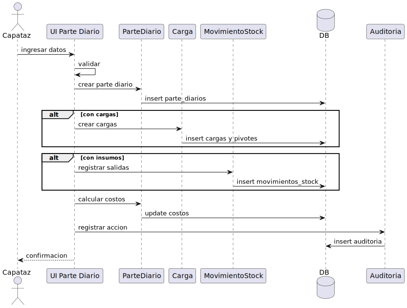
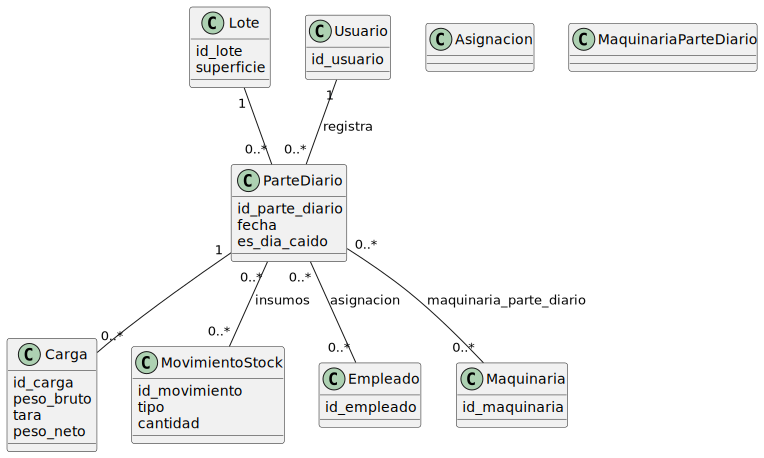
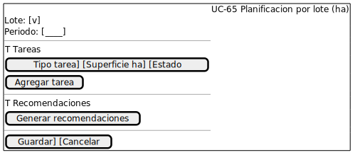
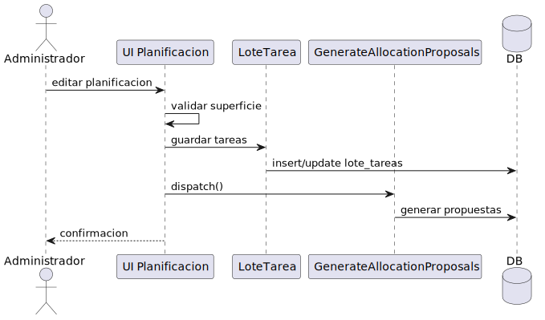
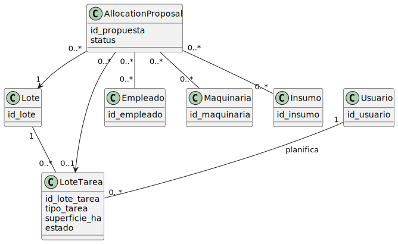
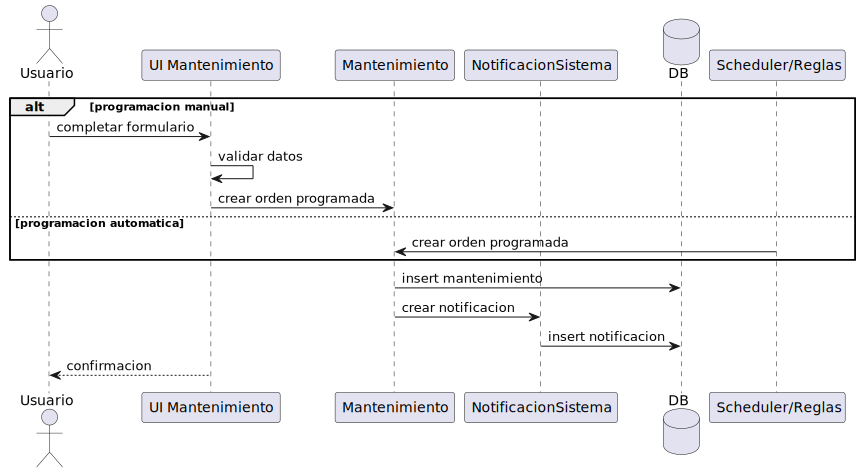
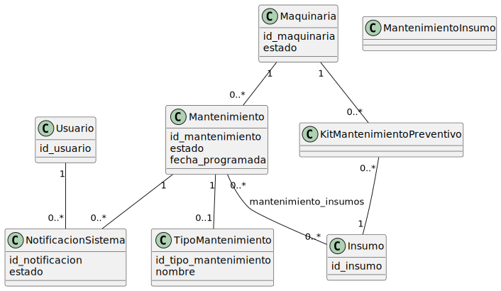

Diseno - Fase de Diseno (UP)

Casos de Usos Reales

UC-61 Cargar Parte Diario
Interface Grafica para el caso de uso

Diagrama de Interaccion

Diagrama de Clase

UC-65 Planificacion de tareas por lote (ha)
Interface Grafica para el caso de uso

Diagrama de Interaccion

Diagrama de Clase

UC-63 Programar mantenimiento
Interface Grafica para el caso de uso

Diagrama de Interaccion

Diagrama de Clase

