# Gestion Rennova
## Documento de Requisitos del Sistema
- Iteracion: 1
- Version: 00.01
- Fecha: 01/09/2025
- Realizado por: Rapp Luis
- Realizado para: Rennova
- Cliente: Rapp Marcelo

## Lista de Cambios
| Nro | Fecha | Descripcion | Autor |
| --- | --- | --- | --- |
| 0 | Dd/mm/aaaa | Version ##,## | Autor |
| 1 | Dd/mm/aaaa | Descripcion Cambio | Autor |

## Indice de Figuras
- Figura 1 - Diagrama de Subsistemas
- Figura 2 - Diagrama de Componentes
- Figura 3 - Diagrama de Componentes (Detalle por subsistemas)
- Figura 4 - Diagrama de Despliegue (Produccion)
- Figura 5 - Diagrama de Despliegue (Desarrollo)
- Figura 6 - Diagrama Caso de Uso del Sistema (Resumen)
- Figura 7 - Diagrama Caso Usos Subsistema Produccion
- Figura 8 - Diagrama Caso Usos Subsistema Maquinaria y Equipos
- Figura 9 - Diagrama Caso Usos Subsistema Recursos Humanos
- Figura 10 - Diagrama Caso Usos Subsistema Finanzas y Costos
- Figura 11 - Diagrama Caso Usos Subsistema Gestion Administrativa
- Figura 12 - Fronteras del Sistema
- Figura 13 - Diagrama de Secuencia - Registrar Parte Diario
- Figura 14 - Diagrama de Secuencia - Planificar tareas por lote (ha)
- Figura 15 - Diagrama de Secuencia - Programar mantenimiento

## Presentacion General
Renova enfrenta la necesidad de crecer en el mercado maderero argentino, en un
contexto donde la industria busca mejorar la eficiencia mediante el control sobre sus
operaciones. Actualmente, la empresa carece de un sistema unificado para gestionar y
auditar sus procesos forestales, logisticos y financieros.
Para responder a estas limitaciones, se desarrollara un sistema de software que
integre las distintas areas que conforman la empresa, de esta manera se busca que
cubra control sobre aspectos operativos, gestion de personal, estadisticas financieras,
metricas financieras derivadas (ingresos, egresos y flujo de caja) y otros conceptos administrativos, para poder lograr centralizar la
informacion de manera ordenada y util.

## Participantes del Proyecto

Debe contener una lista con todos los participantes en el proyecto:
Desarrolladores: Rapp Luis
Clientes: Rapp Marcelo

## Objetivos del Sistema

Se debe hacer una lista con los objetivos que se esperan alcanzar con el software a desarrollar.

### OBJ-01 Centralizacion de registros
**Descripcion:** Centralizar los registros operativos y administrativos en un unico sistema, eliminando la dispersion actual en planillas manuales y mejorando la trazabilidad de la informacion.
**Estabilidad:** Alta
**Comentarios:** ninguno

### OBJ-02 Implementacion del Subsistema de Produccion
**Descripcion:** Incorporar funcionalidades para registrar lotes, cargas, categorias de producto y la planificacion de tareas por lote (ha), asegurando trazabilidad.
**Estabilidad:** Alta
**Comentarios:** ninguno

### OBJ-03 Implementacion del Subsistema de Maquinaria y Equipos
**Descripcion:** Desarrollar el registro de maquinas y equipos, calculo de costos de alquiler y gestion de mantenimientos preventivos y correctivos.
**Estabilidad:** Alta
**Comentarios:** ninguno

### OBJ-04 Implementacion del Subsistema de Recursos Humanos
**Descripcion:** Automatizar la liquidacion de pagos al personal segun productividad y dias trabajados, registrar adelantos y generar recibos de liquidacion.
**Estabilidad:** Alta
**Comentarios:** ninguno

### OBJ-05 Implementacion del Subsistema Financiero y de Costos
**Descripcion:** Integrar ventas y costos operativos para derivar ingresos, egresos y flujo de caja, e incorporar reportes e indicadores de rentabilidad.
**Estabilidad:** Alta
**Comentarios:** ninguno

### OBJ-06 Implementacion del Subsistema de Gestion Administrativa
**Descripcion:** Incorporar la gestion de clientes, proveedores y stock de insumos, asegurando la disponibilidad de materiales para la produccion.
**Estabilidad:** Alta
**Comentarios:** ninguno

### OBJ-07 Seguridad y auditoria del sistema
**Descripcion:** Configurar usuarios, roles y permisos, incorporando un registro de auditoria de acciones para garantizar trazabilidad y control de los procesos.
**Estabilidad:** Alta
**Comentarios:** ninguno

## Subsistemas del Proyecto

### Diagrama de Subsistemas

Figura 1 - Diagrama de Subsistemas
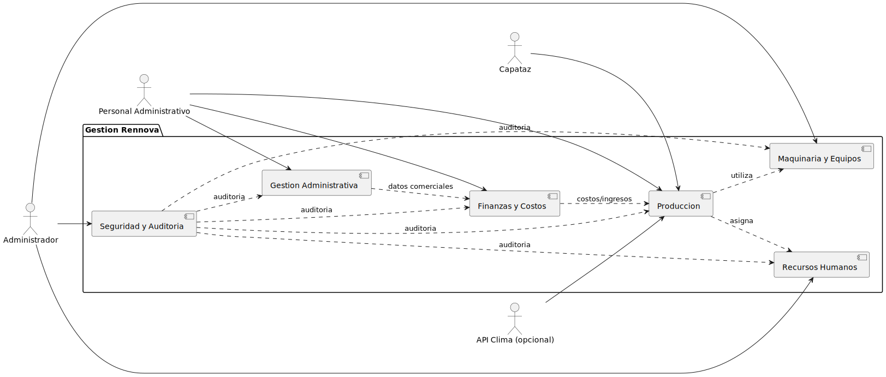

### Descripcion de Subsistemas

1. Subsistema de Produccion
Este subsistema se encarga de administrar y controlar todas las operaciones
relacionadas con la actividad forestal. Integra el registro de lotes de origen,
cargas transportadas y destino final de cada envio. Ademas, permite planificar
tareas por lote (tipo y superficie en ha) en un periodo determinado, asegurar la
trazabilidad de la produccion y validar las partes diarias de trabajo.
2. Subsistema de Maquinaria y Equipos
Su proposito es gestionar de manera integral los recursos mecanicos de la
empresa. Permite registrar cada maquina y equipo, controlando su utilizacion en
el proceso productivo y asociandose a los lotes de extraccion correspondientes.
Incorpora el calculo automatico del costo de alquiler en funcion de los
volumenes extraidos. Incluye funcionalidades para programar y cerrar ordenes
de mantenimiento preventivo y correctivo, favoreciendo el correcto
funcionamiento de la flota.
3. Subsistema de Recursos Humanos
Este subsistema centraliza la gestion del personal operativo y administrativo de
la empresa. Contempla la administracion de empleados, incluyendo datos
personales, historial laboral y asignacion de tareas. Automatiza el calculo de
liquidaciones en base a dias trabajados, tipo de tarea realizada, productividad y
posibles adelantos registrados. Tambien permite generar recibos y mantener un
historial detallado de pagos.
4. Subsistema Financiero y de Costos
Su funcion es consolidar y organizar la informacion economica de la empresa.
Integra el registro de ingresos, egresos y costos operativos, y calcula el flujo de caja como metrica derivada. El
subsistema procesa los datos registrados en las operaciones y los transforma en
informes e indicadores estrategicos (KPIs) que permiten analizar la rentabilidad y
eficiencia de las actividades. De esta manera, brinda soporte para la toma de
decisiones en materia de control de gastos, evaluacion de inversiones y
planificacion de recursos financieros.
5. Subsistema de Gestion Administrativa
Este subsistema articula los procesos de soporte administrativo que
complementan la operacion forestal. Incluye la gestion de clientes, proveedores,
asegurando un registro ordenado de las relaciones comerciales de la empresa.

Tambien contempla el control de insumos y stock, garantizando la
disponibilidad de materiales necesarios para la produccion y facilitando
auditorias de inventario. Ademas, incorpora mecanismos de seguridad mediante
la administracion de usuarios, roles y permisos, junto con un registro de
auditoria de acciones (log del sistema), que otorgan trazabilidad y control en
cada operacion realizada.

## Arquitectura General

**Descripcion:** general: La solucion se organiza en una interfaz web, servicios de aplicacion y capa de datos, con integracion a servicios externos (clima y correo) y ejecucion de tareas programadas.

Figura 2 - Diagrama de Componentes
Descripcion: muestra los componentes principales del sistema y sus dependencias (UI, servicios, ORM, base de datos, notificaciones y API de clima).
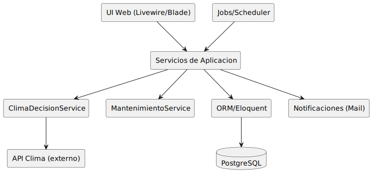

Figura 3 - Diagrama de Componentes (Detalle por subsistemas)
Descripcion: detalla los modulos por subsistema y sus integraciones con reportes/KPIs, notificaciones, scheduler y base de datos.
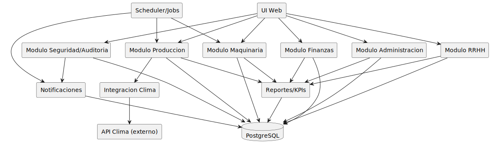

Figura 4 - Diagrama de Despliegue (Produccion)
Descripcion: despliegue recomendado para produccion con servidor de aplicacion, worker/scheduler, base de datos y servicios externos.
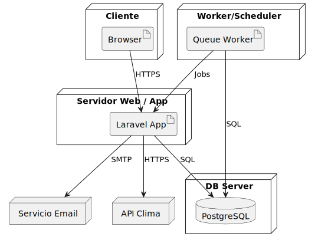

Figura 5 - Diagrama de Despliegue (Desarrollo)
Descripcion: despliegue de desarrollo en un solo equipo con dependencias externas.
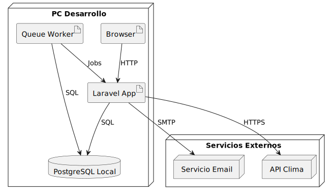

## Diagrama de Caso de Uso del Sistema

Figura 6 - Diagrama Caso de Uso del Sistema (Resumen)
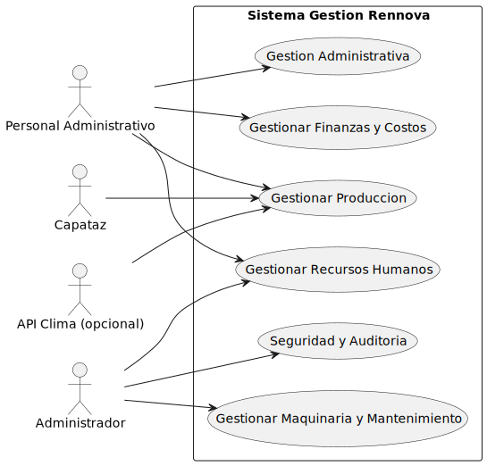

Figura 7 - Diagrama Caso Usos Subsistema Produccion
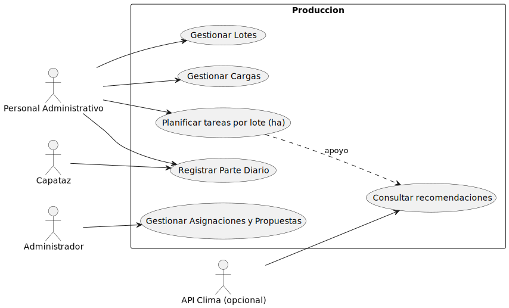

Figura 8 - Diagrama Caso Usos Subsistema Maquinaria y Equipos
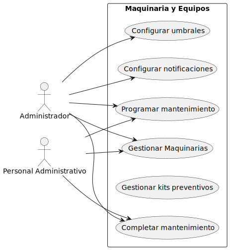

Figura 9 - Diagrama Caso Usos Subsistema Recursos Humanos
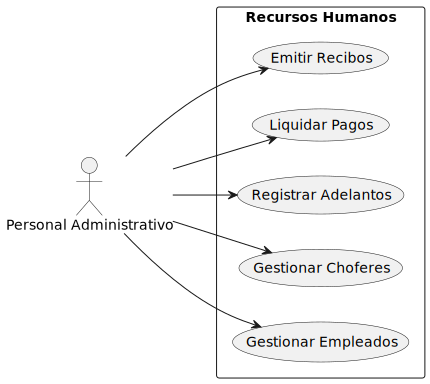

Figura 10 - Diagrama Caso Usos Subsistema Finanzas y Costos
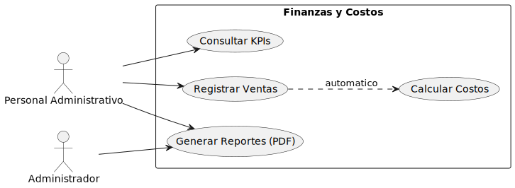

Figura 11 - Diagrama Caso Usos Subsistema Gestion Administrativa
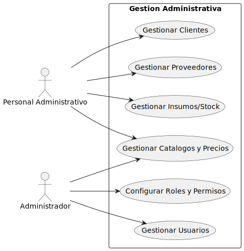

## Requisitos del Sistema

### Requisitos de Informacion
Debe tener una lista de requisitos de almacenamiento y restricciones de informacion identificadas.

### IRQ-01 Informacion sobre lotes y cargas
**Objetivos asociados:**
- OBJ-02 Implementacion del Subsistema de Produccion
**Requisitos asociados:**
- UC-01..UC-04 Gestion de lotes
- UC-41..UC-44 Gestion de cargas
- UC-33..UC-36 Gestion de choferes
**Descripcion:** El sistema debera almacenar toda la informacion vinculada a los lotes y cargas de madera, permitiendo asegurar la trazabilidad de la produccion.
**Datos especificos:**
- Nombre
- Ubicacion
- Especie
- Superficie (ha)
- Nro de ticket
- Categoria de madera
- Chofer
- Peso bruto
- Tara
- Peso neto
- Destino
**Estabilidad:** Alta
**Comentarios:** -

### IRQ-02 Informacion sobre maquinaria y equipos
**Objetivos asociados:**
- OBJ-03 Implementacion del Subsistema de Maquinaria y Equipos
**Requisitos asociados:**
- UC-09..UC-12 Gestion de maquinaria
- UC-62 Cerrar orden de mantenimiento
- UC-63 Programar mantenimiento
**Descripcion:** El sistema debera almacenar los datos relacionados con las maquinas utilizadas en la produccion y su mantenimiento.
**Datos especificos:**
- Identificador y tipo de maquina
- Estado operativo
- Fecha de alta en el sistema
- Produccion asociada (volumen extraido)
- Costo de alquiler por periodo o unidad
- Historial de mantenimientos preventivos y correctivos
**Estabilidad:** Media
**Comentarios:** -

### IRQ-03 Informacion sobre empleados y choferes
**Objetivos asociados:**
- OBJ-04 Implementacion del Subsistema de Recursos Humanos
**Requisitos asociados:**
- UC-21..UC-24 Gestion de empleados
- UC-33..UC-36 Gestion de choferes
- UC-53..UC-56 Gestion de adelantos
- UC-58 Generar recibos
- UC-59 Liquidar pagos
**Descripcion:** El sistema debera almacenar la informacion del personal y choferes necesaria para la gestion operativa y de pagos.
**Datos especificos:**
- Nombre y apellido
- DNI/CUIT
- Categoria laboral o rol
- Historial de asignacion de tareas
- Jornales y productividad
- Sueldos liquidados y adelantos
- Datos de contacto
**Estabilidad:** Alta
**Comentarios:** -

### IRQ-04 Informacion financiera y de costos
**Objetivos asociados:**
- OBJ-05 Implementacion del Subsistema Financiero y de Costos
**Requisitos asociados:**
- UC-13..UC-16 Gestion de ventas
- UC-57 Informes generales
- UC-58 Generar recibos
- UC-59 Liquidar pagos
**Descripcion:** El sistema debera almacenar informacion contable y de costos vinculada a ventas y costos operativos. Ingresos, egresos y flujo de caja se obtienen como metricas derivadas a partir de ventas y costos registrados.
**Datos especificos:**
- Registro de ventas (cliente, cargas, fecha, precio)
- Registro de costos/egresos (insumos, sueldos, alquiler de maquinaria)
- Indicadores de costos por lote o periodo
- Recibos y comprobantes generados
- Metricas derivadas: ingresos, egresos, flujo de caja
**Estabilidad:** Alta
**Comentarios:** -

### IRQ-05 Informacion sobre clientes, proveedores e insumos
**Objetivos asociados:**
- OBJ-06 Implementacion del Subsistema de Gestion Administrativa
**Requisitos asociados:**
- UC-25..UC-28 Gestion de clientes
- UC-29..UC-32 Gestion de proveedores
- UC-37..UC-40 Gestion de stock de insumos
- UC-45..UC-48 Gestion de categorias
- UC-68 Gestionar catalogos y listas de precios
**Descripcion:** El sistema debera almacenar la informacion de clientes, proveedores y stock de insumos necesarios para la operacion.
**Datos especificos:**
- Datos de clientes (razon social, CUIT, direccion, contacto)
- Datos de proveedores (razon social, CUIT, direccion, contacto)
- Insumos disponibles en stock
- Consumo de insumos por lote o maquinaria
- Movimientos de inventario
**Estabilidad:** Media
**Comentarios:** -

### IRQ-06 Informacion sobre usuarios y permisos
**Objetivos asociados:**
- OBJ-07 Seguridad y auditoria del sistema
**Requisitos asociados:**
- UC-49..UC-52 Gestion de usuarios
- UC-64 Configurar permisos
**Descripcion:** El sistema debera almacenar informacion relacionada con la gestion de usuarios y sus niveles de acceso.
**Datos especificos:**
- Identificador de usuario
- Nombre y apellido
- Email
- Rol o perfil asignado
- Permisos y accesos habilitados
- Fecha y hora de creacion del usuario
- Estado de la cuenta (activo/inactivo)
**Estabilidad:** Alta
**Comentarios:** La entidad principal de autenticacion es Usuario; el modelo User de Laravel se considera legado.

### IRQ-07 Informacion de auditoria del sistema
**Objetivos asociados:**
- OBJ-07 Seguridad y auditoria del sistema
**Requisitos asociados:**
- RF-16 Registro de auditoria
**Descripcion:** El sistema debera mantener un registro detallado de todas las acciones criticas realizadas por los usuarios.
**Datos especificos:**
- Usuario responsable de la accion
- Fecha y hora de la operacion
- Tipo de accion (alta, baja, modificacion, consulta)
- Entidad afectada (lote, empleado, carga, etc.)
- Resultado de la operacion (exitosa/fallida)
**Estabilidad:** Alta
**Comentarios:** -

### IRQ-08 Informacion de reportes e indicadores
**Objetivos asociados:**
- OBJ-05 Implementacion del Subsistema Financiero y de Costos
- OBJ-02 Implementacion del Subsistema de Produccion
**Requisitos asociados:**
- UC-57 Informes generales
- UC-65 Planificacion de tareas por lote (ha)
**Descripcion:** El sistema debera almacenar y procesar informacion necesaria para la generacion de reportes e indicadores estrategicos (KPI).
**Datos especificos:**
- Reportes de produccion por lote, categoria y periodo
- Indicadores financieros (ingresos, egresos, rentabilidad)
- Informes de costos operativos por maquinaria o insumos
- Estadisticas de productividad por empleado
- Comparativas de tareas planificadas (ha) vs ejecutadas
**Estabilidad:** Alta
**Comentarios:** -

### IRQ-09 Informacion de configuraciones y notificaciones
**Objetivos asociados:**
- OBJ-07 Seguridad y auditoria del sistema
- OBJ-03 Implementacion del Subsistema de Maquinaria y Equipos
**Requisitos asociados:**
- UC-63 Programar mantenimiento
**Descripcion:** El sistema debera almacenar configuraciones globales y de notificaciones.
**Datos especificos:**
- Umbrales de mantenimiento y parametros generales del sistema
- Horarios y expresiones de scheduler
- Usuarios suscriptos a notificaciones de mantenimiento
- Historial de notificaciones internas enviadas
**Estabilidad:** Alta
**Comentarios:** -

### IRQ-10 Informacion de asignaciones y propuestas
**Objetivos asociados:**
- OBJ-02 Implementacion del Subsistema de Produccion
**Requisitos asociados:**
- UC-65 Planificacion de tareas por lote (ha)
**Descripcion:** El sistema debera almacenar propuestas de asignacion y planes de recursos.
**Datos especificos:**
- Propuestas automaticas por lote/tarea
- Recursos sugeridos (empleados, maquinarias, insumos)
- Estado de propuesta (abierta, aceptada, cerrada)
- Metricas de desempeno asociadas
**Estabilidad:** Media
**Comentarios:** -

### Requisitos Funcionales

### RF-01 Gestion de Lotes
**Objetivos asociados:**
- OBJ-02 Implementacion del Subsistema de
Produccion
**Requisitos asociados:**
- IRQ-01 Informacion sobre lotes y cargas
**Descripcion:** El sistema debera permitir registrar, modificar, consultar y
eliminar lotes de produccion, vinculando datos de origen,
categoria, volumenes planificados y extraidos.
**Estabilidad:** Alta
**Comentarios:** -
### RF-02 Gestion de Cargas
**Objetivos asociados:**
- OBJ-02 Implementacion del Subsistema de
Produccion
**Requisitos asociados:**
- IRQ-01 Informacion sobre lotes y cargas
**Descripcion:** El sistema debera registrar cada carga de madera,
incluyendo numero de ticket, peso bruto, tara, peso neto,
destino y chofer responsable.
**Estabilidad:** Alta
**Comentarios:** -
### RF-03 Planificacion de Produccion
**Objetivos asociados:**
- OBJ-02 Implementacion del Subsistema de
Produccion
**Requisitos asociados:**
- IRQ-08 Informacion de reportes e indicadores
**Descripcion:** El sistema debera permitir planificar tareas por lote (tipo de tarea
y superficie en ha) y comparar lo planificado con lo ejecutado
(partes diarios/cargas).
**Estabilidad:** Media
**Comentarios:** -
### RF-04 Gestion de Maquinaria y Equipos

**Objetivos asociados:**

- OBJ-03 Implementacion del Subsistema de
Maquinaria y Equipos
**Requisitos asociados:**

- IRQ-02 Informacion sobre maquinaria y equipos
**Descripcion:** El sistema debera permitir registrar, consultar y modificar
la informacion de cada maquina o equipo utilizado en la
produccion.

**Estabilidad:** Alta

**Comentarios:** -

### RF-05 Calculo de costos de maquinaria

**Objetivos asociados:**

- OBJ-03 Implementacion del Subsistema de
Maquinaria y Equipos
**Requisitos asociados:**

- IRQ-02 Informacion sobre maquinaria y equipos
- IRQ-04 Informacion financiera y de costos
**Descripcion:** El sistema debera calcular de manera automatica el costo
de alquiler de la maquinaria en funcion de los parametros
definidos (toneladas extraidas, tarifas por hora o dia).

**Estabilidad:** Alta

**Comentarios:** -

### RF-06 Gestion de mantenimientos

**Objetivos asociados:**

- OBJ-03 Implementacion del Subsistema de
Maquinaria y Equipos
**Requisitos asociados:**

- IRQ-02 Informacion sobre maquinaria y equipos
**Descripcion:** El sistema debera permitir programar mantenimientos
preventivos y registradores correctivos,
incluyendo fechas de inicio, cierre de orden y costo
asociado.

**Estabilidad:** Baja

**Comentarios:** -

### RF-07 Gestion de empleados

**Objetivos asociados:**

- OBJ-04 Implementacion del Subsistema de
Recursos Humanos
**Requisitos asociados:**

- IRQ-03 Informacion sobre empleados
**Descripcion:** El sistema debera administrar la informacion del personal
(empleados y choferes), permitiendo su alta, baja,
consulta y modificacion de datos.

**Estabilidad:** Alta

**Comentarios:** -

### RF-08 Liquidacion de pagos

**Objetivos asociados:**

- OBJ-04 Implementacion del Subsistema de
Recursos Humanos
**Requisitos asociados:**

- IRQ-03 Informacion sobre empleados
- IRQ-04 Informacion financiera y de costos
**Descripcion:** El sistema debera calcular automaticamente los haberes
del personal en base a dias trabajados, productividad y
adelantos registrados.

**Estabilidad:** Alta

**Comentarios:** -

### RF-09 Emision de recibos y adelantos

**Objetivos asociados:**

- OBJ-04 Implementacion del Subsistema de
Recursos Humanos
**Requisitos asociados:**

- IRQ-03 Informacion sobre empleados
**Descripcion:** El sistema debera emitir recibos de pago y registrador
adelantados entregados al personal, manteniendo un
historial de liquidaciones.

**Estabilidad:** Alta

**Comentarios:** -

### RF-10 Gestion financiera (ingresos/egresos)

**Objetivos asociados:**

- OBJ-05 Implementacion del Subsistema Financiero
y de Costos
**Requisitos asociados:**

- IRQ-04 Informacion financiera y de costos
**Descripcion:** El sistema debera calcular ingresos, egresos y flujo de caja como metricas derivadas a partir de ventas, costos operativos y liquidaciones registradas.
**Estabilidad:** Alta

**Comentarios:** -

### RF-11 Generacion de informes financieros

**Objetivos asociados:**

- OBJ-05 Implementacion del Subsistema Financiero
y de Costos
**Requisitos asociados:**

- IRQ-08 Informacion de reportes e indicadores
**Descripcion:** El sistema debera generar reportes PDF con estadisticas
forestales y productivas (por lote, periodo y categoria), ademas
de indicadores de costos y productividad.

**Estabilidad:** Media

**Comentarios:** Informes financieros avanzados quedan pendientes.

### RF-12 Gestion de clientes y proveedores

**Objetivos asociados:**

- OBJ-06 Implementacion del Subsistema de Gestion
Administrativa
**Requisitos asociados:**

- IRQ-05 Informacion sobre clientes, proveedores e
insumos
**Descripcion:** El sistema debera administrar la informacion de clientes y
proveedores, incluyendo sus datos comerciales basicos y contactos.

**Estabilidad:** Media

**Comentarios:** -

### RF-13 Gestion de insumos y stock

**Objetivos asociados:**

- OBJ-06 Implementacion del Subsistema de Gestion
Administrativa
**Requisitos asociados:**

- IRQ-05 Informacion sobre clientes, proveedores e
insumos
**Descripcion:** El sistema debera permitir controlar el stock de insumos,
registrando ingresos, egresos y consumos por lote o
maquinaria.

**Estabilidad:** Alta

**Comentarios:** -

### RF-14 Gestion de usuarios y roles

**Objetivos asociados:**

- OBJ-07 Seguridad y auditoria del sistema
**Requisitos asociados:**

- IRQ-06 Informacion sobre usuarios y permisos
**Descripcion:** El sistema debera permitir crear, modificar y eliminar
usuarios, asignandoles roles y permisos de acceso segun
su perfil.

**Estabilidad:** Alta

**Comentarios:** -

### RF-15 Configuracion de permisos

**Objetivos asociados:**

- OBJ-07 Seguridad y auditoria del sistema
**Requisitos asociados:**

- IRQ-06 Informacion sobre usuarios y permisos
**Descripcion:** El sistema debera definir y aplicar permisos especificos
para cada usuario o rol, controlando el acceso a modulos
y operaciones criticas.

**Estabilidad:** Alta

**Comentarios:** -

### RF-16 Registro de auditoria

**Objetivos asociados:**

- OBJ-07 Seguridad y auditoria del sistema
**Requisitos asociados:**

- IRQ-07 Informacion de auditoria del sistema
**Descripcion:** El sistema debera registrar en un registro de auditoria todas
las relevantes realizadas por los usuarios,
incluyendo fecha, hora, accion y acciones afectadas.

**Estabilidad:** Alta

**Comentarios:** -

### RF-17 Generacion de indicadores de gestion

**Objetivos asociados:**

- OBJ-05 Implementacion del Subsistema Financiero
y de Costos
- OBJ-02 Produccion
**Requisitos asociados:**

- IRQ-08 Informacion de reportes e indicadores
**Descripcion:** El sistema debera generar indicadores de productividad,
eficiencia operativa y rentabilidad, basados en los datos
registrados en los diferentes modulos.

**Estabilidad:** Media

**Comentarios:** -

### RF-18 Gestion de asignaciones y propuestas automaticas

**Objetivos asociados:**

- OBJ-02 Implementacion del Subsistema de Produccion
**Requisitos asociados:**

- IRQ-10 Informacion de asignaciones y propuestas
**Descripcion:** El sistema debera generar propuestas automaticas de asignacion
de recursos por lote/tarea y permitir su revision, aceptacion o
cierre, registrando recursos asociados.

**Estabilidad:** Media

**Comentarios:** -

### RF-19 Notificaciones internas y recordatorios

**Objetivos asociados:**

- OBJ-07 Seguridad y auditoria del sistema
- OBJ-03 Implementacion del Subsistema de Maquinaria y Equipos
**Requisitos asociados:**

- IRQ-09 Informacion de configuraciones y notificaciones
**Descripcion:** El sistema debera generar notificaciones internas y recordatorios
relacionados con mantenimientos y eventos relevantes, y permitir
marcar su estado (leida/accionada).

**Estabilidad:** Alta

**Comentarios:** -

### RF-20 Configuracion del sistema

**Objetivos asociados:**

- OBJ-07 Seguridad y auditoria del sistema
- OBJ-03 Implementacion del Subsistema de Maquinaria y Equipos
**Requisitos asociados:**

- IRQ-09 Informacion de configuraciones y notificaciones
**Descripcion:** El sistema debera permitir configurar parametros generales
(umbrales de mantenimiento, horarios de verificacion y reglas
de notificacion).

**Estabilidad:** Alta

**Comentarios:** -

### RF-21 Gestion de catalogos y listas de precios

**Objetivos asociados:**

- OBJ-06 Implementacion del Subsistema de Gestion Administrativa
- OBJ-03 Implementacion del Subsistema de Maquinaria y Equipos
**Requisitos asociados:**

- IRQ-02 Informacion sobre maquinaria y equipos
- IRQ-05 Informacion sobre clientes, proveedores e insumos
**Descripcion:** El sistema debera administrar catalogos maestros
(tipos de maquinaria, tipos de mantenimiento, unidades de medida)
y listas de precios por cliente/categoria de madera.

**Estabilidad:** Media

**Comentarios:** -

### Requisitos No Funcionales

### NFR01 Copias de seguridad
**Objetivos asociados:**
- OBJ-07 Seguridad y auditoria del sistema
**Requisitos asociados:**
- RF-16 Registro de auditoria
**Descripcion:** El sistema debera incorporar un mecanismo que permita realizar copias de seguridad automaticas de la base de datos al menos una vez por mes, con opcion de restauracion.
**Comentarios:** ninguno

### NFR02 Control de acceso
**Objetivos asociados:**
- OBJ-07 Seguridad y auditoria del sistema
**Requisitos asociados:**
- RF-14 Gestion de usuarios y roles
- RF-15 Configuracion de permisos
**Descripcion:** El sistema debera implementar control de acceso basado en roles y permisos.
**Comentarios:** ninguno

### NFR03 Registros de auditoria
**Objetivos asociados:**
- OBJ-07 Seguridad y auditoria del sistema
**Requisitos asociados:**
- RF-16 Registro de auditoria
**Descripcion:** Toda accion de alta, baja, modificacion y consulta debe generar un registro de auditoria.
**Comentarios:** ninguno

### NFR04 Manejo de errores de persistencia
**Objetivos asociados:**
- OBJ-01 Centralizacion de registros operativos y administrativos
**Requisitos asociados:**
- RF-01, RF-02, RF-03, RF-04, RF-05, RF-06, RF-07, RF-08, RF-09, RF-10, RF-12, RF-13, RF-18, RF-19, RF-20, RF-21
**Descripcion:** En caso de error de persistencia en la base de datos, el sistema debe informar al usuario y mantener la consistencia de los datos.
**Comentarios:** ninguno

### NFR05 Exportacion de archivos
**Objetivos asociados:**
- OBJ-05 Implementacion del Subsistema Financiero y de Costos
**Requisitos asociados:**
- RF-11 Generacion de informes financieros
- RF-17 Generacion de indicadores de gestion
**Descripcion:** El sistema debe permitir la exportacion de reportes en formato PDF.
**Comentarios:** La exportacion a Excel no esta incluida en esta version.

## Fronteras del Sistema
Figura 12 - Fronteras del Sistema
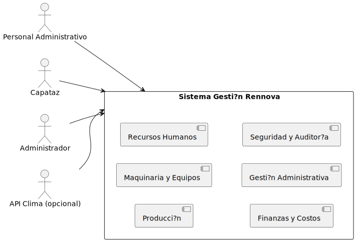

## Definicion de Actores

ACT-01 Personal Administrativo
**Descripcion:**
Este actor representa al personal de la empresa
encargado de gestionar tareas administrativas, tales
como la carga de datos, gestion de clientes,
proveedores, insumos y emision de reportes.
**Comentarios:** -
ACT-02 Capataz
**Descripcion:**
Este actor representa al encargado de supervisar y
validar las tareas operativas realizadas en campo,
incluyendo la extraccion, el registro de cargas y la
verificacion de partes diarios.
**Comentarios:** -
ACT-03 Administrador
**Descripcion:**
Este actor representa a la persona responsable de la
configuracion y mantenimiento del sistema, incluyendo
la gestion de usuarios, asignacion de roles y permisos,
y control de la seguridad.
**Comentarios:** -
ACT-04 API clima
**Descripcion:**
Este actor representa un servicio externo de terceros
que provee informacion meteorologica, utilizada como
insumo para el analisis climatico y recomendaciones
operativas.
**Comentarios:** -
## Casos de Uso del Sistema
### Listado de Casos de Uso
- 1 Alta Lote
- 2 Baja Lote
- 3 Modificar Lote
- 4 Ver Lote
- 5 Alta Insumo
- 6 Baja Insumo
- 7 Modificar Insumo
- 8 Ver Insumo
- 9 Alta Maquinaria
- 10 Baja Maquinaria
- 11 Modificar Maquinaria
- 12 Ver Maquinaria
- 13 Alta Venta
- 14 Baja Venta
- 15 Modificar Venta
- 16 Ver Venta
- 21 Alta Empleado
- 22 Baja Empleado
- 23 Modificar Empleado
- 24 Ver Empleado
- 25 Alta Cliente
- 26 Baja Cliente
- 27 Modificar Cliente
- 28 Ver Cliente
- 29 Alta Proveedor
- 30 Baja Proveedor
- 31 Modificar Proveedor
- 32 Ver Proveedor
- 33 Alta Chofer
- 34 Baja Chofer
- 35 Modificar Chofer
- 36 Ver Chofer
- 37 Alta Stock Insumo
- 38 Baja Stock Insumo
- 39 Modificar Stock Insumo
- 40 Ver Stock Insumo
- 41 Alta Carga
- 42 Baja Carga
- 43 Modificar Carga
- 44 Ver Carga
- 45 Alta Categoria
- 46 Baja Categoria
- 47 Modificar Categoria
- 48 Ver Categoria
- 49 Alta Usuario
- 50 Baja Usuario
- 51 Modificar Usuario
- 52 Ver Usuario
- 53 Alta Adelanto
- 54 Baja Adelanto
- 55 Modificar Adelanto
- 56 Ver Adelanto
- 57 Informes generales
- 58 Generar Recibos
- 59 Liquidar Pagos
- 61 Cargar Parte diario
- 62 Cerrar orden de mantenimiento
- 63 Programar mantenimiento
- 64 Configurar permisos
- 65 Planificacion de tareas por lote (ha)
- 66 Gestionar asignaciones y propuestas
- 67 Configurar notificaciones de mantenimiento
- 68 Gestionar catalogos y listas de precios

### Casos de Uso Expandidos
### UC-01 Alta Lote
**Actores:** Personal Administrativo
**Descripcion:** Permite registrar un nuevo lote con su identificacion y
caracteristicas basicas para ser utilizado en planificacion,
cargas y partes diarios.
**Precondicion:** -
**Secuencia:**
Normal
1- El usuario navega a Gestion de Lotes > Registrar
Lote.
2- El sistema muestra formulario con campos: Codigo
de Lote (unico), propietario, ubicacion, especie,
superficie (ha) , condicion de compra (vuelo forestal,
tn), precio por lote, fecha de compra y
observaciones.
3- El usuario completa los datos obligatorios y
selecciona Guardar.
4- El sistema valida: presencia de obligatorios,formatos
(superficie numerica > 0, fecha valida).
5- El sistema registra el nuevo lote, asigna id interno ,
establece estado inicial = adquirido , guarda
fecha/hora y usuario creador, y genera entrada de
auditoria.
6- El sistema confirma el alta y muestra el detalle del
lote creado.
**Postcondicion:** Lote creado y disponible para Planificacion , Cargas y
Partes Diarios.
**Excepciones:** 3a. Cancelacion : si el usuario cancela, no se guardan
cambios y se vuelve a Gestion de Lotes.
4a. Datos invalidos/incompletos : el sistema marca
campos con error y solicita correccion.
5a. Error de persistencia/BD : el sistema informa el
error, revierte la operacion y sugiere reintentar.
### UC-02 Baja Lote

**Actores:** Personales Administrativos

**Descripcion:** Este caso de uso permite dar de baja un lote que ya no
esta disponible para su explotacion. La baja es logica
(cambio de estado) y no fisica, para mantener
trazabilidad en historicos de produccion e informes.

**Precondicion:** El lote existe en el sistema.
El lote se encuentra en estado Inactivo y no tiene cargas
ni partes diarias pendientes.

**Secuencia:**
normal

1- El usuario navega a Gestion de Lotes>Baja de Lote.
2- El sistema muestra el listado de lotes disponibles para
baja.
3- El usuario selecciona el lote a dar de baja.
4- El usuario confirma la baja.
5- El sistema cambia el estado del lote, guarda la fecha
y usuario responsable y registra la operacion en la
auditoria.
6- El sistema confirma al usuario que el lote ha sido
dado de baja correctamente.
**Postcondicion:** Lote dado de baja y ya no disponible para
Planificacion , Cargas y Partes Diarios .

**Excepciones:** 2a- No hay lotes en estado Inactivo: el sistema informa
que no hay lotes disponibles para dar de baja.
5a- Si el usuario cancela no se realizan cambios y se
regresa al menu de Gestion de Lotes.
6a- Si ocurre un error en el sistema informa la falla y
sugiere reintentar

### UC-03 Modificar Lote

**Actores:** Personales Administrativos

**Descripcion:** Permite modificar datos de un lote existente para
mantener la informacion actualizada.

**Precondicion:** El lote existe en el sistema, el lote no esta dado de baja.

**Secuencia:**
normal

1- El usuario navega a Gestion de Lotes > Modificar
Lote.
2- El sistema muestra listado de lotes disponibles.
3- El usuario selecciona el lote a modificar.
4- El sistema muestra los datos actuales en un
formulario editable.
5- El usuario puede modificar: superficie, condicion de
compra, especie, propietario, observaciones.
6- El sistema verifica los cambios: formatos correctos
(superficie numerica > 0).
7- El usuario confirma la modificacion.
8- El sistema actualiza los datos del lote, registra fecha
y usuario responsable y genera entrada de auditoria.
9- El sistema confirma al usuario que la modificacion se
realizo correctamente.
**Postcondicion:** Los datos del lote quedan actualizados en el sistema.

**Excepciones:** 2a- No hay lotes disponibles: el sistema informa que no
existen lotes en estado valido para modificar.
3a- Seleccion invalida: si el lote no existe o ya esta dado
de baja, el sistema rechaza la operacion.
6a- Datos invalidos: si el usuario ingresa datos
incompletos o incorrectos, el sistema marca los errores
y solicita correccion.
7a- Cancelacion: si el usuario cancela la operacion, no
se guardan cambios y se regresa al menu de Gestion de
Lotes.
8a- Si ocurre un error al guardar, el sistema informa y
sugiere reintentar.

### UC-04 Ver lote

**Actores:** Personales administrativos

**Descripcion:** Este caso de uso permite consultar y listar los lotes
existentes en el sistema, ya sea filtrados por estado
(Activo, Cerrado, Baja), propietario, ubicacion u otros
criterios. El sistema debe mostrar informacion basica de
cada lote y permitir acceder al detalle completo de uno
en particular.

**Precondicion:** Debe existir al menos un lote registrado en el sistema.

**Secuencia:**
normal

1- El usuario navega a Gestion de Lotes>Consultar
Lotes.
2- El sistema muestra filtros de busqueda: estado,
propietario, ubicacion, fecha de inicio, especie.
3- El usuario completa uno o mas filtros y selecciona
Buscar.
4- El sistema procesa la busqueda y despliega un listado
de lotes coincidentes, mostrando: Codigo/Nombre del
lote, Propietario, Ubicacion, Estado, Superficie.
5- El usuario selecciona un lote especifico.
6- El sistema despliega la informacion detallada del lote.
**Postcondicion:** -

**Excepciones:** 2a- Sin filtros aplicados: el sistema devuelve el listado
completo de lotes.
3a- Si no se encuentra ningun lote con los criterios
ingresados el sistema muestra un mensaje "No se
encontraron lotes".
6a- Si ocurre un error en la busqueda el sistema informa
la falla y sugiere reintentar.
7a- Si el usuario cancela, el sistema retorna al menu
principal de Gestion de Lotes.

### UC-05 Alta Insumo

**Actores:** Personales administrativos

**Descripcion:** Permite registrar un nuevo insumo en el sistema para
que pueda ser utilizado.

**Precondicion:** -

**Secuencia:**
normal

1- El usuario navega a Gestion de Insumos>Registrar
Insumo.
2- El sistema muestra el formulario con los campos:
nombre, descripcion, unidad de medida, categoria, stock
inicial, proveedor asociado.
3- El usuario completa los campos requeridos.
4- El sistema valida los formatos (stock inicial>0) y
existencia del proveedor.
5- El usuario confirma la operacion.
6- El sistema registra el insumo, asigna identificador
unico, registra usuario y fecha y genera un registro en la
auditoria.
7- El sistema confirma que el alta se realizo con exito.
**Postcondicion:** El insumo queda registrado en el sistema.

**Excepciones:** 3a- Si los campos obligatorios estan incompletos el
sistema solicita completarlos.
4a- Si el proveedor es inexistente el sistema le informa
al usuario.
5a- Si el usuario cancela la operacion se descartan los
cambios y se vuelve al menu Gestionar Insumos.
6a- Si ocurre algun error en el sistema se le notifica al
usuario.

### UC-06 Baja Insumo

**Actores:** Personales Administrativos

**Descripcion:** Permite dar de baja un insumo que ya no se utiliza. La
baja es logica para mantener la trazabilidad.

**Precondicion:** El insumo debe estar registrado en el sistema.

**Secuencia:**
normal

1- El usuario navega a Gestion de Insumos>Baja de
Insumo.
2- El sistema muestra un listado de insumos.
3- El usuario selecciona el insumo.
4- El usuario confirma la operacion.
5- El sistema cambia el estado del insumo, registra
usuario y fecha y confirma la baja.
**Postcondicion:** El insumo es dado de baja.

**Excepciones:** 2a- Si no hay insumos el sistema notifica al usuario.
4a- Si el usuario cancela la baja se descartan los
cambios y se retorna el menu de Gestionar Insumos.
5a- En caso de un error de sistema se le notifica al
usuario.

### UC-07 Modificar Insumo

**Actores:** Personales administrativos

**Descripcion:** Permite modificar datos de un insumo existente para
mantener la informacion actualizada.

**Precondicion:** El insumo existe en el sistema y no este dado de baja.

**Secuencia:**
normal

1- El usuario navega a Gestion de Insumos>Modificar
Insumo.
2- El sistema muestra un listado de los insumos
disponibles.
3- El usuario selecciona el lote a modificar.
4- El sistema muestra los datos actuales en un
formulario editable.
5- El usuario puede modificar: nombre, descripcion,
unidad de medida, categoria, stock inicial, proveedor
asociado.
6- El sistema verifica los cambios y que los campos no
esten nulos.
7- El usuario confirma la modificacion.
8- El sistema actualiza los datos del insumo, registra la
fecha y el usuario responsable y genera un registro en el
log de auditoria.
9- El sistema confirma al usuario que la modificacion se
realizo correctamente.
**Postcondicion:** Los datos del insumo quedan actualizados en el sistema.

**Excepciones:** 2a- No hay insumos disponibles: el sistema informa que
no existen insumos para modificar.
3a- Seleccion invalida: si el insumo no existe o ya esta
dado de baja, el sistema rechaza la operacion.
6a- Datos invalidos: si el usuario ingresa datos
incompletos o incorrectos, el sistema marca los errores
y solicita correccion.
7a- Cancelacion: si el usuario cancela la operacion, no
se guardan cambios y se regresa al menu de Gestion de
Insumos.
8a- Si ocurre un error al guardar, el sistema informa y
sugiere reintentar.

### UC-08 Ver insumo

**Actores:** Personales administrativos

**Descripcion:** Este caso de uso permite consultar y listar los insumos
existentes en el sistema, ya sea filtrados por estado
(Activo, Inactivo), proveedor u otros criterios. El sistema
debe mostrar informacion basica de cada insumo y
permitir acceder al detalle completo de uno en
particular.

**Precondicion:** Debe existir al menos un insumo registrado en el
sistema.

**Secuencia:**
normal

1- El usuario navega a Gestion de Insumos>Consultar
Insumos.
2- El sistema muestra filtros de busqueda: categoria,
proveedor.
3- El usuario completa uno o mas filtros y selecciona
Buscar.
4- El sistema procesa la busqueda y despliega un listado
de los insumos.
5- El usuario selecciona un insumo especifico.
6- El sistema despliega la informacion detallada del
insumo.
**Postcondicion:**

**Excepciones:** 2a- Sin filtros aplicados: el sistema devuelve el listado
completo de los insumos.
3a- Si no se encuentra ningun lote con los criterios
ingresados el sistema muestra un mensaje "No se
encontraron Insumos".
6a- Si ocurre un error en la busqueda el sistema informa
la falla y sugiere reintentar.
7a- Si el usuario cancela, el sistema retorna al menu
principal de Gestion de Insumos.

### UC-09 Alta Maquinaria

**Actores:** Personales Administrativos.

**Descripcion:** Permite registrar una nueva maquinaria con sus
caracteristicas basicas para ser utilizada.

**Precondicion:** -

**Secuencia:**
normal

1- El usuario navega a Gestion de Lotes>Registrar
Maquinaria.
2- El sistema muestra formulario con campos: modelo,
ano, categoria, condicion, costo alquiler, fecha incio de
actividades.
3- El usuario completa los datos obligatorios y
selecciona guardar.
4- El sistema valida: presencia de campos obligatorios,
formatos.
5- El sistema registra la nueva maquinaria y asigna un
identificador unico, genera entra en el log de auditoria.
6- El sistema confirma el alta de la maquinaria y
muestra los detalles
**Postcondicion:** Maquinaria creada y disponible para distintas
operaciones.

**Excepciones:** 3a- Cancelacion: si el usuario cancela, no se guardan
cambios y se vuelve a Gestion de Lotes.
4a- Datos invalidos/incompletos: el sistema marca
campos con error y solicita correccion.
5a-En caso de error del sistema el sistema informa el
error, revierte la operacion y sugiere reintentar.

### UC-10 Baja Maquinaria

**Actores:** Personales Administrativos

**Descripcion:** Permite dar de baja una maquinaria que ya no esta
disponible para su uso. La baja se realiza de manera
logica, para mantener trazabilidad en historicos de
produccion e informes.

**Precondicion:** La maquinaria existe en el sistema.

**Secuencia:**
normal

1- El usuario navega a Gestion de Maquinaria>Baja de
Maquinaria.
2- El sistema muestra el listado de maquinaria
disponible para baja.
3- El usuario selecciona la maquinaria a dar de baja.
4- El usuario confirma la baja.
5- El sistema cambia el estado de la maquinaria, guarda
la fecha y usuario responsable y registra la operacion en
la auditoria.
6- El sistema confirma al usuario que el lote ha sido
dado de baja correctamente
**Postcondicion:** Maquinaria dada de baja y ya no esta disponible para las
operaciones.

**Excepciones:** 2a- No hay maquinaria disponible para dar de baja y el
sistema notifica al usuario.
5a- Si el usuario cancela la operacion no se realizan
cambios y se regresa al menu de Gestion de Maquinaria.
6a- Si ocurre un error en el sistema se informa la falla y
se sugiere reintentar

### UC-11 Modificar Maquinaria

**Actores:** Personales Administrativos

**Descripcion:** Permite modificar datos de un lote existente para
mantener la informacion actualizada.

**Precondicion:** La maquinaria debe estar registrada en el sistema, la
maquinaria no esta dada de baja.

**Secuencia:**
normal

1- El usuario navega a Gestion de Maquinaria>Modificar
Maquinaria.
2- El sistema muestra listado de maquinaria disponible.
3- El sistema muestra los datos actuales en un
formulario editable.
4- El usuario puede modificar: modelo, ano, categoria,
condicion, costo alquiler, fecha incio de actividades.
6- El sistema verifica el formato de los datos ingresados.
7- El usuario confirma la modificacion.
8- El sistema actualiza los datos de la maquinaria,
registra fecha y usuario responsable y genera una
entrada en el log de auditoria.
9- El sistema confirma al usuario que la modificacion se
realizo correctamente.
**Postcondicion:** Los datos de la maquinaria quedan actualizados en el
sistema.

**Excepciones:**

### UC-12 Ver maquinaria

**Actores:** Personales administrativos

**Descripcion:** Este caso de uso permite consultar y listar la maquinaria
existente en el sistema ya sea filtrada por estado,
propietario u otros criterios. El sistema debe mostrar
informacion basica de cada maquinaria y permitir
acceder al detalle completo de cada una en particular.

**Precondicion:** Debe existir al menos un lote registrado en el sistema.

**Secuencia:**
normal

1- El usuario navega a Gestion de Maquinaria>Consultar
Maquinaria.
2- El sistema muestra filtros de busqueda.
3- El usuario completa uno o mas filtros y selecciona
Buscar.
4- El sistema procesa la busqueda y despliega un listado
coincidente.
5- El usuario selecciona una maquinaria especifica.
6- El sistema despliega la informacion detallada de la
maquinaria.
**Postcondicion:** -

**Excepciones:** 2a- Sin filtros aplicados: el sistema devuelve el listado
completo de maquinaria.
3a- Si no se encuentra ningun lote con los criterios
ingresados el sistema muestra un mensaje "No se
encontro maquinaria".
6a- Si ocurre un error en la busqueda el sistema informa
la falla y sugiere reintentar.
7a- Si el usuario cancela, el sistema retorna al menu
principal de Gestion de Maquinaria.

### UC-13 Alta Venta

**Actores:** Personales Administrativos

**Descripcion:** Este caso de uso permite registrar en el sistema una nueva
venta. Una venta incluye: cliente, fecha de la operacion,
precio y condiciones de pago, relacion con una o varias cargas
despachadas.
De esta forma, cada ingreso queda asociado a las cargas que
lo originaron, asegurando trazabilidad desde la produccion
hasta la venta final.

**Precondicion:** Debe existir al menos un Cliente registrado en el sistema.

**Secuencia:**
normal

1- El usuario ingresa a Ventas > Alta Venta.
2- El sistema muestra un formulario con campos:
Cliente
Fecha de venta
Condiciones de pago
Seleccion de cargas asociadas (una o varias).
Observaciones (opcional).
3- El usuario selecciona un Cliente.
4- El usuario selecciona las cargas que forman parte de la
venta.
5- El sistema valida que esas cargas: esten registradas,
no hayan sido previamente asignadas a otra venta,
tengan informacion de categoria, destino y chofer.
6- El sistema calcula automaticamente el total de la venta
(sumando cargas, aplicando precios segun categoria/especie).
7- El usuario confirma el alta.
8- El sistema registra la nueva venta, genera un identificador
unico y vincula las cargas seleccionadas.
9- El sistema guarda fecha/hora, usuario responsable.
10- El sistema confirma al usuario que la venta fue registrada
exitosamente.
**Postcondicion:** La venta queda registrada en el sistema con relacion al Cliente
y las Cargas.

**Excepciones:** 3a. Cliente inexistente -> el sistema no permite continuar.
4a. No hay cargas registradas -> el sistema informa que no
hay cargas disponibles.
5a. Carga ya asociada -> si una carga ya pertenece a otra
venta, el sistema bloquea la operacion.
6a. Inconsistencias de precios -> si falta precio de una
categoria, el sistema alerta al usuario.
7a. Cancelacion -> si el usuario cancela, no se guarda la
venta.
8a. Error de persistencia/BD -> si falla el guardado, el sistema
informa al usuario y reintenta.

### UC-14 Baja Venta

**Actores:** Personales administrativos

**Descripcion:** Este caso de uso permite dar de baja una venta
registrada previamente en el sistema.

**Precondicion:** Debe existir una Venta registrada.

**Secuencia:**
normal

1- El usuario ingresa a Ventas > Baja Venta.
2- El sistema despliega listado de ventas.
3- El usuario selecciona la venta que desea dar de baja.
4- El sistema muestra el detalle de la venta: cliente,
cargas asociadas, precio total, fecha y condiciones.
5- El usuario confirma la baja.
6- El sistema marca la venta como Anulada (no se
elimina fisicamente).
7- Las cargas asociadas a la venta vuelven a quedar
disponibles en el sistema para asignacion a otra venta.
8- El sistema guarda fecha/hora y usuario responsable.
9- El sistema confirma al usuario que la venta fue dada
de baja.
**Postcondicion:** La venta queda en estado Anulada y no se refleja mas
en los ingresos financieros.
Las cargas asociadas quedan nuevamente disponibles
para futuras ventas.

**Excepciones:** 2a. No hay ventas registradas -> el sistema informa que
no existen ventas para dar de baja.
5a. Cancelacion -> el usuario cancela la operacion y no
se realizan cambios.
9a. Error de persistencia/BD -> el sistema informa la
falla y solicita que se reintente.

### UC-15 Modificar Venta

**Actores:** Personales Administrativos

**Descripcion:** Este caso de uso permite modificar los datos de una
venta previamente registrada, siempre que la misma se
encuentre en estado Activa.
Las modificaciones pueden incluir: cambio de cliente,
ajuste de condiciones de pago, actualizacion de cargas
asociadas o correccion de precios.

**Precondicion:** Debe existir una venta registrada en el sistema.

**Secuencia:**
normal

1- El usuario ingresa a Ventas > Modificar Venta.
2- El sistema despliega un listado de ventas disponibles
para modificacion.
3- El usuario selecciona la venta a modificar.
4- El sistema muestra el detalle de la venta (cliente,
fecha, condiciones de pago, cargas asociadas, precio
total).
5- El usuario actualiza uno o varios campos: cliente,
condiciones de pago, cargas asociadas (anadir o quitar
cargas disponibles), precios y observaciones.
6- El sistema valida que: el cliente exista y este activo,
las cargas nuevas seleccionadas no esten asociadas a
otra venta, las cargas quitadas vuelvan a quedar
disponibles.
7- El usuario confirma la modificacion.
8- El sistema actualiza la informacion de la venta,
recalcula el total si corresponde, guarda fecha/hora,
usuario responsable.
9- El sistema confirma que la venta fue modificada
exitosamente.
**Postcondicion:** La venta queda actualizada en el sistema.

**Excepciones:** 2a. No existen ventas registradas -> el sistema informa
que no hay ventas para modificar.
6a. Carga ya asociada a otra venta -> el sistema bloquea
la modificacion hasta que se elija otra carga.
6b. Cliente inexistente/inactivo -> el sistema no permite
asignar un cliente invalido.
7a. Cancelacion -> el usuario cancela y no se aplican
cambios.
8a. Error de persistencia/BD -> el sistema informa la
falla.

### UC-16 Ver Venta

**Actores:** Personales Administrativos

**Descripcion:** Este caso de uso permite consultar el detalle de una o
varias ventas registradas en el sistema.
La visualizacion incluye: cliente, cargas asociadas,
fecha, precio total, condiciones de pago y estado
(abierta, cerrada, anulada).

**Precondicion:** Debe existir al menos una venta registrada en el
sistema.

**Secuencia:**
normal

1- El usuario ingresa a Ventas > Ver Venta.
2- El sistema muestra opciones de busqueda y filtrado:
cliente, rango de fechas, estado de la venta, carga
asociada.
3- El usuario aplica filtros o solicita listar todas las
ventas.
4- El sistema despliega una lista con las ventas que
cumplen los criterios.
5- El usuario selecciona una venta para ver el detalle.
6- El sistema muestra informacion completa de la venta:
**Postcondicion:** -

**Excepciones:** 2a. No hay ventas registradas -> el sistema informa que
no existen ventas.
3a. Filtros invalidos -> el sistema alerta al usuario y
solicita correccion.
4a. Sin resultados -> el sistema informa que no se
encontraron ventas con los criterios aplicados.

### UC-21 Alta Empleado

**Actores:** Personales Administrativos

**Descripcion:** Permite registrar un nuevo empleado en la nomina con
sus datos personales y laborales basicos, para luego ser
utilizado en liquidaciones y asignacion de tareas.

**Precondicion:** No debe existir otro empleado con el mismo DNI en el
sistema.

**Secuencia:**
normal

1- El usuario selecciona Gestion de Personal > Alta de
Empleado.
2- El sistema despliega un formulario con campos
obligatorios: nombre, apellido, DNI, fecha de
nacimiento, cargo/puesto, fecha de ingreso, precio por
tn, domicilio, telefono, email.
3- El usuario completa los campos requeridos.
4- El sistema valida: unicidad del dni, formato correcto
de datos, nulidad en campos obligatorios.
5- El usuario confirma la operacion.
6- El sistema registra el nuevo empleado en la nomina,
asigna identificador unico, guarda fecha/hora y usuario
responsable y genera registro de auditoria.
7- El sistema confirma la operacion mostrando el detalle
del empleado creado.
**Postcondicion:** El empleado queda registrado en el sistema y disponible
para asignacion en partes diarias, liquidaciones y
adelantos.

**Excepciones:** 2a- Si el usuario cancela, no se guardan cambios y se
vuelve al menu de Gestion de Personal.
4a- El sistema marca los campos incorrectos y solicita
correccion.
6a- Si ocurre un error en el registro el sistema informa y
sugiere reintentar.

### UC-22 Baja Empleado

**Actores:** Personales Administrativos

**Descripcion:** Este caso de uso permite dar de baja a un empleado que
ya no pertenece a la empresa. La baja es logica de
forma que se conserva el historial para consultas,
informes y auditorias.

**Precondicion:** El empleado existe en la nomina y no debe tener
liquidaciones pendientes.

**Secuencia:**
normal

1- El usuario selecciona Gestion de Personal>Baja de
Empleado.
2- El sistema despliega el listado de empleados activos.
3- El usuario selecciona el empleado a dar de baja.
4- El sistema valida que el empleado no tenga
liquidaciones, adelantos o asignaciones abiertas.
5- El usuario confirma la baja.
6- El sistema cambia el estado del empleado a Inactivo,
guarda fecha/hora y usuario responsable.
7- El sistema confirma la operacion.
**Postcondicion:** El empleado queda en estado inactivo, ya no disponible
para liquidaciones, asignacion de tareas o partes diarias.

**Excepciones:** 2a- Si no hay empleados activos, el sistema informa que
no existen empleados disponibles para dar de baja.
4a- Si el empleado tiene operaciones pendientes el
sistema rechaza la baja e informa que debe cerrar
liquidaciones antes de proceder.
5a- Si el usuario cancela, no se realizan cambios y se
vuelve al menu.
6a- Si ocurre un error en el sistema informa al usuario.

### UC-23 Modificar Empleado

**Actores:** Personales Administrativos

**Descripcion:** Permite modificar los datos de un empleado ya
registrado en la nomina. Solo pueden modificarse ciertos
campos y los cambios quedan registrados.

**Precondicion:** El empleado existe en la nomina y no esta dado de baja.

**Secuencia:**
normal

1- El usuario selecciona Gestion de Personal>Modificar
Empleado.
2- El sistema muestra un listado de empleados activos.
3- El usuario selecciona un empleado activo.
4- El sistema despliega los datos actuales del empleado
en un formulario editable.
5- El usuario modifica los campos editables.
6- El sistema valida que los cambios cumplan con los
formatos obligatorios.
7- El usuario confirma la modificacion.
8- El sistema actualiza la informacion del empleado,
registra usuario y fecha.
9- El sistema confirma que la modificacion se realizo
correctamente.
**Postcondicion:** Los datos del empleado quedan actualizados en la
nomina.

**Excepciones:** 2a- Si no existen empleados registrados el sistema lo
informa.
6a- Si el formato de los datos es incorrecto, el sistema
marca los errores y solicita correccion.
7a- Si el usuario cancela la operacion no se guardan los
cambios y se retorna al menu.
8a- Si ocurre un error en el sistema se informa al
usuario.

### UC-24 Ver Empleado

**Actores:** Personales Administrativos

**Descripcion:** al usuario permite consultar la informacion de los
empleados registrados en la nomina aplicando filtros de
busqueda y accediendo al detalle de un empleado en
particular.

**Precondicion:** Debe existir al menos un empleado registrado en el
sistema.

**Secuencia:**
normal

1- El usuario selecciona Gestion de Personal > Consultar
Empleado.
2- El sistema despliega un formulario de busqueda con
filtros.
3- El usuario aplica uno o varios filtros y selecciona
Buscar.
4- El sistema muestra un listado de empleados
coincidentes, mostrando los datos basicos: nombre,
apellido, DNI, puesto, estado.
5- El usuario selecciona un empleado especifico.
6- El sistema muestra la informacion detallada: datos
personales, laborales, fecha de ingreso, precio por
produccion, liquidaciones asociadas e historial de
modificaciones.
**Postcondicion:** -

**Excepciones:** 2a- Sin filtros aplicables el sistema devuelve la lista
completa de empleados activos.
3a- Si no se encuentran coincidencias el sistema informa
al usuario.

### UC-25 Alta Cliente

**Actores:** Personales Administrativos

**Descripcion:** Permite registrar un nuevo cliente con sus datos para
luego ser asociado a ventas y choferes.

**Precondicion:** -

**Secuencia:**
normal

1- El usuario selecciona Gestion de Clientes > Alta de
Cliente.
2- El sistema despliega un formulario con campos
obligatorios: razon social, CUIT, domicilio, telefono.
3- El usuario completa los campos requeridos.
4- El sistema valida que los campos obligatorios esten
completos y el formato de los datos.
5- El usuario confirma la operacion.
6- El sistema registra el nuevo cliente y le asigna un
identificador unico.
7- El sistema confirma la operacion mostrando el detalle
del cliente.
**Postcondicion:** El cliente queda registrado en el sistema y disponible
para las operaciones.

**Excepciones:** 2a- Si el usuario cancela no se guardan cambios y se
vuelve al menu de Gestion de Clientes.
4a- Si los datos no cumplen con los requisitos el sistema
marca el error y solicita su correccion.
6a- Si ocurre algun error el sistema notifica al usuario.

### UC-26 Baja Cliente

**Actores:** Personales administrativos

**Descripcion:** Este caso de uso permite dar de baja a un cliente. La
baja es logica, de forma que se conserva el historial
para consultas, informes y auditorias.

**Precondicion:** El cliente debe estar registrado en el sistema.

**Secuencia:**
normal

1- El usuario selecciona Gestion de Cliente > Baja de
Cliente.
2- El sistema despliega el listado de clientes activos.
3- El usuario selecciona el cliente a dar de baja.
4- El usuario confirma la baja.
5- El sistema cambia el estado del cliente a inactivo,
guarda fecha/hora y usuario responsable.
6- El sistema confirma la operacion mostrando un
mensaje de exito.
**Postcondicion:** El cliente queda en estado inactivo, ya no disponible
para las operaciones.

**Excepciones:** 2a- Si no hay clientes activos el sistema informa que no
hay clientes para dar de baja.
4a- Si el usuario cancela, no se realizan los cambios y se
vuelve al menu.
6a- En caso de error el sistema notifica al usuario.

### UC-27 Modificar Cliente

**Actores:** Personales Administrativos

**Descripcion:** Este caso de uso permite modificar los datos de un
cliente ya registrado.

**Precondicion:** El cliente debe estar registrado en el sistema.

**Secuencia:**
normal

1- El usuario selecciona Gestion de Clientes > Modificar
Cliente.
2- El sistema muestra un listado de los clientes activos.
3- El usuario selecciona un cliente.
4- El sistema despliega los datos actuales del cliente en
un formulario editable.
5- El usuario modifica los campos deseados.
6- El sistema valida los cambios.
7- El usuario confirma la modificacion.
8- El sistema actualiza la informacion del cliente,
registra el usuario y fecha.
9- El sistema confirma que la modificacion se realizo
correctamente.
**Postcondicion:** Los datos del cliente quedan actualizados en la nomina.

**Excepciones:** 2a- Si no hay clientes activos el sistema informa que no
existen registros para modificar.
6a- Si los datos tienen errores el sistema los marca y
solicita correccion.
7a- Si el usuario cancela, no se guardaran los cambios y
se retornara al menu.
8a- Si ocurre un error en el sistema notifica

### UC-28 Ver Cliente

**Actores:** Personales Administrativos

**Descripcion:** Permite al usuario consultar la informacion de los
clientes registrados aplicando filtros de busqueda y
accediendo al detalle de un empleado en particular

**Precondicion:** Debe existir al menos un cliente registrado en el
sistema.

**Secuencia:**
normal

1- El usuario selecciona Gestion de Clientes > Consultar
Cliente.
2- El sistema despliega un formulario de busqueda con
filtros.
3- El usuario aplica uno o varios filtros y selecciona
Buscar.
4- El sistema muestra un listado de clientes
coincidentes, indicando datos basicos.
5- El usuario selecciona un cliente especifico.
6- El sistema muestra la informacion detallada del
cliente.
**Postcondicion:** -

**Excepciones:** 2a- Sin filtros aplicables el sistema devuelve la lista
completa de empleados activos.
3a- Si no se encuentran coincidencias el sistema informa
al usuario.

### UC-29 Alta Proveedor

**Actores:** Personales Administrativos

**Descripcion:** Permite registrar un nuevo proveedor en el sistema para
luego ser utilizado en el sistema.

**Precondicion:** -

**Secuencia:**
normal

1- El usuario selecciona Gestion de Proveedores > Alta
de Proveedor.
2- El sistema despliega un formulario con campos
obligatorios: razon social, CUIT, domicilio, numero de
telefono.
3- El usuario completa los campos requeridos.
4- El sistema valida el formato de los datos y la nulidad
en campos obligatorios.
5- El usuario confirma la operacion.
6- El sistema registra el nuevo proveedor, asigna un
identificador unico y fecha de inicio de actividades.
7- El sistema confirma la operacion mostrando el detalle
del proveedor creado.
**Postcondicion:** El proveedor queda registrado y disponible para
operaciones.

**Excepciones:** 2a- Si el usuario cancela, no se guardan cambios y se
vuelve al menu de Gestion de Proveedores.
4a- El sistema marca los campos incorrectos y solicita
correccion.
6a- Si ocurre un error en el registro el sistema informa y
sugiere reintentar.

### UC-30 Baja Proveedor

**Actores:** Personales Administrativos

**Descripcion:** Este caso de uso permite dar de baja a un proveedor
que ya no pertenece a la empresa. La baja es logica de
forma que se conserva el historial para consultas,
informes y auditorias.

**Precondicion:** El proveedor debe estar registrado en el sistema.

**Secuencia:**
normal

1- El usuario selecciona Gestion de Proveedores>Baja de
Proveedor.
2- El sistema despliega el listado de proveedores
activos.
3- El usuario selecciona el proveedor a dar de baja.
4- El usuario confirma la baja.
5- El sistema cambia el estado del proveedor a Inactivo,
guarda fecha/hora y usuario responsable.
6- El sistema confirma la operacion.
**Postcondicion:** El proveedor queda en estado inactivo, ya no disponible
para asignarlo a un insumo.

**Excepciones:** 2a- Si no hay proveedores activos, el sistema informa
que no existen proveedores disponibles para dar de
baja.
4a- Si el usuario cancela, no se realizan cambios y se
vuelve al menu.
6a- Si ocurre un error en el sistema informa al usuario.

### UC-31 Modificar Proveedor

**Actores:** Personales Administrativos

**Descripcion:** Permite modificar los datos de un proveedor ya
registrado. Solo pueden modificarse ciertos campos y los
cambios quedan registrados.

**Precondicion:** El proveedor ya esta registrado en el sistema.

**Secuencia:**
normal

1- El usuario selecciona Gestion de Proveedor>Modificar
Proveedor.
2- El sistema muestra un listado de proveedores activos.
3- El usuario selecciona un proveedor activo.
4- El sistema despliega los datos actuales del proveedor
en un formulario editable.
5- El usuario modifica los campos editables.
6- El sistema valida que los cambios cumplan con los
formatos obligatorios.
7- El usuario confirma la modificacion.
8- El sistema actualiza la informacion del proveedor,
registra usuario y fecha.
9- El sistema confirma que la modificacion se realizo
correctamente.
**Postcondicion:** Los datos del proveedor quedan actualizados.

**Excepciones:** 2a- Si no existen proveedores registrados el sistema lo
informa.
6a- Si el formato de los datos es incorrecto, el sistema
marca los errores y solicita correccion.
7a- Si el usuario cancela la operacion no se guardan los
cambios y se retorna al menu.
8a- Si ocurre un error en el sistema se informa al
usuario.

### UC-32 Ver Proveedor

**Actores:** Personales Administrativos

**Descripcion:** Permite al usuario consultar la informacion de los
proveedores registrados en el sistema aplicando filtros
de busqueda y accediendo al detalle de un empleado en
particular.

**Precondicion:** Debe existir al menos un proveedor registrado en el
sistema.

**Secuencia:**
normal

1- El usuario selecciona Gestion de Proveedores>
Consultar Proveedor.
2- El sistema despliega un formulario de busqueda con
filtros.
3- El usuario aplica uno o varios filtros y selecciona
Buscar.
4- El sistema muestra un listado de proveedores
coincidentes, mostrando los datos basicos
5- El usuario selecciona un empleado especifico.
6- El sistema muestra la informacion detallada.
**Postcondicion:** -

**Excepciones:** 2a- Sin filtros aplicables el sistema devuelve la lista
completa de proveedores activos.
3a- Si no se encuentran coincidencias el sistema informa
al usuario.

### UC-33 Alta Chofer

**Actores:** Personales Administrativos

**Descripcion:** Este caso de uso permite registrar un nuevo chofer en el
sistema. Cada chofer debe estar vinculado
obligatoriamente a un Cliente y contar con sus propios
datos identificatorios y laborales.

**Precondicion:** Debe existir un Cliente registrado en el sistema.

**Secuencia:**
normal

1- El usuario selecciona Gestion de Choferes > Alta de
Chofer.
2- El sistema muestra un formulario con campos:
- Datos personales: nombre, apellido, DNI,
telefono, direccion.
- Datos laborales: cliente asociado.
3- El usuario completa los campos y selecciona el cliente
correspondiente.
4- El sistema valida el formato de los datos, la existencia
del cliente seleccionado y la nulidad en campos
obligatorios.
5- El usuario confirma la operacion.
6- El sistema registra el nuevo chofer vinculado al
cliente, asigna un identificador unico y guarda
fecha/hora.
7- El sistema confirma que el chofer fue registrado
exitosamente y muestra el detalle.
**Postcondicion:** El chofer queda registrado en el sistema, vinculado a un
cliente y disponible para asignacion de cargas.

**Excepciones:** 2a- Si no hay clientes registrados el sistema informa que
no se puede dar de alta un chofer.
5a- Si el usuario cancela la operacion, no se guardan
cambios y se vuelve al menu.
6a- Si ocurre algun error en el sistema se le notifica al
usuario y sugiere seleccionar otro.

### UC-34 Baja Chofer

**Actores:** Personales Administrativos

**Descripcion:** Este caso de uso permite dar de baja a un chofer
previamente registrado en el sistema. La baja es logica,
conservando la relacion con el cliente y el historial de
cargas asociadas para mantener la trazabilidad.

**Precondicion:** El chofer tiene que estar registrado en el sistema.

**Secuencia:**
normal

1- El usuario selecciona Gestion de Choferes > Baja de
Chofer.
2- El sistema despliega un listado de choferes activos
con su cliente asociado.
3- El usuario selecciona el chofer a dar de baja.
4- El usuario confirma la operacion.
5- El sistema cambia el estado del chofer a Inactivo,
guarda fecha/hora y usuario responsable, y genera
registro de auditoria.
6- El sistema confirma que la baja se realizo
exitosamente.
**Postcondicion:** El chofer queda en estado Inactivo, no disponible para
nuevas asignaciones de cargas.

**Excepciones:** 2a- Si no hay choferes activos el sistema informa al
usuario.
4a- Si el usuario cancela la operacion, no se realizan
cambios y se vuelve al menu principal.
5a- Si ocurre un error el sistema notifica al usuario.

### UC-35 Modificar Chofer

**Actores:** Personales Administrativos

**Descripcion:** Este caso de uso permite modificar los datos de un
chofer registrado, ya sea en informacion personal,
laboral o en su relacion con un cliente. Todas las
modificaciones quedan registradas en el sistema para
mantener la trazabilidad.

**Precondicion:** El chofer debe existir en el sistema.

**Secuencia:**
normal

1- El usuario selecciona Gestion de Choferes > Modificar
Chofer.
2- El sistema muestra un listado de choferes con su
cliente asociado.
3- El usuario selecciona un chofer.
4- El sistema despliega los datos actuales del chofer en
un formulario editable.
5- El usuario modifica los campos deseados.
6- El sistema valida: obligatoriedad de campos y
formatos.
7- El usuario confirma la operacion.
8- El sistema actualiza los datos del chofer, guarda
usuario responsable, fecha y valores modificados.
9- El sistema confirma que la modificacion se realizo
correctamente.
**Postcondicion:** Los datos del chofer quedan actualizados en el sistema.

**Excepciones:** 2a- Si no hay choferes registrados el sistema informa al
usuario.
6a- Si los datos tienen errores el sistema informa al
usuario.
7a- Si el usuario cancela la operacion no se guardan los
cambios.
8a- Si ocurre un error el sistema notifica al usuario.

### UC-36 Ver Chofer

**Actores:** Personales Administrativos

**Descripcion:** Este caso de uso permite consultar la informacion de los
choferes registrados en el sistema, visualizando tanto
sus datos propios como la relacion con el cliente
correspondiente. Incluye opciones filtradas por
nombre, DNI, licencia, cliente o estado (Activo/Inactivo).

**Precondicion:** Debe existir al menos un chofer registrado en el
sistema.

**Secuencia:**
normal

1- El usuario selecciona Gestion de Choferes > Consultar
Chofer.
2- El sistema muestra filtros de busqueda (nombre, DNI,
licencia, cliente, estado).
3- El usuario aplica uno o varios filtros y selecciona
Buscar.
4- El sistema lista los choferes coincidentes, mostrando
datos basicos: nombre, apellido, DNI, cliente asociado y
estado.
5- El usuario selecciona un chofer.
6- El sistema muestra informacion detallada del chofer
**Postcondicion:** -

**Excepciones:** 2a. Sin filtros aplicados: el sistema devuelve todos los
choferes registrados.
6a- Si ocurre un error el sistema notifica al usuario.

### UC-37 Alta Stock Insumo

**Actores:** Personales Administrativos

**Descripcion:** Este caso de uso permite registrar el ingreso de un
insumo al stock, normalmente asociado a una compra.
Se registra la cantidad, proveedor y costo de
adquisicion, actualizando automaticamente el inventario
disponible.

**Precondicion:** El insumo debe estar registrado en el sistema

**Secuencia:**
normal

1- El usuario selecciona Gestion de Stock > Alta de
Stock.
2- El sistema despliega un formulario con campos:
insumo, proveedor, cantidad, precio unitario, precio
total, fecha de compra.
3- El usuario completa los campos y selecciona el
insumo y proveedor correspondiente.
4- El sistema valida: obligatoriedad de campos, formatos
correctos (cantidad numerica positiva, precios validos),
existencia del insumo y del proveedor.
5- El usuario confirma la operacion.
6- El sistema registra el movimiento de ingreso de stock,
actualiza la cantidad disponible del insumo, calcula el
costo total, guarda fecha y usuario responsable, y
genera registro de auditoria.
7- El sistema confirma que la compra fue registrada
exitosamente.
**Postcondicion:** Se registro el movimiento de stock y se actualiza la
cantidad de stock disponible de ese insumo

**Excepciones:** 2a- Si el insumo no esta registrado el sistema informa
que no se puede dar de alta stock de un insumo no
existente.
4a- El sistema marca los errores y solicita correccion.
5a- Si el usuario cancela no se registran cambios
6a- Si ocurre un error el sistema notifica al usuario.

### UC-38 Baja Stock Insumo

**Actores:** Personales Administrativos

**Descripcion:** Este caso de uso permite registrar la salida de un
insumo del stock, ya sea por uso en produccion, entrega
a personal, devolucion a proveedor o descarte por
vencimiento.

**Precondicion:** El insumo debe existir en el sistema y tener stock
suficiente disponible.

**Secuencia:**
normal

1- El usuario selecciona Gestion de Stock > Baja de
Stock.
2- El sistema despliega un formulario con campos:
insumo, cantidad a egresar, motivo de la baja
(produccion, descarte, devolucion, otro), fecha.
3- El usuario completa los campos y selecciona el
insumo correspondiente.
4- El sistema valida: obligatoriedad de campos, formato
correcto de cantidad (numero positivo), existencia del
insumo, disponibilidad de stock suficiente.
5- El usuario confirma la operacion.
6- El sistema registra el movimiento de egreso,
descuenta la cantidad correspondiente del stock
disponible.
7- El sistema confirma que la baja se registro
exitosamente.
**Postcondicion:** El sistema registra un movimiento de salida de stock.
La cantidad disponible del insumo se reduce en la
cantidad indicada.

**Excepciones:** 2a. No hay insumos registrados: el sistema informa que
no se puede dar de baja stock sin insumos existentes.
4a. Datos incompletos o invalidos: el sistema marca los
errores y solicita correccion.
4b. Cantidad solicitada mayor al stock disponible: el
sistema rechaza la operacion e informa el error.
5a. Cancelacion: si el usuario cancela, no se registraran
cambios.
6a- Si ocurre un error el sistema informa al usuario

### UC-39 Modificar Stock Insumo

**Actores:** Personales Administrativos

**Descripcion:** Este caso de uso permite modificar un movimiento de
stock previamente registrado (alta o baja). Se utiliza en
casos de errores de carga, cambios en cantidades,
precios o motivos. El sistema actualiza las cantidades de
stock disponibles segun corresponda.

**Precondicion:** El movimiento de stock debe existir en el sistema.

**Secuencia:**
normal

1- El usuario selecciona Gestion de Stock > Modificar
Stock.
2- El sistema despliega un listado de movimientos de
stock registrados (con filtros: insumo, fecha, tipo de
movimiento, proveedor).
3- El usuario selecciona el movimiento a modificar.
4- El sistema muestra los datos actuales en un
formulario editable (ej.: cantidad, precio unitario,
motivo, proveedor).
5- El usuario edita los campos requeridos.
6- El sistema valida: obligatoriedad de campos, formatos
correctos (cantidades positivas, precios validos), que la
modificacion no deje stock en negativo.
7- El usuario confirma la operacion.
8- El sistema actualiza el movimiento, recalcula el stock
disponible.
9- El sistema confirma que la modificacion fue exitosa.
**Postcondicion:** El movimiento de stock queda actualizado.

**Excepciones:** 6b. La modificacion dejaria stock negativo: el sistema
rechaza la operacion.
7a. Si el usuario cancela, no se guardaran cambios.

### UC-40 Ver Stock Insumo

**Actores:** Personales Administrativos

**Descripcion:** Este caso de uso permite consultar el estado actual de
los insumos en stock, visualizando cantidades
disponibles, movimientos historicos (altas, bajas,
modificaciones), costos asociados y proveedores.
Incluye opciones de busqueda y filtros.

**Precondicion:** Debe existir al menos un insumo registrado en el
sistema.

**Secuencia:**
normal

1- El usuario selecciona Gestion de Stock > Consultar
Stock.
2- El sistema despliega filtros de busqueda (ej.: insumo,
proveedor, estado, rango de fechas).
3- El usuario aplica uno o varios filtros (opcional) y
selecciona Buscar.
4- El sistema muestra el listado de insumos coincidentes
con: Codigo y nombre del insumo ,Cantidad disponible,
Unidad de medida, Proveedor principal, Costo promedio.
5- El usuario selecciona un insumo especifico.
6- El sistema despliega informacion detallada:
**Postcondicion:** -

**Excepciones:** 2a- Sin filtros aplicados: el sistema devuelve el listado
completo de insumos con stock.
6a- Si ocurre un error en la consulta, el sistema informa
y sugiere reintentar.

### UC-41 Alta Carga

**Actores:** Personal Administrativo, Capataz

**Descripcion:** Este caso de uso permite registrar una nueva carga en
el sistema, incluyendo datos del origen (lote), destino,
categoria de producto, chofer responsable y pesos
(bruto, tara y neto). El sistema calcula el peso neto y
actualiza los registros de produccion asociados.

**Precondicion:** - Debe existir al menos un lote registrado y activo.

Debe existir un chofer activo vinculado a un
cliente.
La categoria de producto debe estar registrada en
el sistema.
**Secuencia:**
normal

1- El usuario selecciona Gestion de Produccion > Alta
de Carga.
2- El sistema despliega un formulario con los campos:
lote de origen, destino de la carga, categoria (fino,
mediano, grueso), chofer asignado, peso bruto, tara,
fecha.
3- El usuario completa los datos requeridos.
4- El sistema valida: obligatoriedad de campos, formatos
correctos (pesos numericos y positivos, fechas validas),
existencia y estado valido del lote, categoria y chofer.
5- El usuario confirma la operacion.
6- El sistema registra la carga, actualiza estadisticas de
produccion y genera registro de auditoria.
7- El sistema confirma que la carga fue registrada
exitosamente y muestra el detalle.
**Postcondicion:** La carga queda registrada en el sistema con todos sus
datos.

**Excepciones:** 2a- No hay lotes/categorias/choferes registrados: el
sistema informa que no se puede registrar la carga.
4a- El sistema marca los errores y solicita correccion.
5- Si el usuario cancela, no se registran cambios y se
regresa al menu.

### UC-42 Baja Carga

**Actores:** Personales Administrativos

**Descripcion:** Este caso de uso permite dar de baja una carga
previamente registrada. La baja es logica para preservar
la trazabilidad y evitar la perdida de informacion historica.

**Precondicion:** La carga debe existir en el sistema y estar en estado
Activo.

**Secuencia:**
normal

1- El usuario selecciona Gestion de Produccion >
Baja de Carga.
2- El sistema despliega un listado de cargas activas con
datos basicos: lote de origen, destino, chofer, categoria,
peso neto, fecha.
3- El usuario selecciona la carga a dar de baja.
4- El usuario confirma la operacion.
5- El sistema cambia el estado de la carga a Inactiva ,
registra fecha/hora y usuario responsable, ajusta
estadisticas de produccion asociadas y genera registro
de auditoria.
6- El sistema confirma que la baja se realizo
exitosamente.
**Postcondicion:** La carga es dada de baja en el sistema.

**Excepciones:** 2a- No hay cargas activas: el sistema informa que no
existen cargas disponibles para dar de baja.
4a- Si el usuario cancela no se realizan cambios y se
regresa al menu.
6a- Si ocurre un error el sistema notifica al usuario.

### UC-43 Modificar Carga

**Actores:** Personales Administrativos

**Descripcion:** Este caso de uso permite modificar los datos de una
carga previamente registrada, como el destino, la
categoria, el chofer o los valores de peso.

**Precondicion:** La carga debe existir en el sistema y estar en estado
Activo.

**Secuencia:**
normal

1- El usuario selecciona Gestion de Produccion >
Modificar Carga.
2- El sistema despliega un listado de cargas activas con
informacion resumida: lote, destino, chofer, categoria,
peso neto, fecha.
3- El usuario selecciona la carga a modificar.
4- El sistema muestra un formulario con los datos
actuales de la carga en campos editables.
5- El usuario edita los campos que desea modificar.
6- El sistema valida: obligatoriedad de los
campos,formatos correctos (pesos positivos, fechas
validas), coherencia de datos (tara < bruto, chofer
activo, categoria valida, lote activo).
7- El usuario confirma la modificacion.
8- El sistema actualiza la carga en la base de datos.
9- El sistema confirma que la modificacion se realizo
exitosamente y muestra el detalle actualizado.
**Postcondicion:** La carga queda registrada con los datos actualizados.

**Excepciones:** 2a. No hay cargas activas: el sistema informa que no
existen registros disponibles para modificar.
6a- Si los datos tienen errores el sistema informa al
usuario.
7a- Si el usuario cancela, no se guardan cambios y se
vuelve al menu.

### UC-44 Ver Carga

**Actores:** Personales Administrativos

**Descripcion:** Este caso de uso permite consultar las cargas
registradas en el sistema, aplicando filtros de busqueda
y accediendo al detalle de cada carga, incluyendo pesos,
origen, destino y trazabilidad.

**Precondicion:** Debe existir al menos una carga registrada en el
sistema.

**Secuencia:**
normal

1- El usuario selecciona Gestion de Produccion >
Consultar Cargas.
2- El sistema muestra filtros de busqueda (lote, chofer,
categoria, destino, rango de fechas, estado).
3- El usuario aplica uno o varios filtros (opcional) y
selecciona Buscar.
4- El sistema lista las cargas coincidentes mostrando
datos basicos: lote de origen, destino, categoria, chofer,
peso neto, fecha, estado.
5- El usuario selecciona una carga del listado.
6- El sistema muestra la informacion detallada:
- Lote de origen.
- Destino de la carga.
- Categoria del producto.
- Chofer y cliente asociado.
- Pesos: bruto, tara y neto.
- Fecha de carga.
- Estado (Activo/Inactivo).
- Auditoria de modificaciones.
**Postcondicion:** -

**Excepciones:** 2a. Sin filtros aplicados: el sistema devuelve todas las
cargas registradas
6a- Si ocurre un error el sistema notifica al usuario.

### UC-45 Alta Categoria

**Actores:** Personales Administrativos

**Descripcion:** Permite registrar una nueva categoria de producto,
asociada a un diametro, cliente, especie y precio, para
ser utilizada en cargas y planificacion de produccion.

**Precondicion:** El cliente y la especie deben estar previamente
registrados.

**Secuencia:**
normal

1- El usuario selecciona Gestion de Categorias > Alta
de Categoria.
2- El sistema muestra un formulario con campos:
nombre de categoria, diametro, especie, cliente, precio.
3- El usuario completa los campos requeridos.
4- El sistema valida formatos y existencia de cliente y
especie.
5- El usuario confirma la operacion.
6- El sistema registra la categoria, asigna identificador
unico.
7- El sistema confirma la operacion mostrando el detalle
de la categoria.
**Postcondicion:** La categoria queda registrada y disponible para
asignacion en cargas y planificacion.

**Excepciones:** 4a- El sistema marca los errores y pide al usuario que
los corrija.
5a- Si el usuario cancela la operacion se regresa al
menu.
6a- Si ocurre un error el sistema notifica al usuario.

### UC-46 Baja Categoria

**Actores:** Personales Administrativos

**Descripcion:** Permite dar de baja una categoria registrada. La baja es
logica (estado = Inactiva) para preservar la trazabilidad en
cargas historicas.

**Precondicion:** La categoria existe y esta activa.

**Secuencia:**
normal

1- El usuario selecciona Gestion de Categorias > Baja
de Categoria.
2- El sistema muestra un listado de categorias activas.
3- El usuario selecciona una categoria.
4- El usuario confirma.
5- El sistema marca la categoria como inactiva.
6- El sistema confirma la operacion.
**Postcondicion:** La categoria queda Inactiva.

**Excepciones:** 2a- En caso de que no existan categorias, se activa el
sistema informa al usuario.
5a- Si el usuario cancela la operacion no se registran los
cambios y se regresa al menu principal.

### UC-47 Modificar Categoria

**Actores:** Personales Administrativos.

**Descripcion:** Permite modificar los datos de una categoria ya
registrada en el sistema.

**Precondicion:** La categoria debe estar registrada en el sistema.

**Secuencia:**
normal

1- El usuario selecciona Gestion de Categorias >
Modificar Categoria.
2- El sistema muestra un listado de categorias.
3- El usuario selecciona una.
4- El sistema muestra datos actuales en formulario
editable.
5- El usuario modifica los campos necesarios.
6- El sistema valida consistencia y unicidad.
7- El usuario confirma.
8- El sistema actualiza la categoria.
9- El sistema confirma la modificacion.
**Postcondicion:** Los datos de la categoria quedan actualizados.

**Excepciones:** 2a- Si no hay categorias registradas el sistema informa
al usuario.
6a- Si hay errores en los datos el sistema informa al
usuario y solicita que se corrijan.
7a- Si el usuario cancela la operacion se regresa al
menu principal.

### UC-48 Ver Categoria

**Actores:** Personales Administrativos.

**Descripcion:** Permite consultar las categorias registradas, aplicando
filtros por cliente, especie, diametro o estado.

**Precondicion:** Debe existir al menos una categoria registrada.

**Secuencia:**
normal

1- El usuario selecciona Gestion de Categorias >
Consultar Categorias.
2- El sistema muestra filtros (cliente, especie, diametro,
estado).
3- El usuario aplica filtros y selecciona Buscar.
4- El sistema lista las categorias coincidentes con:
nombre, diametro, cliente, especie, precio, estado.
5- El usuario selecciona una.
6- El sistema muestra la informacion detallada de la
categoria.
7- El sistema registra la consulta en auditoria.
**Postcondicion:** -

**Excepciones:** 3a- Si el usuario no aplica filtros el sistema devuelve la
lista completa de categorias.

### UC-49 Alta Usuario

**Actores:** Administrador

**Descripcion:** Este caso de uso permite registrar un nuevo usuario del
sistema. El puede estar vinculado opcionalmente
a un empleado, pero tambien el usuario puede ser un perfil
independiente. Se deben definir sus credenciales y los
roles/permisos asociados.

**Precondicion:** El nombre de usuario no debe estar registrado
previamente.

**Secuencia:**
normal

El Administrador selecciona Gestion de Usuarios >
Alta de Usuario.
El sistema despliega un formulario con los campos
requeridos: nombre de usuario, contrasena, permisos
opcion de vincular con un empleado existente.
El Administrador completa los campos requeridos.
El sistema valida: unicidad del nombre de usuario,
cumplimiento de politicas de contrasena, validez de los
roles asignados, existencia del empleado.
El Administrador confirma la operacion.
El sistema registra el nuevo usuario, asigna identificador
unico, guarda fecha/hora y usuario responsable, y
genera registro de auditoria.
El sistema confirma la operacion mostrando el detalle
del usuario creado.
**Postcondicion:** El nuevo usuario queda registrado en el sistema y puede
autenticarse con las credenciales asignadas.

**Excepciones:** 4a- Si el nombre de usuario ya esta en uso el sistema
informa al usuario y solicita uno nuevo.
4b- Contrasena invalida: si no cumple con las politicas
de seguridad (longitud, complejidad), el sistema solicita
correccion.
4c- Rol no valido: si se intenta asignar un rol
inexistente, se rechaza la operacion.
5a- Si el usuario cancela la operacion no se registran
cambios y se regresa al menu.
6a- Si ocurre un error el sistema notifica al usuario.

### UC-50 Baja Usuario

**Actores:** Administrador

**Descripcion:** Este caso de uso permite dar de baja un usuario del
sistema. La baja es logica (estado = Inactivo), para
mantener historico de accesos y auditoria. El
dado de baja no podra autenticarse ni operar en el
sistema.

**Precondicion:** El usuario a dar de baja debe existir en el sistema y
estar en estado Activo.

**Secuencia:**
normal

1- El Administrador selecciona Gestion de Usuarios >
Baja de Usuario.
2- El sistema despliega un listado de usuarios activos
con datos basicos: nombre de usuario, rol, estado, si
esta o no vinculado a un empleado.
3- El Administrador selecciona el usuario a dar de baja.
4- El sistema valida que el usuario no sea el propio
Administrador autenticado ni el ultimo usuario con rol de
Administrador (para evitar bloqueo total del sistema).
5- El Administrador confirma la operacion.
6- El sistema cambia el estado del usuario a Inactivo,
guarda fecha/hora y administrador responsable, y
genera registro de auditoria.
7- El sistema confirma que la baja fue realizada
exitosamente.
**Postcondicion:** El usuario queda en estado Inactivo y ya no puede
acceder al sistema.

**Excepciones:** 2a- El sistema informa que no existen usuarios
disponibles para dar de baja.
5a- Si el Administrador cancela, no se realizaran cambios.
6a- Si ocurre un error, el sistema informa y sugiere
reintentar.

### UC-51 Modificar Usuario

**Actores:** Administrador

**Descripcion:** Este caso de uso permite modificar los datos de un
usuario registrado en el sistema. Entre las
modificaciones posibles se incluyen: cambio de
contrasena, ajuste de rol/permisos, actualizacion de
datos de contacto o vinculacion/desvinculacion con un
empleado.

**Precondicion:** El usuario a modificar debe estar registrado en el
sistema.

**Secuencia:**
normal

1- El Administrador selecciona Gestion de Usuarios >
Modificar Usuario.
2- El sistema muestra un listado de usuarios registrados
(activos e inactivos).
3- El Administrador selecciona un usuario para modificar.
4- El sistema muestra un formulario con los datos
actuales.
5- El Administrador modifica los campos necesarios.
6- El sistema valida: formato de los datos ingresados,
cumplimiento de politicas de seguridad.
7- El Administrador confirma la operacion.
8- El sistema actualiza los datos del usuario.
9- El sistema confirma la operacion mostrando los datos
actualizados.
**Postcondicion:** El usuario queda actualizado con los nuevos datos.

**Excepciones:** 2a- Si no hay usuarios registrados el sistema informa al
usuario.
6a- Si los datos son invalidos el sistema rechaza los
cambios y pide correccion.

### UC-52 Ver Usuario

**Actores:** Administrador

**Descripcion:** Este caso de uso permite consultar la informacion de los
usuarios registrados en el sistema, tanto activos como
inactivos. Se pueden aplicar filtros de busqueda y
acceder al detalle de cada usuario, incluyendo roles,
estado y auditoria de cambios.

**Precondicion:** Debe existir al menos un usuario registrado en el
sistema.

**Secuencia:**
normal

1- El Administrador selecciona Gestion de Usuarios >
Consultar Usuario.
2- El sistema muestra filtros de busqueda:
3- El Administrador aplica uno o varios filtros (opcional)
y selecciona Buscar.
4- El sistema muestra listado de usuarios coincidentes.
5- El Administrador selecciona un usuario del listado.
6- El sistema despliega informacion detallada del
usuario.
**Postcondicion:** -

**Excepciones:** 3a- Si el usuario no aplica filtros el sistema devuelve la
lista completa de usuarios.

### UC-53 Alta Adelanto

**Actores:** Personales administrativos

**Descripcion:** Este caso de uso permite registrar un nuevo adelanto de
dinero entregado a un empleado. El adelanto queda
asociado al empleado y se descuenta automaticamente
en la proxima liquidacion de pagos.

**Precondicion:** Debe existir al menos un empleado registrado en el
sistema.

**Secuencia:**
normal

1- El usuario selecciona Gestion de Recursos
Humanos > Adelantos > Alta de Adelanto.
2- El sistema muestra un formulario con campos:
empleado, monto del adelanto, fecha de entrega,
observaciones
3- El usuario completa los datos requeridos.
4- El sistema valida: que el empleado exista y este
activo, que el monto sea positivo, que la fecha sea
valida.
5- El usuario confirma la operacion.
6- El sistema registra el adelanto, lo asocia al empleado,
guarda fecha/usuario responsable y genera registro de
auditoria.
7- El sistema confirma la operacion mostrando el detalle
del adelanto.
**Postcondicion:** El adelanto queda registrado y asociado al empleado
correspondiente.

**Excepciones:** 2a- Si no hay empleados registrados el sistema informa
al usuario.
4a- Si el monto excede al limite el sistema rechaza el
adelanto y solicita un nuevo monto.
6a- Si ocurre un error el sistema notifica al usuario.

### UC-54 Baja Adelanto

**Actores:** Personales Administrativos

**Descripcion:** Este caso de uso permite dar de baja un adelanto
registrado. La baja se implementa como anulacion
logica (estado = Anulado), preservando la trazabilidad
del movimiento.

**Precondicion:** El adelanto debe existir en el sistema y estar en estado
pendiente.

**Secuencia:**
normal

1- El usuario selecciona Gestion de Recursos Humanos >
Adelantos > Baja de Adelanto.
2- El sistema despliega listado de adelantos pendientes
con datos: empleado, monto, fecha, estado.
3- El usuario selecciona el adelanto a dar de baja.
4- El sistema valida que el adelanto este en estado
pendiente.
5- El usuario confirma la operacion.
6- El sistema cambia el estado del adelanto a Anulado,
guarda fecha/hora y usuario responsable.
7- El sistema confirma la anulacion mostrando detalle
actualizado.
**Postcondicion:** El adelanto queda en estado Anulado y no sera
considerado en proximas liquidaciones.

**Excepciones:** 2a- Si no hay adelantos pendientes el sistema informa la
situacion.
6a- Si ocurre un error el sistema notifica al usuario.

### UC-55 Modificar Adelanto

**Actores:** Personales Administrativos

**Descripcion:** Este caso de uso permite modificar los datos de un
adelanto previamente registrado. Solo se pueden
modificar adelantos en estado pendiente.

**Precondicion:** El adelanto debe existir en el sistema y estar en estado
pendiente.

**Secuencia:**
normal

1- El usuario selecciona Gestion de Recursos
Humanos > Adelantos > Modificar Adelanto.
2- El sistema muestra listado de adelantos pendientes
con datos basicos.
3- El usuario selecciona el adelanto a modificar.
4- El sistema despliega un formulario con los datos
actuales: empleado asociado, monto del adelanto, fecha
de entrega, observaciones.
5- El usuario modifica los campos necesarios.
6- El sistema valida: que el monto sea positivo, que la
fecha sea valida, que no se supere el limite de adelantos
definido por la empresa.
7- El usuario confirma la operacion.
8- El sistema actualiza el adelanto, guarda fecha/hora y
usuario responsable, y genera auditoria con valores
anteriores y nuevos.
9- El sistema confirma la modificacion mostrando el
detalle actualizado.
**Postcondicion:** El adelanto queda actualizado en el sistema con los
nuevos valores.

**Excepciones:** 2a- Si no hay adelantos pendientes el sistema informa
que no hay registros disponibles para modificar.
8a- Si ocurre un error en el sistema informa al usuario.

### UC-56 Ver Adelanto

**Actores:** Personales Administrativos

**Descripcion:** Este caso de uso permite consultar los adelantos
registrados en el sistema, filtrando por empleado, fecha,
estado o monto. El usuario puede acceder al detalle de
cada adelanto, incluyendo su estado actual y la
trazabilidad de cambios realizados.

**Precondicion:** Debe existir al menos un adelanto registrado en el
sistema.

**Secuencia:**
normal

1- El usuario selecciona Gestion de Recursos
Humanos > Adelantos > Consultar Adelantos.
2- El sistema muestra filtros de busqueda.
3- El usuario aplica filtros y selecciona Buscar.
4- El sistema lista los adelantos coincidentes mostrando:
empleado, monto, fecha, estado.
5- El usuario selecciona un adelanto del listado.
6- El sistema muestra la informacion detallada.
7- El sistema registra la consulta en auditoria.
**Postcondicion:** -

**Excepciones:** -

### UC-57 Informes generales

**Actores:** Personales Administrativos

**Descripcion:** Este caso de uso permite generar informes a partir de la
informacion almacenada en los diferentes modulos del
sistema. Los informes pueden ser filtrados por periodo,
modulo, cliente o categoria, y pueden exportarse en
diferentes formatos.

**Precondicion:** Debe existir informacion registrada en el sistema para el
periodo solicitado.

**Secuencia:**
normal

1- El usuario selecciona Gestion Administrativa >
Reportes> Generar Reportes.
2- El sistema muestra opciones de reportes disponibles
3- El usuario selecciona el tipo de reporte.
4- El sistema muestra filtros de generacion para el
reporte.
5- El usuario define los filtros y confirma la generacion.
6- El sistema procesa la informacion y genera el reporte
solicitado.
7- El sistema muestra el reporte en pantalla y ofrece la
opcion para exportarlo.
8- El usuario descarga el reporte
9- El sistema registra la generacion del reporte en
auditoria.
**Postcondicion:** El informe queda disponible para consulta y exportacion.

**Excepciones:** 6a. No hay datos para el periodo o filtros seleccionados
-> el sistema muestra el mensaje "No se encontraron
resultados" .
6b. Error de procesamiento -> si ocurre un error al
generar, el sistema informa y sugiere reintentar.
7a. Error de exportacion -> si no se puede generar el
archivo (PDF/Excel), el sistema informa la situacion.

### UC-58 Generar Recibos

**Actores:** Personales Administrativos

**Descripcion:** Este caso de uso permite generar un recibo de pago
para un empleado, reflejando el detalle de su liquidacion
(sueldos, jornales, horas trabajadas, bonificaciones,
adelantos descontados). Los recibos pueden ser
visualizados en pantalla o exportados en PDF.

**Precondicion:** Debe existir al menos una liquidacion o adelanto
registrado para el empleado.

**Secuencia:**
normal

1- El usuario selecciona Recursos Humanos > Recibos >
Generar Recibo.
2- El sistema despliega filtros de busqueda: empleado,
periodo.
3- El usuario selecciona el empleado y el periodo.
4- El sistema recupera los datos de liquidaciones,
jornales y adelantos correspondientes al empleado.
5- El sistema genera un borrador del recibo con:
Datos del empleado (nombre, DNI, puesto).
Conceptos liquidados (sueldo basico, horas
trabajadas, bonificaciones, descuentos).
Adelantos descontados.
Total neto a cobrar.
Fecha de emision.
6- El usuario revisa el recibo y confirma la emision.
7- El sistema genera el recibo definitivo, asigna numero
unico, guarda fecha/hora y usuario responsable, y
registra auditoria.
8- El sistema ofrece opciones de exportacion en formato
PDF
**Postcondicion:** El recibo queda registrado en el sistema y disponible
para consultas posteriores.

**Excepciones:** 2a. Sin empleados registrados -> el sistema informa que
no existen registros disponibles.
4a. Sin datos de liquidacion o adelantos en el periodo ->
el sistema informa "No se encontraron registros para
generar recibo" .
6a. Cancelacion -> si el usuario cancela, no se genera
recibo.
7a. Error de persistencia/BD -> el sistema informa la
falla y sugiere reintentar.
8a. Error de exportacion -> si no se puede generar el
PDF/Excel, el sistema muestra mensaje de error.

### UC-59 Liquidar Pagos

**Actores:** Personales Administrativos

**Descripcion:** Este caso de uso permite realizar la liquidacion de pagos de
los empleados en funcion de los jornales trabajados, sueldos
pactados, bonificaciones y descuentos, incluyendo el
descuento automatico de adelantos otorgados. El proceso
genera un registro de liquidacion por empleado y deja
disponible la informacion para la emision de recibos.

**Precondicion:** Deben existir registros de jornales y/o adelantos para el
periodo a liquidar.

**Secuencia:**
normal

1- El usuario selecciona Recursos Humanos > Liquidacion
> Liquidar Pagos.
2- El sistema muestra filtros de liquidacion: periodo de tiempo
y empleados a incluir.
3- El usuario define los parametros y confirma la operacion.
4- El sistema recopila la informacion del periodo para cada
empleado:
- Jornales o dias trabajados.
- Sueldo pactado o valor por jornal.
- Bonificaciones adicionales (si existen).
- Adelantos otorgados (pendientes de descuento).
5- El sistema calcula el monto bruto, descuentos aplicables y
neto a pagar por empleado.
6- El sistema genera registros de liquidacion por cada
empleado, vinculando: empleado, periodo, monto bruto,
adelantos descontados, monto neto.
7- El sistema guarda los registros de liquidacion, asigna
identificadores unicos, guarda fecha/hora y usuario
responsable, y genera auditoria.
8- El sistema muestra un resumen de liquidacion con totales
por empleado y totales generales de la nomina.
9 -El usuario confirma y procede a generar recibos (UC-58).
**Postcondicion:** Quedan registradas las liquidaciones de pago por
empleado para el periodo definido.

**Excepciones:** 2a. Periodo invalido -> el sistema solicita correccion.
3a. Cancelacion -> si el usuario cancela, no se genera ninguna
liquidacion.
4a. Falta de datos -> si un empleado no tiene sueldo pactado
ni jornales registrados, el sistema lo marca como
inconsistente y no genera su liquidacion.
5a. Calculo invalido -> si hay incoherencias (ej.: neto
negativo), el sistema alerta al usuario.
7a. Error de persistencia/BD -> el sistema informa la falla y
sugiere reintentar.
8a. Usuario rechaza resultados -> puede volver atras, revisar
datos y recalcular antes de confirmar.

### UC-61 Cargar Parte diario

**Actores:** Capataz

**Descripcion:** Este caso de uso permite registrar el Parte Diario de
produccion, que incluye las condiciones meteorologicas, la
asistencia de empleados, roturas o incidencias de maquinaria
y las cargas de madera producidas en la jornada. Los datos
cargados se utilizaran para validar produccion, liquidaciones y
planificacion.

Diagrama de Actividad - Cargar Parte Diario
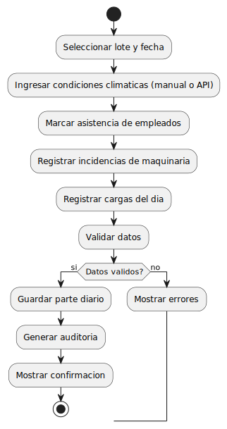

**Precondicion:** Debe existir al menos un lote en produccion activo.
Debe existir una tarea planificada o en ejecucion asociada al lote.
La fecha no puede ser futura y debe estar dentro de los ultimos 7 dias.

**Secuencia:**
normal

1- El usuario selecciona Produccion > Parte Diario > Cargar
Parte Diario.
2- El sistema despliega un formulario dividido en secciones:
Condiciones Meteorologicas: temperatura, lluvias,
humedad (el sistema puede precargar desde el API
Clima, editable por el usuario).
Asistencia de Empleados: lista de empleados asignados
con opcion de marcar presentes/ausentes.
Roturas/Incidencias de Maquinaria: seleccion de
maquinas con campos para describir fallas, tiempos de
parada.
Produccion del Dia: uso del caso de uso Registrar
Carga (UC-41), donde se registran destino, chofer,
categoria, bruto, tara y neto de cada carga.
3- El usuario completa o ajusta los campos de cada seccion.
4- El sistema valido:
obligatoriedad de campos minimos.
consistencia de datos.
5- El usuario confirma la operacion.
6- El sistema registra el Parte Diario completo, guarda
fecha/hora y usuario responsable, y genera auditoria.
7- El sistema muestra confirmacion y el resumen del Parte
Diario cargado.
**Postcondicion:** El parte diario queda registrado como documento unico del
dia.

**Excepciones:** 2a. No hay empleados asignados al lote -> el sistema muestra
advertencia pero permite continuar sin asistencia.
2c. API Clima no disponible -> el usuario debe cargar
manualmente las condiciones.
4a. Datos invalidos -> el sistema marca errores y solicita
correccion.
5a. Cancelacion -> el usuario cancela y se descarta la parte
diaria en curso.
6a. Error de persistencia/BD -> el sistema informa la falla y
sugiere reintentar.

### UC-62 Cerrar orden de Mantenimiento

**Actores:** Personales Administrativos

**Descripcion:** Este caso de uso permite cerrar una orden de mantenimiento
programada una vez que la intervencion fue realizada. En el
cierre se registran detalles de la tarea ejecutada, insumos
utilizados, costos y observaciones. El cierre actualiza el
historial de la maquina.

**Precondicion:** Debe existir una orden de mantenimiento programada y en
estado programado o en curso.

**Secuencia:**
normal

1- El usuario selecciona Maquinaria > Mantenimiento > Cerrar
Orden de Mantenimiento.
2- El sistema muestra un listado de ordenes de
mantenimiento pendientes o en ejecucion.
3- El usuario selecciona una orden para cerrar.
4- El sistema despliega un formulario con campos para el
cierre:
Tipo de mantenimiento (preventivo, correctivo,
servicio)
Observaciones
Insumos utilizados
Costos asociados
Observaciones
5- El usuario completa la informacion y confirma.
6- El sistema valida la consistencia de datos
7- El sistema actualiza el estado de la orden a Completada,
guarda los datos ingresados, registra fecha/hora y usuario
responsable.
8- El sistema actualiza el historial de la maquina con la
informacion del mantenimiento realizado.
9- El sistema confirma que la orden fue cerrada exitosamente.
**Postcondicion:** Orden de mantenimiento cambia su estado a completado. El
historial de la maquina se actualiza con el registro del
mantenimiento realizado. Los insumos utilizados (si se
informa) se descuentan del stock.

**Excepciones:** 2a. No hay ordenes pendientes -> el sistema informa que no
existen ordenes para cerrar.
3a. Seleccion invalida -> si la orden ya esta completada o anulada,
el sistema lo informa.
6a. Inconsistencia de datos -> el sistema marca errores y
solicita correccion.
5a. Cancelacion -> si el usuario cancela, no se realizan
cambios.
7a. Error de persistencia/BD -> el sistema informa la falla y
sugiere reintentar.

### UC-63 Programar mantenimiento

**Actores:** Primario: Personal Administrativo
Secundario: Sistema

**Descripcion:** Este caso de uso permite programar una orden de
mantenimiento para una maquina o equipo. La programacion
se puede realizar de dos maneras:

Manual: un usuario del sistema programa el
mantenimiento seleccionando maquina, fecha y tipo de
intervencion.
Automatica: el sistema invoca este caso de uso cuando
detecta, mediante reglas predefinidas, que una
maquina alcanzo un umbral de toneladas producidas o
fecha de servicio.

Diagrama de Actividad - Programar mantenimiento
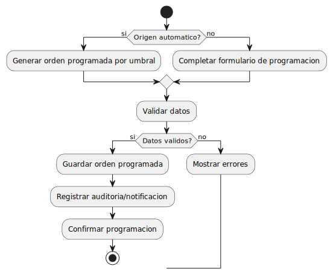

**Precondicion:** La maquina debe estar registrada y en estado activo.

**Secuencia:**
normal

1- El usuario selecciona Maquinaria > Mantenimiento >
Programar Mantenimiento.
2- El sistema despliega un formulario con los campos:
Maquina o equipo.
Tipo de mantenimiento (preventivo, correctivo,
servicio).
Fecha programada.
Observaciones (opcional).
3- El usuario completa los campos requeridos.
4- El sistema valida que:
la maquina existe y esta activa
la fecha programada sea valida
5- El usuario confirma la operacion.
6- El sistema genera la orden de mantenimiento programada,
asigna identificador unico, guarda fecha/hora y usuario
responsable, y genera registro de auditoria.
7- El sistema confirma la operacion mostrando el detalle de la
orden programada.
**Postcondicion:** Una orden de mantenimiento queda registrada y programada

**Excepciones:** 2a- No hay maquinas registradas -> el sistema informa que no
se pueden programar mantenimientos.
4a- Datos invalidos -> fecha incorrecta, maquina inactiva, tipo
no valido -> el sistema rechaza la operacion.
4b- Mantenimiento duplicado -> si ya existe una orden en la
misma fecha y maquina, el sistema alerta al usuario.

### UC-64 Configurar permisos

**Actores:** Administradores del sistema

**Descripcion:** Este caso de uso permite al Administrador configurar
permisos de acceso a los distintos modulos y
funcionalidades del sistema. Los permisos pueden
asignarse a roles o directamente a usuarios especificos.

**Precondicion:** Deben existir usuarios y/o roles previamente
registrados.

**Secuencia:**
normal

1- El Administrador selecciona Gestion de Seguridad >
Configurar Permisos.
2- El sistema muestra las opciones disponibles:
Asignar permisos a roles.
Modificar permisos de un usuario en particular.
El Administrador selecciona si desea trabajar a
nivel Rol o Usuario.
El sistema despliega un listado de roles o usuarios
segun corresponda.
El Administrador selecciona un rol/usuario.
3- El sistema muestra una matriz de permisos con los
modulos y funcionalidades del sistema.
4- El Administrador marca o desmarca los permisos
correspondientes.
5- El sistema valida que siempre existe al menos un
usuario con permisos de Administrador.
6- El Administrador confirma la operacion.
7- El sistema guarda los cambios, registra fecha/hora y
usuario responsable, y genera auditoria del cambio de
permisos.
8- El sistema confirma la modificacion mostrando el
detalle actualizado.
**Postcondicion:** Los roles y/o usuarios seleccionados tienen actualizados
sus permisos de acceso.2a. No hay ventas registradas ->
el sistema informa que no existen ventas.

3a. Filtros invalidos -> el sistema alerta al usuario y
solicita correccion.
4a. Sin resultados -> el sistema informa que no se
encontraron ventas con los criterios aplicados.
**Excepciones:** 2a. No existen roles o usuarios registrados -> el sistema
informa la situacion.
5a. Seleccion invalida -> si el rol o usuario no existe, el
sistema rechaza la accion.
8a. Intento de eliminar ultimo Administrador -> el

sistema bloquea la operacion y muestra advertencia.
9a. Cancelacion -> si el Administrador cancela, no se
guardan cambios.
10a. Error de persistencia/BD -> si ocurre un error al
guardar los permisos, el sistema informa la falla.
### UC-65 Planificacion de tareas por lote (ha)

**Actores:** Primario: Administrador
Secundario: API clima (opcional)

**Descripcion:** Este caso de uso permite registrar la planificacion de tareas por lote
(tipo de tarea y superficie en ha) para un periodo de produccion. El sistema
muestra informacion historica y recomendaciones climaticas como apoyo, y valida
que la suma de superficies no supere la superficie del lote.
Diagrama de Actividad - Planificacion de tareas por lote (ha)
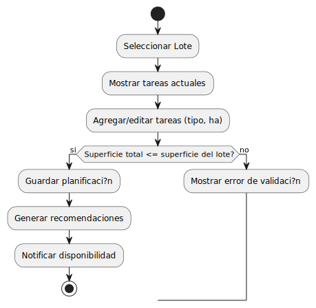

**Precondicion:** Lote registrado y activo. (Opcional) API de clima disponible.

**Secuencia:**
normal

1- El Administrador ingresa a Planificacion de tareas del Lote.
2- El sistema muestra el lote y las tareas planificadas existentes.
3- El Administrador agrega o edita tareas (tipo de tarea, superficie, observaciones).
4- El sistema valida que la suma de superficies no supere la superficie del lote.
5- El Administrador confirma la planificacion.
6- El sistema guarda la planificacion e inicia la generacion de recomendaciones.
7- El sistema notifica que la planificacion quedo disponible para revision.

**Postcondicion:** Planificacion de tareas por lote registrada en el sistema.

**Excepciones:** 2a. Lote no encontrado -> el sistema informa el error al usuario.
4a. Superficie total supera la superficie del lote -> el sistema informa el error.

2c. Precio de mercado no disponible -> el sistema notifica del
error al usuario.

### UC-66 Gestionar asignaciones y propuestas

**Actores:** Primario: Administrador
Secundario: Sistema

**Descripcion:** Este caso de uso permite revisar y gestionar propuestas automaticas
de asignacion de recursos por lote/tarea (empleados, maquinarias e insumos),
aceptarlas o cerrarlas y registrar asignaciones efectivas.

**Precondicion:** Deben existir lotes activos con tareas planificadas.

**Secuencia:**
normal

1- El Administrador ingresa a Asignaciones > Propuestas.
2- El sistema muestra las propuestas disponibles con sus recursos sugeridos.
3- El Administrador revisa la propuesta y decide:
- Aceptar (aplicar recursos).
- Cerrar (descartar propuesta).
4- El sistema registra la decision, actualiza el estado y genera auditoria.
5- El sistema confirma la operacion.

**Postcondicion:** Propuesta actualizada y, en caso de aceptacion, asignaciones
registradas para el lote/tarea.

**Excepciones:** 2a. No hay propuestas disponibles -> el sistema informa.
4a. Error de persistencia/BD -> el sistema informa la falla.

### UC-67 Configurar notificaciones de mantenimiento

**Actores:** Administrador

**Descripcion:** Permite configurar usuarios suscriptos, canales y parametros
de notificaciones de mantenimiento.

**Precondicion:** Deben existir usuarios registrados.

**Secuencia:**
normal

1- El Administrador ingresa a Configuracion > Notificaciones de mantenimiento.
2- El sistema muestra usuarios y preferencias actuales.
3- El Administrador selecciona usuarios y define parametros.
4- El sistema valida la informacion y guarda la configuracion.
5- El sistema confirma la operacion.

**Postcondicion:** Configuracion de notificaciones actualizada.

**Excepciones:** 2a. No existen usuarios -> el sistema informa.
4a. Error de persistencia/BD -> el sistema informa la falla.

### UC-68 Gestionar catalogos y listas de precios

**Actores:** Administrador, Personal Administrativo

**Descripcion:** Permite administrar catalogos maestros (tipos de maquinaria,
tipos de mantenimiento, unidades de medida) y listas de precios por cliente
y categoria de madera.

**Precondicion:** -

**Secuencia:**
normal

1- El usuario ingresa a Configuracion > Catalogos y Precios.
2- El sistema muestra los catalogos y listas existentes.
3- El usuario crea, modifica o elimina registros.
4- El sistema valida duplicados y consistencia.
5- El sistema guarda los cambios y registra auditoria.

**Postcondicion:** Catalogos y listas de precios actualizados.

**Excepciones:** 4a. Datos invalidos o duplicados -> el sistema informa.
5a. Error de persistencia/BD -> el sistema informa la falla.

## Diagramas de Secuencia de Diseno

Figura 13 - Diagrama de Secuencia - Registrar Parte Diario
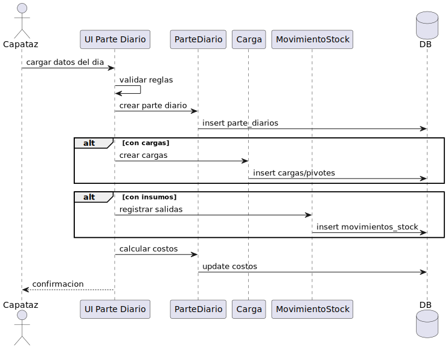

Figura 14 - Diagrama de Secuencia - Planificar tareas por lote (ha)

Figura 15 - Diagrama de Secuencia - Programar mantenimiento
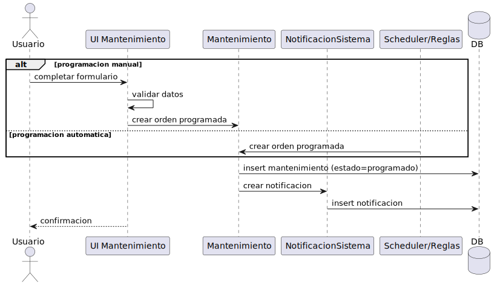

## Matriz de Rastreabilidad Objetivo/Requisitos

| Objetivo | IRQ (Info) | RF (Funcionales) | NFR |
| --- | --- | --- | --- |
| OBJ-01 Centralizacion de registros | IRQ-01..IRQ-06, IRQ-09, IRQ-10 | RF-01..RF-13, RF-18..RF-21 | NFR04 |
| OBJ-02 Subsistema de Produccion | IRQ-01, IRQ-08, IRQ-10 | RF-01, RF-02, RF-03, RF-17, RF-18 | NFR05 |
| OBJ-03 Subsistema de Maquinaria y Equipos | IRQ-02, IRQ-09 | RF-04, RF-05, RF-06, RF-20, RF-21 | NFR04 |
| OBJ-04 Subsistema de Recursos Humanos | IRQ-03 | RF-07, RF-08, RF-09 | NFR04 |
| OBJ-05 Subsistema Financiero y de Costos | IRQ-04, IRQ-08 | RF-10, RF-11, RF-17 | NFR05 |
| OBJ-06 Subsistema de Gestion Administrativa | IRQ-05 | RF-12, RF-13, RF-21 | NFR04 |
| OBJ-07 Seguridad y auditoria del sistema | IRQ-06, IRQ-07, IRQ-09 | RF-14, RF-15, RF-16, RF-19, RF-20 | NFR01, NFR02, NFR03 |
## Glosario de Terminos

Lote: unidad productiva forestal con superficie, ubicacion, especie y estado.
LoteTarea: planificacion por lote (tipo de tarea, superficie en ha y estado).
Parte Diario: registro operativo diario con empleados, maquinaria, cargas e insumos.
Carga: transporte de madera desde un lote hacia un destino (bruto, tara y neto).
Categoria de Madera: clasificacion usada en cargas y precios.
Maquinaria: equipo productivo registrado para explotacion y mantenimiento.
Mantenimiento: orden de servicio (programado, en curso, vencido o completado).
Insumo: material consumible; su stock se calcula por movimientos.
Movimiento de Stock: entrada o salida de insumos con referencia operativa.
Lote Inventario: lote FIFO de stock con cantidad disponible y costo.
Empleado: personal de la empresa vinculado a roles laborales y liquidaciones.
Chofer: transportista externo asociado a cargas.
Cliente: comprador de productos/servicios.
Proveedor: suministrador de insumos/servicios.
Venta: transaccion comercial asociada a cargas y cliente.
Usuario: identidad de acceso al sistema (modelo principal de autenticacion).
Rol/Permiso: control de acceso por funciones y modulos.
KPI: indicador de gestion generado a partir de datos operativos.
API Clima: servicio externo para analisis y recomendaciones climaticas.
Propuesta de Asignacion: sugerencia automatica de recursos por lote/tarea.
Asignacion de recursos: vinculacion efectiva de empleados, maquinarias e insumos a un lote/tarea.
Notificacion de mantenimiento: alerta interna sobre ordenes programadas, vencidas o pendientes.
Configuracion del sistema: parametros globales de umbrales, horarios y reglas.
Catalogo maestro: tablas de referencia (tipos, unidades, listas de precios).
