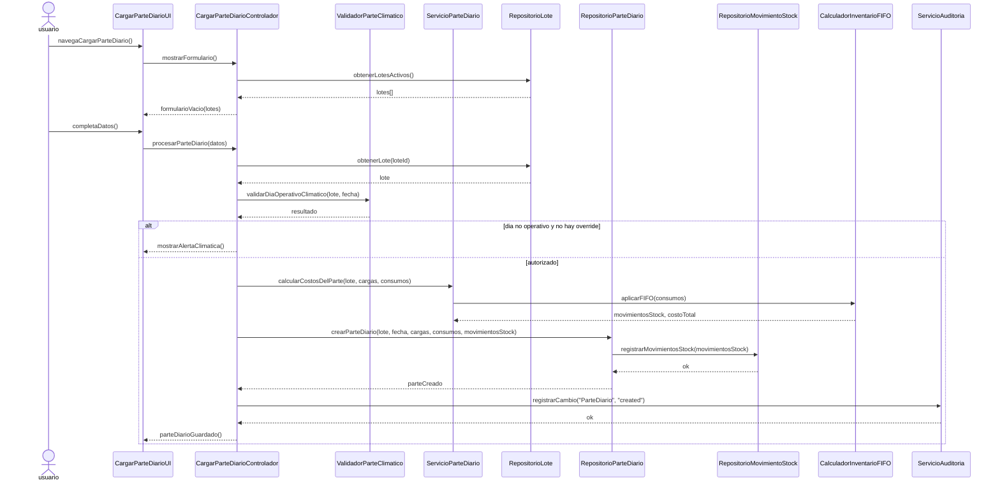
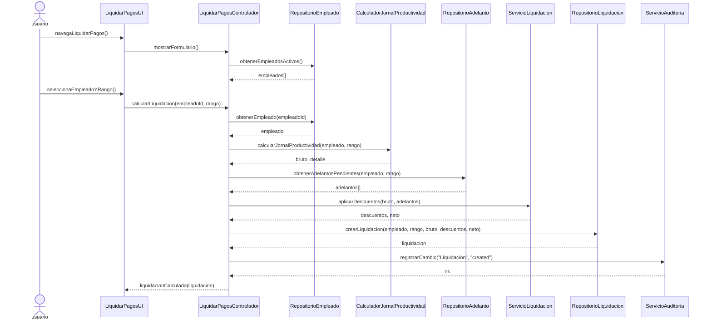
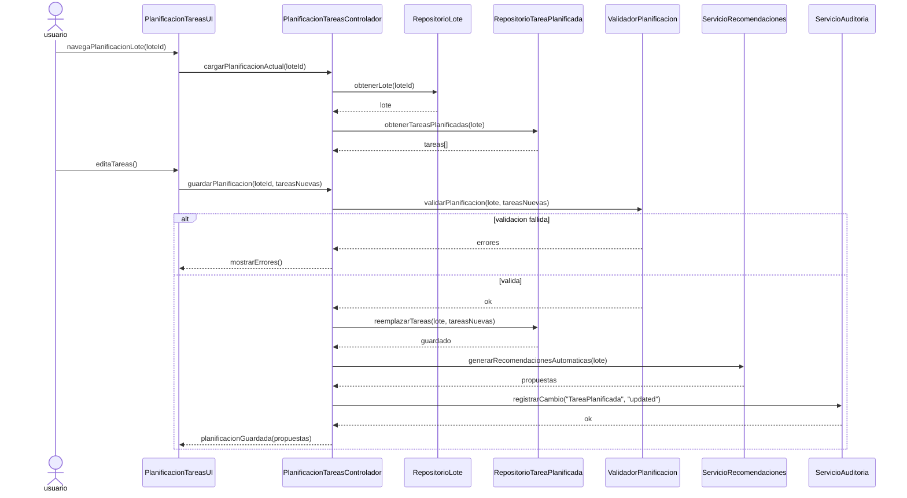
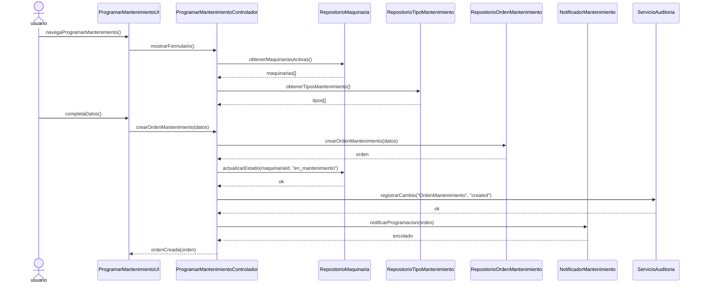
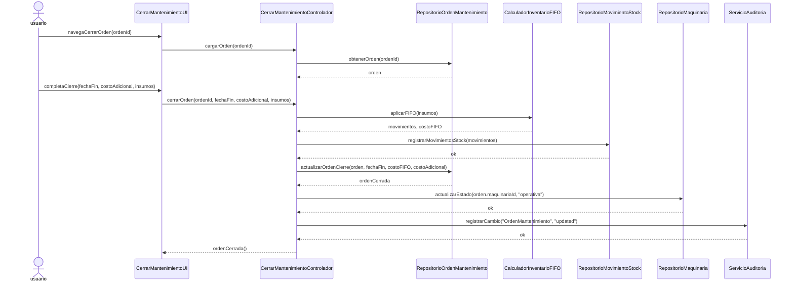
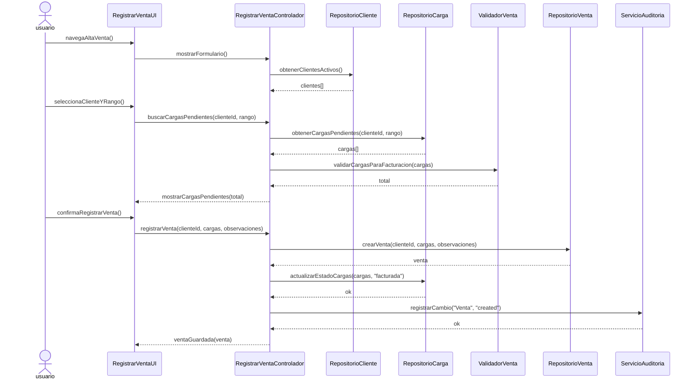
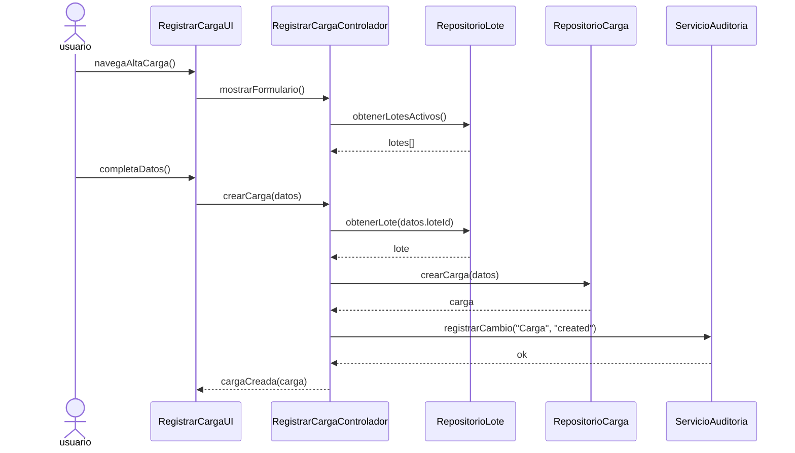
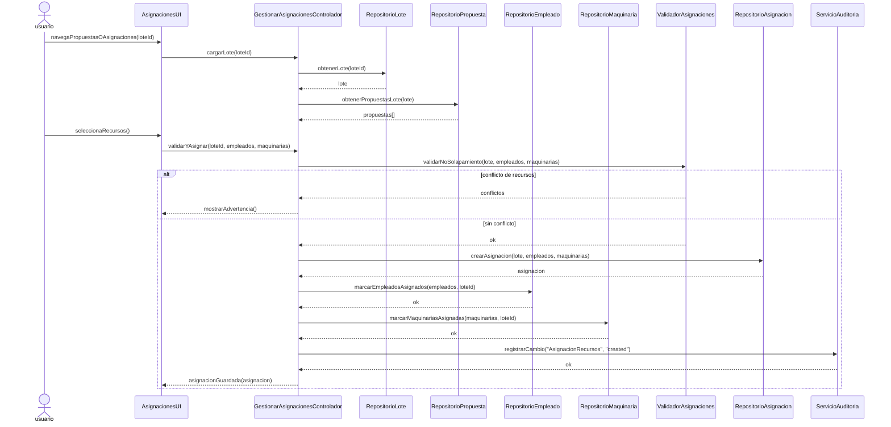
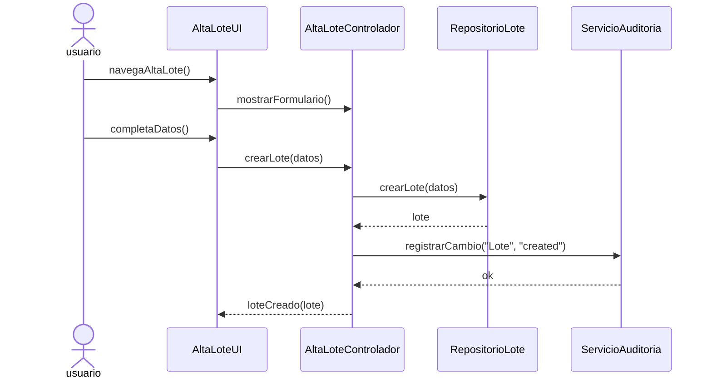
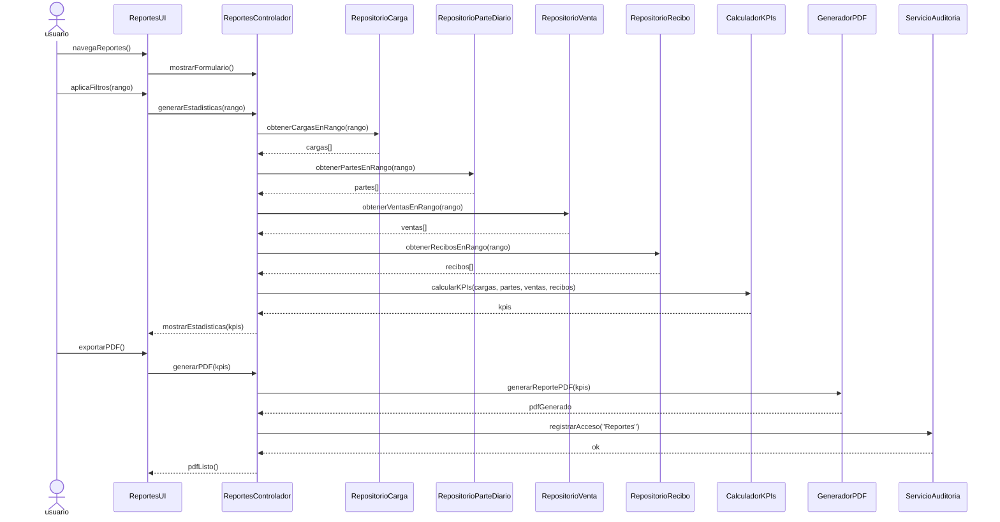

# Gestion Rennova
## Documento de Requisitos del Sistema
- Iteracion: 1
- Version: 00.01
- Fecha: 01/09/2025
- Realizado por: Rapp Luis
- Realizado para: Rennova
- Cliente: Rapp Marcelo

## Lista de Cambios
| Nro | Fecha | Descripción | Autor |
| --- | --- | --- | --- |
| 0 | Dd/mm/aaaa | Version ##,## | Autor |
| 1 | Dd/mm/aaaa | Descripción Cambio | Autor |
| 2 | 27/04/2026 | Agregado: 10 Diagramas de Secuencia de Diseño GRASP (UC-61, UC-59, UC-65, UC-63, UC-62, UC-13, UC-41, UC-66, UC-01, UC-57) en DIAGRAMAS_SECUENCIA_DISENO.md. Arquitectura Controlador-thin, Expertos de dominio, GRASP patterns, transacciones por Repositorio. | Rapp Luis |
| 3 | 30/04/2026 | Actualizado el glosario de términos al formato de tabla con columnas Término, Categoría y Comentarios. | Rapp Luis |

## Indice de Figuras
- Figura 1 - Diagrama de Subsistemas
- Figura 2 - Diagrama de Componentes
- Figura 3 - Diagrama de Componentes (Detalle por subsistemas)
- Figura 4 - Diagrama de Despliegue (Produccion)
- Figura 5 - Diagrama de Despliegue (Desarrollo)
- Figura 6 - Diagrama Caso de Uso del Sistema (Resumen)
- Figura 7 - Diagrama Caso Usos Subsistema Produccion
- Figura 8 - Diagrama Caso Usos Subsistema Maquinaria y Equipos
- Figura 9 - Diagrama Caso Usos Subsistema Recursos Humanos
- Figura 10 - Diagrama Caso Usos Subsistema Finanzas y Costos
- Figura 11 - Diagrama Caso Usos Subsistema Gestion Administrativa
- Figura 12 - Fronteras del Sistema
- Figura 13 - Diagrama de Secuencia - Registrar Parte Diario
- Figura 14 - Diagrama de Secuencia - Planificar tareas por lote (ha)
- Figura 15 - Diagrama de Secuencia - Programar mantenimiento
- **Figuras 16-25 - 10 Diagramas de Secuencia de Diseño GRASP (referenciados en DIAGRAMAS_SECUENCIA_DISENO.md)**

## Presentacion General
Renova enfrenta la necesidad de crecer en el mercado maderero argentino, en un
contexto donde la industria busca mejorar la eficiencia mediante el control sobre sus
operaciones. Actualmente, la empresa carece de un sistema unificado para gestionar y
auditar sus procesos forestales, logisticos y financieros.
Para responder a estas limitaciones, se desarrollara un sistema de software que
integre las distintas areas que conforman la empresa, de esta manera se busca que
cubra control sobre aspectos operativos, gestion de personal, estadisticas financieras,
metricas financieras derivadas (ingresos, egresos y flujo de caja) y otros conceptos administrativos, para poder lograr centralizar la
informacion de manera ordenada y util.

## Participantes del Proyecto

Debe contener una lista con todos los participantes en el proyecto:
Desarrolladores: Rapp Luis
Clientes: Rapp Marcelo

## Objetivos del Sistema

Se debe hacer una lista con los objetivos que se esperan alcanzar con el software a desarrollar.

### OBJ-01 Centralizacion e integracion de registros operativos y administrativos
**Descripcion:** Proveer una plataforma unificada para el negocio, eliminando la dispersion actual de datos en planillas manuales. Esto aporta valor estrategico al garantizar la consistencia y mejorar la trazabilidad global de la informacion en todas las areas de la empresa.
**Estabilidad:** Alta
**Comentarios:** Este es un objetivo de nivel de empresa que justifica la inversion en el sistema y atraviesa todas las funcionalidades.

### OBJ-02 Soporte operativo y trazabilidad de la produccion forestal
**Descripcion:** Dotar al Personal Administrativo de herramientas para la planificacion de tareas por lote (ha), y al Capataz/Supervisor de la capacidad de registrar partes diarios (y asociar/registrar cargas cuando corresponda). Aporta valor al asegurar la trazabilidad de la madera e incorporar soporte operativo mediante la consulta y analisis del clima.
**Estabilidad:** Alta
**Comentarios:** Las reglas de validacion climatica y de dias no operativos se gestionan como flujos y variaciones dentro de la logica de los partes diarios.

### OBJ-03 Gestion del mantenimiento y control de costos de maquinaria
**Descripcion:** Permitir el registro de maquinas y equipos, la programacion y cierre de mantenimientos preventivos y correctivos, y el envio de notificaciones asociadas. Incluye administrar costos historicos por tonelada e imputarlos en los costos de la maquinaria.
**Estabilidad:** Alta
**Comentarios:** -

### OBJ-04 Automatizacion de la liquidacion de nominas de Recursos Humanos
**Descripcion:** Facilitar al area administrativa la liquidacion automatica de pagos al personal basandose en metricas de productividad y dias trabajados, gestionando ademas el registro de adelantos y la generacion de recibos.
**Estabilidad:** Media
**Comentarios:** Las formulas de liquidacion dependen de leyes laborales y reglas de negocio corporativas, por lo que requeriran un diseno que soporte variaciones.

### OBJ-05 Soporte analitico financiero y de costos
**Descripcion:** Consolidar la informacion de ventas y los costos operativos (derivados de partes diarios, consumos de insumos, mantenimientos y liquidaciones) para generar reportes e indicadores (KPIs) estrategicos sobre costos, ingresos y rentabilidad.
**Estabilidad:** Media
**Comentarios:** Aunque la necesidad de reportes es estable, los tipos exactos de indicadores (KPIs) requeridos suelen evolucionar conforme madura la vision del negocio por parte de la gerencia.

### OBJ-06 Gestion administrativa comercial y de abastecimiento
**Descripcion:** Proveer al Personal Administrativo la capacidad de gestionar clientes, proveedores, choferes y ventas. Incluye el control del stock de insumos con valorizacion FIFO, junto con la administracion de catalogos (categorias/unidades/tipos) y listas de precios, garantizando el soporte material a la produccion.
**Estabilidad:** Alta
**Comentarios:** -

### OBJ-07 Seguridad y auditoria funcional del sistema
**Descripcion:** Proveer a los roles de soporte (Administrador) las interfaces para configurar usuarios, roles y permisos, incorporando un registro y consulta de auditoria de acciones (logs) para garantizar la trazabilidad, seguridad funcional y el control interno de los procesos.
**Estabilidad:** Alta
**Comentarios:** Abarca tanto los casos de uso de administracion de usuarios como el cumplimiento de los atributos de calidad (seguridad) de la Especificacion Complementaria.

## Subsistemas del Proyecto

### Diagrama de Subsistemas

Figura 1 - Diagrama de Subsistemas

### Descripcion de Subsistemas

1. Subsistema de Produccion
Este subsistema se encarga de administrar y controlar todas las operaciones
relacionadas con la actividad forestal. Integra el registro de lotes de origen,
cargas transportadas y destino final de cada envio. Ademas, permite planificar
tareas por lote (tipo y superficie en ha) en un periodo determinado, asegurar la
trazabilidad de la produccion y validar las partes diarias de trabajo.
2. Subsistema de Maquinaria y Equipos
Su proposito es gestionar de manera integral los recursos mecanicos de la
empresa. Permite registrar cada maquina y equipo, controlando su utilizacion en
el proceso productivo y asociandose a los lotes de extraccion correspondientes.
Incorpora el calculo automatico del costo de alquiler en funcion de los
volumenes extraidos. Incluye funcionalidades para programar y cerrar ordenes
de mantenimiento preventivo y correctivo, favoreciendo el correcto
funcionamiento de la flota.
3. Subsistema de Recursos Humanos
Este subsistema centraliza la gestion del personal operativo y administrativo de
la empresa. Contempla la administracion de empleados, incluyendo datos
personales, historial laboral y asignacion de tareas. Automatiza el calculo de
liquidaciones en base a dias trabajados, tipo de tarea realizada, productividad y
posibles adelantos registrados. Tambien permite generar recibos y mantener un
historial detallado de pagos.
4. Subsistema Financiero y de Costos
Su funcion es consolidar y organizar la informacion economica de la empresa.
Integra el registro de ingresos, egresos y costos operativos, y calcula el flujo de caja como metrica derivada. El
subsistema procesa los datos registrados en las operaciones y los transforma en
informes e indicadores estrategicos (KPIs) que permiten analizar la rentabilidad y
eficiencia de las actividades. De esta manera, brinda soporte para la toma de
decisiones en materia de control de gastos, evaluacion de inversiones y
planificacion de recursos financieros.
5. Subsistema de Gestion Administrativa
Este subsistema articula los procesos de soporte administrativo que
complementan la operacion forestal. Incluye la gestion de clientes, proveedores,
asegurando un registro ordenado de las relaciones comerciales de la empresa.

Tambien contempla el control de insumos y stock, garantizando la
disponibilidad de materiales necesarios para la produccion y facilitando
auditorias de inventario. Ademas, incorpora mecanismos de seguridad mediante
la administracion de usuarios, roles y permisos, junto con un registro de
auditoria de acciones (log del sistema), que otorgan trazabilidad y control en
cada operacion realizada.

## Arquitectura General

**Descripcion:** general: La solucion se organiza en una interfaz web, servicios de aplicacion y capa de datos, con integracion a servicios externos (clima y correo) y ejecucion de tareas programadas.

Figura 2 - Diagrama de Componentes
Descripcion: muestra los componentes principales del sistema y sus dependencias (UI, servicios, ORM, base de datos, notificaciones y API de clima).

Figura 3 - Diagrama de Componentes (Detalle por subsistemas)
Descripcion: detalla los modulos por subsistema y sus integraciones con reportes/KPIs, notificaciones, scheduler y base de datos.

Figura 4 - Diagrama de Despliegue (Produccion)
Descripcion: despliegue recomendado para produccion con servidor de aplicacion, worker/scheduler, base de datos y servicios externos.

Figura 5 - Diagrama de Despliegue (Desarrollo)
Descripcion: despliegue de desarrollo en un solo equipo con dependencias externas.

## Diagrama de Caso de Uso del Sistema

Figura 6 - Diagrama Caso de Uso del Sistema (Resumen)

Figura 7 - Diagrama Caso Usos Subsistema Produccion

Figura 8 - Diagrama Caso Usos Subsistema Maquinaria y Equipos

Figura 9 - Diagrama Caso Usos Subsistema Recursos Humanos

Figura 10 - Diagrama Caso Usos Subsistema Finanzas y Costos

Figura 11 - Diagrama Caso Usos Subsistema Gestion Administrativa

## Requisitos del Sistema

### Requisitos de Informacion
Debe tener una lista de requisitos de almacenamiento y restricciones de informacion identificadas.

### IRQ-01 Informacion sobre lotes y cargas
**Objetivos asociados:**
- OBJ-02 Soporte operativo y trazabilidad de la produccion forestal
**Requisitos asociados:**
- UC-01..UC-04 Gestion de lotes
- UC-41..UC-44 Gestion de cargas
- UC-33..UC-36 Gestion de choferes
**Descripcion:** El sistema debera almacenar toda la informacion vinculada a los lotes y cargas de madera, permitiendo asegurar la trazabilidad de la produccion.
**Datos especificos:**
- Nombre
- Ubicacion
- Especie
- Superficie (ha)
- Nro de ticket
- Categoria de madera
- Chofer
- Peso bruto
- Tara
- Peso neto
- Destino
**Estabilidad:** Alta
**Comentarios:** -

### IRQ-02 Informacion sobre maquinaria y equipos
**Objetivos asociados:**
- OBJ-03 Gestion del mantenimiento y control de costos de maquinaria
**Requisitos asociados:**
- UC-09..UC-12 Gestion de maquinaria
- UC-62 Cerrar orden de mantenimiento
- UC-63 Programar mantenimiento
**Descripcion:** El sistema debera almacenar los datos relacionados con las maquinas utilizadas en la produccion y su mantenimiento.
**Datos especificos:**
- Identificador y tipo de maquina
- Estado operativo
- Fecha de alta en el sistema
- Produccion asociada (volumen extraido)
- Costo de alquiler por periodo o unidad
- Historial de mantenimientos preventivos y correctivos
**Estabilidad:** Media
**Comentarios:** -

### IRQ-03 Informacion sobre empleados y choferes
**Objetivos asociados:**
- OBJ-04 Automatizacion de la liquidacion de nominas de Recursos Humanos
**Requisitos asociados:**
- UC-21..UC-24 Gestion de empleados
- UC-33..UC-36 Gestion de choferes
- UC-53..UC-56 Gestion de adelantos
- UC-58 Generar recibos
- UC-59 Liquidar pagos
**Descripcion:** El sistema debera almacenar la informacion del personal (empleados) y choferes contratados necesaria para la gestion operativa y de pagos. Para mantener alta cohesion, la informacion se organiza por entidades fisicas (maestras) y transacciones (operaciones historicas).
**Datos especificos:**
- Entidad fisica: Empleado
- Nombre y apellido
- DNI/CUIT
- Datos de contacto
- Categoria laboral o rol
- / Historial de asignacion de tareas (Derivado)
- / Jornales y productividad acumulada (Derivado)
- / Saldo actual de adelantos (Derivado)
- Entidad fisica: Chofer
- Nombre y apellido
- DNI/CUIT
- Datos de contacto
- / Historial de cargas asociadas (Derivado)
- Entidad transaccional: Adelanto
- Empleado solicitante (Referencia a Empleado)
- Fecha de solicitud
- Monto del adelanto
- Estado (pendiente de descuento, descontado)
- Entidad transaccional: Liquidacion/Recibo
- Empleado liquidado (Referencia a Empleado)
- Periodo de liquidacion (fecha inicio/fin)
- Monto bruto (basado en productividad/jornales)
- Descuentos aplicados (adelantos deducidos)
- Monto neto a pagar
**Estabilidad:** Alta
**Comentarios:** Los atributos precedidos por "/" son atributos derivados (notacion UML). El sistema no los almacena como campos estaticos, sino que los calcula consultando transacciones vinculadas (Partes Diarios, Adelantos, Cargas).

### IRQ-04 Informacion financiera y de costos
**Objetivos asociados:**
- OBJ-05 Soporte analitico financiero y de costos
**Requisitos asociados:**
- UC-13..UC-16 Gestion de ventas
- UC-57 Informes generales
- UC-58 Generar recibos
- UC-59 Liquidar pagos
- UC-61 Cargar parte diario
- UC-37..UC-40 Gestion de stock de insumos
- UC-62 Cerrar orden de mantenimiento
- UC-63 Programar mantenimiento
**Descripcion:** El sistema debera consolidar la informacion de ventas y costos operativos para generar reportes e indicadores (KPIs) de costos, ingresos y rentabilidad por lote y por periodo. Ingresos, egresos y flujo de caja se obtienen como metricas derivadas a partir de transacciones operativas y de ventas registradas.
**Datos especificos:**
- Entidad transaccional: Venta
- Cliente (Referencia)
- Cargas incluidas (Referencia)
- Fecha de venta
- Precio unitario
- / Subtotal (Derivado)
- / Monto total (Derivado)
- Entidad operativa: Parte Diario
- Lote (Referencia)
- Fecha
- / Costos operativos del dia (Derivado: mano de obra, insumos, maquinaria)
- / Toneladas del dia (Derivado de cargas asociadas)
- / Costo unitario por tonelada (Derivado)
- Entidad operativa/inventario: Movimiento de Stock (FIFO)
- Insumo (Referencia)
- Tipo (entrada/salida)
- Cantidad
- Fecha
- Motivo/Referencia operativa (ej. Parte Diario o Mantenimiento)
- Precio unitario de compra
- / Costo total del movimiento FIFO (Derivado)
- / Lote de inventario consumido (Derivado, si aplica)
- Entidad transaccional: Orden de Mantenimiento
- Maquinaria (Referencia)
- Tipo/Estado
- Fechas (programacion y cierre)
- / Costo total de insumos consumidos (Derivado de movimientos de stock asociados)
- Entidad transaccional: Recibo/Liquidacion
- Empleado (Referencia)
- Periodo de liquidacion (fecha inicio/fin)
- Fecha de emision
- / Monto bruto (Derivado de jornales/productividad)
- / Descuentos totales (Derivado de adelantos)
- / Monto neto (Derivado)
- Observaciones/Comprobante generado
- Metricas gerenciales (KPIs no persistidos)
- / Ingresos del periodo (Derivado de Ventas)
- / Egresos del periodo (Derivado de Partes Diarios, FIFO, Mantenimientos y Recibos)
- / Rentabilidad general y por lote (Derivada)
- / Flujo de caja (Derivado)
**Estabilidad:** Media
**Comentarios:** Los campos marcados con "/" son atributos derivados segun notacion UML. El sistema no cuenta con un ABM contable estatico para estos valores; se calculan a partir de las transacciones subyacentes.

### IRQ-05 Informacion sobre clientes, proveedores e insumos
**Objetivos asociados:**
- OBJ-06 Gestion administrativa comercial y de abastecimiento
**Requisitos asociados:**
- UC-25..UC-28 Gestion de clientes
- UC-29..UC-32 Gestion de proveedores
- UC-37..UC-40 Gestion de stock de insumos
- UC-45..UC-48 Gestion de categorias
- UC-68 Gestionar catalogos y listas de precios
**Descripcion:** El sistema debera almacenar la informacion de clientes, proveedores y stock de insumos necesarios para la operacion.
**Datos especificos:**
- Datos de clientes (razon social, CUIT, direccion, contacto)
- Datos de proveedores (razon social, CUIT, direccion, contacto)
- Insumos disponibles en stock
- Consumo de insumos por lote o maquinaria
- Movimientos de inventario
**Estabilidad:** Media
**Comentarios:** -

### IRQ-06 Informacion sobre usuarios y permisos
**Objetivos asociados:**
- OBJ-07 Seguridad y auditoria funcional del sistema
**Requisitos asociados:**
- UC-49..UC-52 Gestion de usuarios
- UC-64 Configurar permisos
**Descripcion:** El sistema debera almacenar informacion relacionada con la gestion de usuarios y sus niveles de acceso.
**Datos especificos:**
- Identificador de usuario
- Nombre y apellido
- Email
- Rol o perfil asignado
- Permisos y accesos habilitados
- Fecha y hora de creacion del usuario
- Estado de la cuenta (activo/inactivo)
**Estabilidad:** Alta
**Comentarios:** La entidad principal de autenticacion es Usuario; el modelo User de Laravel se considera legado.

### IRQ-07 Informacion de auditoria del sistema
**Objetivos asociados:**
- OBJ-07 Seguridad y auditoria funcional del sistema
**Requisitos asociados:**
- RF-16 Registro de auditoria
**Descripcion:** El sistema debera mantener un registro de auditoria de cambios sobre las entidades del dominio auditables. La auditoria se implementa a nivel de eventos Eloquent mediante el paquete `owen-it/laravel-auditing` con almacenamiento en base de datos (tabla `audits`).
**Datos especificos:**
- Usuario responsable del cambio (si existe sesion autenticada)
- Fecha y hora del evento
- Evento auditado (created, updated, deleted, restored)
- Entidad afectada (auditable_type) e identificador (auditable_id)
- Valores anteriores y nuevos (old_values/new_values)
- URL, direccion IP y user agent (cuando aplica)
- Tags o metadatos de contexto (si aplica)
**Estabilidad:** Alta
**Comentarios:** La auditoria actual registra cambios (alta/modificacion/baja/restauracion) y no registra "consultas" como evento funcional. Algunas operaciones internas tambien registran logs tecnicos (Laravel Log) independientes de esta auditoria.

### IRQ-08 Informacion de reportes e indicadores
**Objetivos asociados:**
- OBJ-05 Soporte analitico financiero y de costos
- OBJ-02 Soporte operativo y trazabilidad de la produccion forestal
**Requisitos asociados:**
- UC-57 Informes generales
- UC-65 Planificacion de tareas por lote (ha)
- UC-61 Cargar parte diario
**Descripcion:** El sistema no almacenara reportes estaticos, sino que debera procesar la informacion transaccional subyacente para generar metricas, reportes e indicadores estrategicos (KPIs) de manera dinamica. Estos indicadores consolidan informacion operativa, de produccion y financiera.
**Datos especificos:**
- Metricas de produccion y operativa (derivadas)
- / Total producido por lote y por periodo (Derivado de Partes Diarios y Cargas)
- / Total extraido por categoria de madera (Derivado de Cargas)
- / Avance de tareas planificadas (ha) vs ejecutadas (Derivado de Planificacion y Partes Diarios)
- / Estadisticas de productividad por empleado (Derivado de Partes Diarios)
- Metricas financieras y de costos (derivadas)
- / Ingresos y egresos del periodo (Derivado de Ventas, Recibos, FIFO, Mantenimientos)
- / Rentabilidad general y por lote (Derivado de enfrentar Ventas vs Costos imputados)
- / Costo historico por maquinaria (Derivado de Mantenimientos y Partes Diarios)
- / Costo por consumo de insumos (Derivado de Movimientos FIFO)
**Estabilidad:** Media
**Comentarios:** Los elementos con prefijo "/" son atributos o metricas derivadas (notacion UML). Se obtienen mediante consultas y calculos sobre entidades transaccionales, no como almacenamiento duplicado de "reportes".

### IRQ-09 Informacion de configuraciones y notificaciones
**Objetivos asociados:**
- OBJ-07 Seguridad y auditoria funcional del sistema
- OBJ-03 Gestion del mantenimiento y control de costos de maquinaria
**Requisitos asociados:**
- UC-63 Programar mantenimiento
**Descripcion:** El sistema debera almacenar configuraciones globales y de notificaciones.
**Datos especificos:**
- Umbrales de mantenimiento y parametros generales del sistema
- Horarios y expresiones de scheduler
- Usuarios suscriptos a notificaciones de mantenimiento
- Historial de notificaciones internas enviadas
**Estabilidad:** Alta
**Comentarios:** -

### IRQ-10 Informacion de asignaciones y propuestas
**Objetivos asociados:**
- OBJ-02 Soporte operativo y trazabilidad de la produccion forestal
**Requisitos asociados:**
- UC-65 Planificacion de tareas por lote (ha)
**Descripcion:** El sistema debera almacenar propuestas de asignacion y planes de recursos.
**Datos especificos:**
- Propuestas automaticas por lote/tarea
- Recursos sugeridos (empleados, maquinarias, insumos)
- Estado de propuesta (abierta, aceptada, cerrada)
- Metricas de desempeno asociadas
**Estabilidad:** Media
**Comentarios:** -

### Requisitos Funcionales

### RF-01 Gestion de Lotes
**Objetivos asociados:**
- OBJ-02 Soporte operativo y trazabilidad de la produccion forestal
**Requisitos asociados:**
- IRQ-01 Informacion sobre lotes y cargas
**Descripcion:** El sistema debera permitir registrar, modificar, consultar y
dar de baja lotes de produccion mediante cambio de estado,
vinculando datos de origen,
categoria, volumenes planificados y extraidos.
**Estabilidad:** Alta
**Comentarios:** -
### RF-02 Gestion de Cargas
**Objetivos asociados:**
- OBJ-02 Soporte operativo y trazabilidad de la produccion forestal
**Requisitos asociados:**
- IRQ-01 Informacion sobre lotes y cargas
**Descripcion:** El sistema debera registrar cada carga de madera,
incluyendo numero de ticket, peso bruto, tara, peso neto,
destino y chofer responsable.
**Estabilidad:** Alta
**Comentarios:** -
### RF-03 Planificacion de Produccion
**Objetivos asociados:**
- OBJ-02 Soporte operativo y trazabilidad de la produccion forestal
**Requisitos asociados:**
- IRQ-08 Informacion de reportes e indicadores
**Descripcion:** El sistema debera permitir planificar tareas por lote (tipo de tarea
y superficie en ha) y comparar lo planificado con lo ejecutado
(partes diarios/cargas).
**Estabilidad:** Media
**Comentarios:** -
### RF-04 Gestion de Maquinaria y Equipos

**Objetivos asociados:**

- OBJ-03 Gestion del mantenimiento y control de costos de maquinaria
**Requisitos asociados:**

- IRQ-02 Informacion sobre maquinaria y equipos
**Descripcion:** El sistema debera permitir registrar, consultar y modificar
la informacion de cada maquina o equipo utilizado en la
produccion.

**Estabilidad:** Alta

**Comentarios:** -

### RF-05 Calculo de costos de maquinaria

**Objetivos asociados:**

- OBJ-03 Gestion del mantenimiento y control de costos de maquinaria
**Requisitos asociados:**

- IRQ-02 Informacion sobre maquinaria y equipos
- IRQ-04 Informacion financiera y de costos
**Descripcion:** El sistema debera calcular de manera automatica el costo
de alquiler de la maquinaria en funcion de los parametros
definidos (toneladas extraidas, tarifas por hora o dia).

**Estabilidad:** Alta

**Comentarios:** -

### RF-06 Gestion de mantenimientos

**Objetivos asociados:**

- OBJ-03 Gestion del mantenimiento y control de costos de maquinaria
**Requisitos asociados:**

- IRQ-02 Informacion sobre maquinaria y equipos
**Descripcion:** El sistema debera permitir programar mantenimientos
preventivos y registradores correctivos,
incluyendo fechas de inicio, cierre de orden y costo
asociado.

**Estabilidad:** Baja

**Comentarios:** -

### RF-07 Gestion de empleados

**Objetivos asociados:**

- OBJ-04 Automatizacion de la liquidacion de nominas de Recursos Humanos
**Requisitos asociados:**

- IRQ-03 Informacion sobre empleados
**Descripcion:** El sistema debera administrar la informacion del personal
(empleados y choferes), permitiendo su alta, baja,
consulta y modificacion de datos.

**Estabilidad:** Alta

**Comentarios:** -

### RF-08 Liquidacion de pagos

**Objetivos asociados:**

- OBJ-04 Automatizacion de la liquidacion de nominas de Recursos Humanos
**Requisitos asociados:**

- IRQ-03 Informacion sobre empleados
- IRQ-04 Informacion financiera y de costos
**Descripcion:** El sistema debera calcular automaticamente los haberes
del personal en base a dias trabajados, productividad y
adelantos registrados.

**Estabilidad:** Alta

**Comentarios:** -

### RF-09 Emision de recibos y adelantos

**Objetivos asociados:**

- OBJ-04 Automatizacion de la liquidacion de nominas de Recursos Humanos
**Requisitos asociados:**

- IRQ-03 Informacion sobre empleados
**Descripcion:** El sistema debera emitir recibos de pago y registrador
adelantados entregados al personal, manteniendo un
historial de liquidaciones.

**Estabilidad:** Alta

**Comentarios:** -

### RF-10 Gestion financiera (ingresos/egresos)

**Objetivos asociados:**

- OBJ-05 Soporte analitico financiero y de costos
**Requisitos asociados:**

- IRQ-04 Informacion financiera y de costos
**Descripcion:** El sistema debera calcular ingresos, egresos y flujo de caja como metricas derivadas a partir de ventas, costos operativos y liquidaciones registradas.
**Estabilidad:** Alta

**Comentarios:** -

### RF-11 Generacion de informes financieros

**Objetivos asociados:**

- OBJ-05 Soporte analitico financiero y de costos
**Requisitos asociados:**

- IRQ-08 Informacion de reportes e indicadores
**Descripcion:** El sistema debera generar reportes PDF con estadisticas
forestales y productivas (por lote, periodo y categoria), ademas
de indicadores de costos y productividad.

**Estabilidad:** Media

**Comentarios:** Informes financieros avanzados quedan pendientes.

### RF-12 Gestion de clientes y proveedores

**Objetivos asociados:**

- OBJ-06 Gestion administrativa comercial y de abastecimiento
**Requisitos asociados:**

- IRQ-05 Informacion sobre clientes, proveedores e
insumos
**Descripcion:** El sistema debera administrar la informacion de clientes y
proveedores, incluyendo sus datos comerciales basicos y contactos.

**Estabilidad:** Media

**Comentarios:** -

### RF-13 Gestion de insumos y stock

**Objetivos asociados:**

- OBJ-06 Gestion administrativa comercial y de abastecimiento
**Requisitos asociados:**

- IRQ-05 Informacion sobre clientes, proveedores e
insumos
**Descripcion:** El sistema debera permitir controlar el stock de insumos,
registrando ingresos, egresos y consumos por lote o
maquinaria.

**Estabilidad:** Alta

**Comentarios:** -

### RF-14 Gestion de usuarios y roles

**Objetivos asociados:**

- OBJ-07 Seguridad y auditoria funcional del sistema
**Requisitos asociados:**

- IRQ-06 Informacion sobre usuarios y permisos
**Descripcion:** El sistema debera permitir crear, modificar y eliminar
usuarios, asignandoles roles y permisos de acceso segun
su perfil, modelando la baja como cambio de estado.

**Estabilidad:** Alta

**Comentarios:** -

### RF-15 Configuracion de permisos

**Objetivos asociados:**

- OBJ-07 Seguridad y auditoria funcional del sistema
**Requisitos asociados:**

- IRQ-06 Informacion sobre usuarios y permisos
**Descripcion:** El sistema debera definir y aplicar permisos especificos
para cada usuario o rol, controlando el acceso a modulos
y operaciones criticas.

**Estabilidad:** Alta

**Comentarios:** -

### RF-16 Registro de auditoria

**Objetivos asociados:**

- OBJ-07 Seguridad y auditoria funcional del sistema
**Requisitos asociados:**

- IRQ-07 Informacion de auditoria del sistema
**Descripcion:** El sistema debera registrar en un registro de auditoria todas
las relevantes realizadas por los usuarios,
incluyendo fecha, hora, accion y acciones afectadas.

**Estabilidad:** Alta

**Comentarios:** -

### RF-17 Generacion de indicadores de gestion

**Objetivos asociados:**

- OBJ-05 Soporte analitico financiero y de costos
- OBJ-02 Soporte operativo y trazabilidad de la produccion forestal
**Requisitos asociados:**

- IRQ-08 Informacion de reportes e indicadores
**Descripcion:** El sistema debera generar indicadores de productividad,
eficiencia operativa y rentabilidad, basados en los datos
registrados en los diferentes modulos.

**Estabilidad:** Media

**Comentarios:** -

### RF-18 Gestion de asignaciones y propuestas automaticas

**Objetivos asociados:**

- OBJ-02 Soporte operativo y trazabilidad de la produccion forestal
**Requisitos asociados:**

- IRQ-10 Informacion de asignaciones y propuestas
**Descripcion:** El sistema debera generar propuestas automaticas de asignacion
de recursos por lote/tarea y permitir su revision, aceptacion o
cierre, registrando recursos asociados.

**Estabilidad:** Media

**Comentarios:** -

### RF-19 Notificaciones internas y recordatorios

**Objetivos asociados:**

- OBJ-07 Seguridad y auditoria funcional del sistema
- OBJ-03 Gestion del mantenimiento y control de costos de maquinaria
**Requisitos asociados:**

- IRQ-09 Informacion de configuraciones y notificaciones
**Descripcion:** El sistema debera generar notificaciones internas y recordatorios
relacionados con mantenimientos y eventos relevantes, y permitir
marcar su estado (leida/accionada).

**Estabilidad:** Alta

**Comentarios:** -

### RF-20 Configuracion del sistema

**Objetivos asociados:**

- OBJ-07 Seguridad y auditoria funcional del sistema
- OBJ-03 Gestion del mantenimiento y control de costos de maquinaria
**Requisitos asociados:**

- IRQ-09 Informacion de configuraciones y notificaciones
**Descripcion:** El sistema debera permitir configurar parametros generales
(umbrales de mantenimiento, horarios de verificacion y reglas
de notificacion).

**Estabilidad:** Alta

**Comentarios:** -

### RF-21 Gestion de catalogos y listas de precios

**Objetivos asociados:**

- OBJ-06 Gestion administrativa comercial y de abastecimiento
- OBJ-03 Gestion del mantenimiento y control de costos de maquinaria
**Requisitos asociados:**

- IRQ-02 Informacion sobre maquinaria y equipos
- IRQ-05 Informacion sobre clientes, proveedores e insumos
**Descripcion:** El sistema debera administrar catalogos maestros
(tipos de maquinaria, tipos de mantenimiento, unidades de medida)
y listas de precios por cliente/categoria de madera.

**Estabilidad:** Media

**Comentarios:** -

### Requisitos No Funcionales

### NFR01 Copias de seguridad
**Objetivos asociados:**
- OBJ-07 Seguridad y auditoria funcional del sistema
**Requisitos asociados:**
- RF-16 Registro de auditoria
**Descripcion:** El sistema debera incorporar un mecanismo de copias de seguridad automaticas de la base de datos con una ejecucion diaria y capacidad de restauracion ante incidentes o desastres.
**Comentarios:** La politica de retencion, ubicacion del respaldo y periodicidad de verificacion de restauracion se definen a nivel operativo.

### NFR02 Control de acceso
**Objetivos asociados:**
- OBJ-07 Seguridad y auditoria funcional del sistema
**Requisitos asociados:**
- RF-14 Gestion de usuarios y roles
- RF-15 Configuracion de permisos
**Descripcion:** El sistema debera implementar autenticacion de usuarios y autorizacion basada en roles y permisos por modulo, restringiendo el acceso a funciones segun el perfil habilitado.
**Comentarios:** El control de acceso aplica a usuarios autenticados y a las sesiones activas del sistema.

### NFR03 Registros de auditoria
**Objetivos asociados:**
- OBJ-07 Seguridad y auditoria funcional del sistema
**Requisitos asociados:**
- RF-16 Registro de auditoria
**Descripcion:** Toda accion de alta, baja y modificacion sobre entidades auditables, asi como el acceso a informacion sensible o operaciones criticas, debera generar un registro de auditoria interno con usuario, fecha, hora, accion y entidad afectada.
**Comentarios:** La auditoria debe ser trazable y protegida contra modificaciones por usuarios finales.

### NFR04 Manejo de errores de persistencia
**Objetivos asociados:**
- OBJ-01 Centralizacion e integracion de registros operativos y administrativos
**Requisitos asociados:**
- RF-01, RF-02, RF-03, RF-04, RF-05, RF-06, RF-07, RF-08, RF-09, RF-10, RF-12, RF-13, RF-18, RF-19, RF-20, RF-21
**Descripcion:** En caso de error de persistencia en la base de datos o fallo de transaccion, el sistema debera informar al usuario de forma clara, ejecutar rollback sobre la operacion afectada y dejar los datos en un estado consistente.
**Comentarios:** La recuperacion aplica a operaciones que modifiquen estado y dependan de una transaccion atomica.

### NFR05 Exportacion de archivos
**Objetivos asociados:**
- OBJ-05 Soporte analitico financiero y de costos
**Requisitos asociados:**
- RF-11 Generacion de informes financieros
- RF-17 Generacion de indicadores de gestion
**Descripcion:** El sistema debera permitir la exportacion de reportes y listados gerenciales en formato PDF. La exportacion a Excel podra habilitarse para reportes tabulares cuando el modulo de reportes lo soporte.
**Comentarios:** PDF es el formato base del proyecto; Excel queda condicionado a la implementacion del componente de exportacion tabular.

## Fronteras del Sistema
Figura 12 - Fronteras del Sistema

## Definicion de Actores

ACT-01 Personal Administrativo
**Descripcion:**
Este actor representa al personal de la empresa
encargado de gestionar tareas administrativas, tales
como la carga de datos, gestion de clientes,
proveedores, insumos y emision de reportes.
**Comentarios:** -
ACT-02 Capataz
**Descripcion:**
Este actor representa al encargado de supervisar y
validar las tareas operativas realizadas en campo,
incluyendo la extraccion, el registro de cargas y la
verificacion de partes diarios.
**Comentarios:** -
ACT-03 Administrador
**Descripcion:**
Este actor representa a la persona responsable de la
configuracion y mantenimiento del sistema, incluyendo
la gestion de usuarios, asignacion de roles y permisos,
y control de la seguridad.
**Comentarios:** -
ACT-04 API clima
**Descripcion:**
Este actor representa un servicio externo de terceros
que provee informacion meteorologica, utilizada como
insumo para el analisis climatico y recomendaciones
operativas.
**Comentarios:** -
## Casos de Uso del Sistema
### Listado de Casos de Uso
- 1 Alta Lote
- 2 Baja Lote
- 3 Modificar Lote
- 4 Ver Lote
- 5 Alta Insumo
- 6 Baja Insumo
- 7 Modificar Insumo
- 8 Ver Insumo
- 9 Alta Maquinaria
- 10 Baja Maquinaria
- 11 Modificar Maquinaria
- 12 Ver Maquinaria
- 13 Alta Venta
- 14 Baja Venta
- 15 Modificar Venta
- 16 Ver Venta
- 21 Alta Empleado
- 22 Baja Empleado
- 23 Modificar Empleado
- 24 Ver Empleado
- 25 Alta Cliente
- 26 Baja Cliente
- 27 Modificar Cliente
- 28 Ver Cliente
- 29 Alta Proveedor
- 30 Baja Proveedor
- 31 Modificar Proveedor
- 32 Ver Proveedor
- 33 Alta Chofer
- 34 Baja Chofer
- 35 Modificar Chofer
- 36 Ver Chofer
- 37 Alta Stock Insumo
- 38 Baja Stock Insumo
- 39 Modificar Stock Insumo
- 40 Ver Stock Insumo
- 41 Alta Carga
- 42 Baja Carga
- 43 Modificar Carga
- 44 Ver Carga
- 45 Alta Categoria
- 46 Baja Categoria
- 47 Modificar Categoria
- 48 Ver Categoria
- 49 Alta Usuario
- 50 Baja Usuario
- 51 Modificar Usuario
- 52 Ver Usuario
- 53 Alta Adelanto
- 54 Baja Adelanto
- 55 Modificar Adelanto
- 56 Ver Adelanto
- 57 Informes generales
- 58 Generar Recibos
- 59 Liquidar Pagos
- 61 Cargar Parte diario
- 62 Cerrar orden de mantenimiento
- 63 Programar mantenimiento
- 64 Configurar permisos
- 65 Planificacion de tareas por lote (ha)
- 66 Gestionar asignaciones y propuestas
- 67 Configurar notificaciones de mantenimiento
- 68 Gestionar catalogos y listas de precios

### Casos de Uso Expandidos

UC-01

Alta Lote

Actores

Personal Administrativo

Descripcion

Permite registrar un nuevo lote con su identificacion y caracteristicas basicas para ser utilizado en planificacion, cargas, partes diarios y recomendaciones.

Precondicion

-

Secuencia Normal

1- El usuario navega a Gestion de Lotes > Registrar Lote.

2- El sistema muestra formulario con campos: propietario, ubicacion, especie, superficie (ha), condicion de compra (propio/alquilado), estado, tipo de tarea principal, y coordenadas (latitud/longitud) opcionales.

3- El usuario completa los datos obligatorios y selecciona Guardar.

4- El sistema valida: campos obligatorios, formatos (superficie numerica > 0, coordenadas dentro de rango), y valores permitidos (estado, condicion de compra y tipo de tarea).

5- El sistema registra el nuevo lote, asigna id interno, guarda fecha/hora y usuario creador, y registra auditoria.

6- El sistema confirma el alta y muestra el lote creado. Si el estado se registra como en_proceso, el sistema redirige a la planificacion de tareas del lote.

Postcondicion

Lote creado y disponible para Planificacion, Cargas, Partes Diarios y Planificacion de tareas.

Excepciones

3a. Cancelacion: si el usuario cancela, no se guardan cambios y se vuelve a Gestion de Lotes.

4a. Datos invalidos/incompletos: el sistema marca campos con error y solicita correccion.

5a. Error de persistencia/BD: el sistema informa el error, revierte la operacion y sugiere reintentar.

UC-02

Baja Lote

Actores

Personal Administrativo

Descripcion

Permite dar de baja un lote existente. La baja se modela como baja logica (cambio de estado a baja) para mantener trazabilidad.

Precondicion

Existe un lote registrado en estado distinto de baja.

Secuencia Normal

1- El usuario navega a Gestion de Lotes.

2- El sistema lista los lotes existentes con su estado.

3- El usuario selecciona un lote y elige la opcion Dar de baja.

4- El sistema solicita confirmacion de la accion.

5- El usuario confirma la baja.

6- El sistema actualiza el estado del lote a baja, guarda los cambios y registra auditoria.

7- El sistema confirma la baja y actualiza el listado.

Postcondicion

Lote marcado como baja y no disponible para nuevas operaciones.

Excepciones

3a. Lote inexistente: el sistema informa que el lote no existe o no esta disponible.

5a. Cancelacion: si el usuario cancela, no se aplican cambios y se vuelve al listado.

6a. Error de persistencia/BD: el sistema informa el error y no actualiza el estado.

UC-03

Modificar Lote

Actores

Personal Administrativo

Descripcion

Permite actualizar los datos de un lote existente (ubicacion, especie, superficie, condicion de compra, estado, tipo de tarea principal y coordenadas).

Precondicion

Existe un lote registrado.

Secuencia Normal

1- El usuario navega a Gestion de Lotes.

2- El sistema lista los lotes existentes.

3- El usuario selecciona un lote y elige la opcion Editar.

4- El sistema muestra el formulario con los datos actuales del lote.

5- El usuario modifica los campos necesarios y selecciona Guardar.

6- El sistema valida campos obligatorios, formatos y valores permitidos.

7- El sistema guarda los cambios y registra auditoria. Si el estado queda en en_proceso, el sistema puede redirigir a la planificacion de tareas o recomendaciones del lote.

8- El sistema confirma la modificacion y actualiza el listado/detalle.

Postcondicion

Lote actualizado con los nuevos datos.

Excepciones

5a. Cancelacion: si el usuario cancela, no se guardan cambios y se vuelve al listado.

6a. Datos invalidos/incompletos: el sistema marca campos con error y solicita correccion.

7a. Error de persistencia/BD: el sistema informa el error y no aplica la modificacion.

UC-04

Ver Lote

Actores

Personal Administrativo

Descripcion

Permite consultar la informacion de los lotes registrados y su estado actual.

Precondicion

-

Secuencia Normal

1- El usuario navega a Gestion de Lotes.

2- El sistema muestra el listado de lotes con filtro de busqueda.

3- El usuario aplica busqueda si lo necesita.

4- El usuario selecciona un lote para ver su detalle.

5- El sistema muestra la informacion del lote (datos generales, estado, superficie, especie, ubicacion y coordenadas si existen).

Postcondicion

Informacion del lote visualizada.

Excepciones

4a. Lote inexistente: el sistema informa que el lote no existe o no esta disponible.

5a. Error de carga: el sistema informa el error y sugiere reintentar.

UC-05

Alta Insumo

Actores

Personal Administrativo

Descripcion

Permite registrar un nuevo insumo con su informacion basica y referencias a proveedor y unidad de medida.

Precondicion

Existen unidades de medida y proveedores registrados.

Secuencia Normal

1- El usuario navega a Gestion de Insumos > Registrar Insumo.

2- El sistema muestra formulario con campos: nombre, descripcion (opcional), unidad de medida y proveedor.

3- El usuario completa los datos obligatorios y selecciona Guardar.

4- El sistema valida: campos obligatorios, formato de texto, y existencia de unidad de medida y proveedor.

5- El sistema registra el insumo, asigna id interno, guarda fecha/hora y registra auditoria.

6- El sistema confirma el alta y actualiza el listado.

Postcondicion

Insumo creado y disponible para movimientos de stock y mantenimientos.

Excepciones

3a. Cancelacion: si el usuario cancela, no se guardan cambios y se vuelve al listado.

4a. Datos invalidos/incompletos: el sistema marca campos con error y solicita correccion.

5a. Error de persistencia/BD: el sistema informa el error, revierte la operacion y sugiere reintentar.

UC-06

Baja Insumo

Actores

Personal Administrativo

Descripcion

Permite dar de baja un insumo existente. La baja se modela como baja logica (marcar como inactivo) para mantener historial y trazabilidad.

Precondicion

Existe un insumo registrado.

Secuencia Normal

1- El usuario navega a Gestion de Insumos.

2- El sistema lista los insumos existentes.

3- El usuario selecciona un insumo y elige la opcion Dar de baja.

4- El sistema solicita confirmacion.

5- El usuario confirma la baja.

6- El sistema marca el insumo como inactivo, guarda los cambios y registra auditoria.

7- El sistema confirma la baja y actualiza el listado.

Postcondicion

Insumo marcado como inactivo y no disponible para nuevas operaciones.

Excepciones

3a. Insumo inexistente: el sistema informa que el insumo no existe o no esta disponible.

5a. Cancelacion: si el usuario cancela, no se aplican cambios.

6a. Error de persistencia/BD: el sistema informa el error y no aplica la baja.

UC-07

Modificar Insumo

Actores

Personal Administrativo

Descripcion

Permite actualizar los datos de un insumo existente (nombre, descripcion, unidad de medida y proveedor).

Precondicion

Existe un insumo registrado.

Secuencia Normal

1- El usuario navega a Gestion de Insumos.

2- El sistema lista los insumos existentes.

3- El usuario selecciona un insumo y elige la opcion Editar.

4- El sistema muestra el formulario con los datos actuales.

5- El usuario modifica los campos necesarios y selecciona Guardar.

6- El sistema valida campos obligatorios y existencia de unidad de medida y proveedor.

7- El sistema guarda los cambios, registra auditoria y actualiza el listado.

Postcondicion

Insumo actualizado.

Excepciones

5a. Cancelacion: si el usuario cancela, no se guardan cambios.

6a. Datos invalidos/incompletos: el sistema marca campos con error y solicita correccion.

7a. Error de persistencia/BD: el sistema informa el error y no aplica la modificacion.

UC-08

Ver Insumo

Actores

Personal Administrativo

Descripcion

Permite consultar la informacion de insumos y su disponibilidad de stock calculada.

Precondicion

-

Secuencia Normal

1- El usuario navega a Gestion de Insumos.

2- El sistema muestra el listado de insumos con opciones de busqueda.

3- El usuario aplica busqueda por nombre, descripcion, proveedor o unidad de medida.

4- El usuario selecciona un insumo para ver su detalle.

5- El sistema muestra la informacion del insumo y el stock disponible calculado a partir de los movimientos de inventario.

Postcondicion

Informacion del insumo visualizada.

Excepciones

4a. Insumo inexistente: el sistema informa que el insumo no existe o no esta disponible.

5a. Error de carga: el sistema informa el error y sugiere reintentar.

UC-09

Alta Maquinaria

Actores

Personal Administrativo

Descripcion

Permite registrar una nueva maquinaria/equipo con su tipo, modelo y estado operativo para su uso en produccion y mantenimientos.

Precondicion

Existen tipos de maquinaria registrados.

Secuencia Normal

1- El usuario navega a Gestion de Maquinarias > Registrar Maquinaria.

2- El sistema muestra formulario con campos: tipo de maquinaria, modelo, estado (operativa, en_mantenimiento, fuera_de_servicio), si es alquilada, fecha de inicio de actividades y umbral de toneladas (opcional).

3- El usuario completa los datos obligatorios y selecciona Guardar.

4- El sistema valida: campos obligatorios, formatos (fecha valida, umbral numerico >= 0) y valores permitidos para el estado.

5- El sistema registra la maquinaria, asigna id interno, guarda fecha/hora y registra auditoria.

6- El sistema confirma el alta y actualiza el listado.

Postcondicion

Maquinaria creada y disponible para asignaciones y mantenimientos.

Excepciones

3a. Cancelacion: si el usuario cancela, no se guardan cambios.

4a. Datos invalidos/incompletos: el sistema marca campos con error y solicita correccion.

5a. Error de persistencia/BD: el sistema informa el error, revierte la operacion y sugiere reintentar.

UC-10

Baja Maquinaria

Actores

Personal Administrativo

Descripcion

Permite dar de baja una maquinaria existente. La baja se modela como baja logica (cambio de estado a fuera_de_servicio) para mantener historial.

Precondicion

Existe una maquinaria registrada.

Secuencia Normal

1- El usuario navega a Gestion de Maquinarias.

2- El sistema lista las maquinarias existentes.

3- El usuario selecciona una maquinaria y elige la opcion Dar de baja.

4- El sistema solicita confirmacion.

5- El usuario confirma la baja.

6- El sistema cambia el estado a fuera_de_servicio, guarda los cambios y registra auditoria.

7- El sistema confirma la baja y actualiza el listado.

Postcondicion

Maquinaria marcada como fuera_de_servicio y no disponible para nuevas operaciones.

Excepciones

3a. Maquinaria inexistente: el sistema informa que la maquinaria no existe o no esta disponible.

5a. Cancelacion: si el usuario cancela, no se aplican cambios.

6a. Error de persistencia/BD: el sistema informa el error y no aplica la baja.

UC-11

Modificar Maquinaria

Actores

Personal Administrativo

Descripcion

Permite actualizar los datos de una maquinaria existente (tipo, modelo, estado, si es alquilada, fecha de inicio y umbral de toneladas).

Precondicion

Existe una maquinaria registrada.

Secuencia Normal

1- El usuario navega a Gestion de Maquinarias.

2- El sistema lista las maquinarias existentes con opcion de busqueda.

3- El usuario selecciona una maquinaria y elige la opcion Editar.

4- El sistema muestra el formulario con los datos actuales.

5- El usuario modifica los campos necesarios y selecciona Guardar.

6- El sistema valida: campos obligatorios, formatos (fecha valida, umbral numerico >= 0) y valores permitidos para el estado.

7- El sistema guarda los cambios, registra auditoria y actualiza el listado.

Postcondicion

Maquinaria actualizada con los nuevos datos.

Excepciones

5a. Cancelacion: si el usuario cancela, no se guardan cambios y se vuelve al listado.

6a. Datos invalidos/incompletos: el sistema marca campos con error y solicita correccion.

7a. Error de persistencia/BD: el sistema informa el error y no aplica la modificacion.

UC-12

Ver Maquinaria

Actores

Personal Administrativo

Descripcion

Permite consultar la informacion de las maquinarias registradas y su estado operativo actual.

Precondicion

-

Secuencia Normal

1- El usuario navega a Gestion de Maquinarias.

2- El sistema muestra el listado de maquinarias.

3- El usuario aplica busqueda por modelo, estado o tipo si lo necesita.

4- El usuario visualiza los datos de una maquinaria (tipo, modelo, estado, fecha de inicio, si es alquilada y umbral de toneladas si aplica).

Postcondicion

Informacion de maquinaria visualizada.

Excepciones

4a. Error de carga: el sistema informa el error y sugiere reintentar.

UC-13

Alta Venta

Actores

Personal Administrativo

Descripcion

Permite registrar una venta seleccionando un cliente y facturando cargas pendientes dentro de un rango de fechas, generando el total de la operacion.

Precondicion

Existe al menos un cliente registrado y existen cargas en estado pendiente para ese cliente.

Secuencia Normal

1- El usuario navega a Gestion de Ventas > Nueva Venta.

2- El sistema muestra campos: cliente, fecha desde, fecha hasta y observaciones (opcional).

3- El usuario selecciona un cliente y un rango de fechas y elige Buscar cargas pendientes.

4- El sistema valida: cliente seleccionado, fechas presentes y rango valido.

5- El sistema lista las cargas pendientes del cliente dentro del rango, mostrando ticket, fecha, categoria, peso (toneladas), precio unitario y subtotal, y calcula el total.

6- El usuario revisa el detalle y selecciona Registrar Venta.

7- El sistema registra la venta con fecha de emision actual, monto total y observaciones, asocia las cargas a la venta y actualiza el estado de las cargas a facturada, y registra auditoria.

8- El sistema confirma el alta y actualiza el historial de ventas.

Postcondicion

Venta registrada y cargas asociadas marcadas como facturadas.

Excepciones

3a. Cancelacion: si el usuario cancela, no se guardan cambios y se vuelve al historial.

4a. Datos invalidos/incompletos: el sistema informa el error y solicita correccion.

5a. Sin cargas pendientes: el sistema informa que no se encontraron cargas y no registra la venta.

7a. Error de persistencia/BD: el sistema informa el error, revierte la operacion y sugiere reintentar.

UC-14

Baja Venta

Actores

Personal Administrativo

Descripcion

Permite dar de baja una venta registrada. La baja se modela como baja logica (marcar la venta como inactiva) para mantener historial; las cargas asociadas vuelven a estado pendiente.

Precondicion

Existe una venta registrada en estado activo.

Secuencia Normal

1- El usuario navega a Gestion de Ventas > Historial.

2- El sistema muestra el listado de ventas.

3- El usuario selecciona una venta y elige la opcion Dar de baja.

4- El sistema solicita confirmacion de la accion.

5- El usuario confirma la baja.

6- El sistema marca la venta como inactiva (activo = false), actualiza las cargas asociadas a estado pendiente, registra auditoria y actualiza el historial.

7- El sistema confirma la baja.

Postcondicion

Venta marcada como inactiva y cargas asociadas disponibles nuevamente como pendientes.

Excepciones

3a. Venta inexistente: el sistema informa que la venta no existe o no esta disponible.

5a. Cancelacion: si el usuario cancela, no se aplican cambios.

6a. Error de persistencia/BD: el sistema informa el error y no aplica la baja.

UC-15

Modificar Venta

Actores

Personal Administrativo

Descripcion

Permite actualizar datos de una venta registrada (observaciones y monto) desde el detalle de la operacion.

Precondicion

Existe una venta registrada.

Secuencia Normal

1- El usuario navega a Gestion de Ventas > Historial.

2- El sistema muestra el listado de ventas.

3- El usuario selecciona una venta y abre su detalle.

4- El usuario activa el modo edicion.

5- El usuario modifica observaciones y/o monto y selecciona Guardar.

6- El sistema valida formatos basicos (por ejemplo, monto numerico) y guarda los cambios y registra auditoria.

7- El sistema confirma la modificacion y actualiza el historial.

Postcondicion

Venta actualizada.

Excepciones

5a. Cancelacion: si el usuario cancela la edicion, no se guardan cambios.

6a. Datos invalidos: el sistema informa el error y solicita correccion.

6b. Error de persistencia/BD: el sistema informa el error y no aplica la modificacion.

UC-16

Ver Venta

Actores

Personal Administrativo

Descripcion

Permite consultar el historial de ventas y ver el detalle de cargas facturadas por cada venta.

Precondicion

-

Secuencia Normal

1- El usuario navega a Gestion de Ventas > Historial.

2- El sistema muestra el listado de ventas con opcion de busqueda.

3- El usuario aplica busqueda por cliente, id de recibo o monto si lo necesita.

4- El usuario selecciona una venta y visualiza su detalle (cliente, fecha, monto, observaciones y detalle de cargas con categoria, peso, precio y subtotal).

Postcondicion

Informacion de venta visualizada.

Excepciones

4a. Venta inexistente: el sistema informa que la venta no existe o no esta disponible.

4b. Error de carga: el sistema informa el error y sugiere reintentar.

UC-21

Alta Empleado

Actores

Personal Administrativo

Descripcion

Permite registrar un nuevo empleado con sus datos personales y su rol laboral para ser utilizado en partes diarios y liquidaciones.

Precondicion

Existen roles laborales registrados.

Secuencia Normal

1- El usuario navega a Gestion de Empleados > Registrar Empleado.

2- El sistema muestra formulario con campos: rol laboral, DNI, apellido, nombre, fecha de nacimiento, fecha de inicio de actividades y fecha de fin (opcional).

3- El usuario completa los datos obligatorios y selecciona Guardar.

4- El sistema valida: rol existente, DNI de 8 digitos y unico, campos obligatorios, y fechas validas (fecha fin posterior a fecha inicio si se informa).

5- El sistema registra el empleado, asigna id interno, guarda fecha/hora y registra auditoria.

6- El sistema confirma el alta y actualiza el listado.

Postcondicion

Empleado creado y disponible para asignaciones, partes diarios y liquidaciones.

Excepciones

3a. Cancelacion: si el usuario cancela, no se guardan cambios y se vuelve al listado.

4a. Datos invalidos/incompletos: el sistema marca campos con error y solicita correccion.

5a. Error de persistencia/BD: el sistema informa el error, revierte la operacion y sugiere reintentar.

UC-22

Baja Empleado

Actores

Personal Administrativo

Descripcion

Permite dar de baja un empleado existente. La baja se modela como baja logica, registrando una fecha de fin de actividades para conservar historial y trazabilidad.

Precondicion

Existe un empleado registrado.

Secuencia Normal

1- El usuario navega a Gestion de Empleados.

2- El sistema lista los empleados existentes.

3- El usuario selecciona un empleado y elige la opcion Dar de baja.

4- El sistema solicita confirmacion de la accion.

5- El usuario confirma la baja.

6- El sistema registra la baja completando fecha_fin_actividades (por ejemplo, con la fecha actual) y guarda los cambios y registra auditoria.

7- El sistema confirma la baja y actualiza el listado.

Postcondicion

Empleado marcado como dado de baja (con fecha_fin_actividades informada).

Excepciones

3a. Empleado inexistente: el sistema informa que el empleado no existe o no esta disponible.

5a. Cancelacion: si el usuario cancela, no se aplican cambios.

6a. Error de persistencia/BD: el sistema informa el error y no aplica la baja.

UC-23

Modificar Empleado

Actores

Personal Administrativo

Descripcion

Permite actualizar los datos de un empleado existente (rol laboral, datos personales y fechas de actividad).

Precondicion

Existe un empleado registrado.

Secuencia Normal

1- El usuario navega a Gestion de Empleados.

2- El sistema lista los empleados existentes.

3- El usuario selecciona un empleado y elige la opcion Editar.

4- El sistema muestra el formulario con los datos actuales.

5- El usuario modifica los campos necesarios y selecciona Guardar.

6- El sistema valida: rol existente, DNI (si se informa) de 8 digitos y unico, campos obligatorios y fechas validas.

7- El sistema guarda los cambios, registra auditoria y actualiza el listado.

Postcondicion

Empleado actualizado.

Excepciones

5a. Cancelacion: si el usuario cancela, no se guardan cambios.

6a. Datos invalidos/incompletos: el sistema marca campos con error y solicita correccion.

7a. Error de persistencia/BD: el sistema informa el error y no aplica la modificacion.

UC-24

Ver Empleado

Actores

Personal Administrativo

Descripcion

Permite consultar la informacion de empleados registrados y aplicar busqueda por datos personales o rol laboral.

Precondicion

-

Secuencia Normal

1- El usuario navega a Gestion de Empleados.

2- El sistema muestra el listado de empleados con paginacion.

3- El usuario aplica busqueda por apellido, nombre, DNI o rol laboral si lo necesita.

4- El usuario visualiza la informacion del empleado (rol, DNI, apellido, nombre y fechas de actividad).

Postcondicion

Informacion de empleado visualizada.

Excepciones

4a. Error de carga: el sistema informa el error y sugiere reintentar.

UC-25

Alta Cliente

Actores

Personal Administrativo

Descripcion

Permite registrar un nuevo cliente con sus datos comerciales basicos para su uso en ventas, choferes y reportes.

Precondicion

-

Secuencia Normal

1- El usuario navega a Gestion de Clientes > Registrar Cliente.

2- El sistema muestra formulario con campos: razon social, CUIT, direccion y contacto (opcional).

3- El usuario completa los datos obligatorios y selecciona Guardar.

4- El sistema valida: campos obligatorios, CUIT con formato valido y CUIT unico.

5- El sistema registra el cliente, asigna id interno, guarda fecha/hora y registra auditoria.

6- El sistema confirma el alta y actualiza el listado.

Postcondicion

Cliente creado y disponible para operaciones del sistema.

Excepciones

3a. Cancelacion: si el usuario cancela, no se guardan cambios.

4a. Datos invalidos/incompletos: el sistema marca campos con error y solicita correccion.

5a. Error de persistencia/BD: el sistema informa el error, revierte la operacion y sugiere reintentar.

UC-26

Baja Cliente

Actores

Personal Administrativo

Descripcion

Permite dar de baja un cliente existente. La baja se modela como baja logica (marcar como inactivo) para mantener historial y trazabilidad.

Precondicion

Existe un cliente registrado.

Secuencia Normal

1- El usuario navega a Gestion de Clientes.

2- El sistema lista los clientes existentes con opcion de busqueda.

3- El usuario selecciona un cliente y elige la opcion Dar de baja.

4- El sistema solicita confirmacion.

5- El usuario confirma la baja.

6- El sistema marca el cliente como inactivo, guarda los cambios y registra auditoria.

7- El sistema confirma la baja y actualiza el listado.

Postcondicion

Cliente marcado como inactivo y excluido de nuevas operaciones.

Excepciones

3a. Cliente inexistente: el sistema informa que el cliente no existe o no esta disponible.

5a. Cancelacion: si el usuario cancela, no se aplican cambios.

6a. Error de persistencia/BD: el sistema informa el error y no aplica la baja.

UC-27

Modificar Cliente

Actores

Personal Administrativo

Descripcion

Permite actualizar los datos de un cliente existente (razon social, CUIT, direccion y contacto).

Precondicion

Existe un cliente registrado.

Secuencia Normal

1- El usuario navega a Gestion de Clientes.

2- El sistema lista los clientes existentes.

3- El usuario selecciona un cliente y elige la opcion Editar.

4- El sistema muestra el formulario con los datos actuales.

5- El usuario modifica los campos necesarios y selecciona Guardar.

6- El sistema valida: campos obligatorios, formato de CUIT y CUIT unico (si se modifica).

7- El sistema guarda los cambios, registra auditoria y actualiza el listado.

Postcondicion

Cliente actualizado.

Excepciones

5a. Cancelacion: si el usuario cancela, no se guardan cambios.

6a. Datos invalidos/incompletos: el sistema marca campos con error y solicita correccion.

7a. Error de persistencia/BD: el sistema informa el error y no aplica la modificacion.

UC-28

Ver Cliente

Actores

Personal Administrativo

Descripcion

Permite consultar el listado de clientes y sus datos principales, con busqueda por razon social, CUIT o contacto.

Precondicion

-

Secuencia Normal

1- El usuario navega a Gestion de Clientes.

2- El sistema muestra el listado de clientes con opcion de busqueda.

3- El usuario aplica busqueda si lo necesita.

4- El usuario visualiza la informacion del cliente.

Postcondicion

Informacion de cliente visualizada.

Excepciones

4a. Error de carga: el sistema informa el error y sugiere reintentar.

UC-29

Alta Proveedor

Actores

Personal Administrativo

Descripcion

Permite registrar un nuevo proveedor con sus datos comerciales basicos para su uso en insumos y abastecimiento.

Precondicion

-

Secuencia Normal

1- El usuario navega a Gestion de Proveedores > Registrar Proveedor.

2- El sistema muestra formulario con campos: razon social, CUIT, direccion, telefono (opcional) y email (opcional).

3- El usuario completa los datos obligatorios y selecciona Guardar.

4- El sistema valida: campos obligatorios, CUIT con formato valido y CUIT unico, y si se informa email, que sea valido.

5- El sistema registra el proveedor, asigna id interno, guarda fecha/hora y registra auditoria.

6- El sistema confirma el alta y actualiza el listado.

Postcondicion

Proveedor creado y disponible para operaciones del sistema.

Excepciones

3a. Cancelacion: si el usuario cancela, no se guardan cambios.

4a. Datos invalidos/incompletos: el sistema marca campos con error y solicita correccion.

5a. Error de persistencia/BD: el sistema informa el error, revierte la operacion y sugiere reintentar.

UC-30

Baja Proveedor

Actores

Personal Administrativo

Descripcion

Permite dar de baja un proveedor existente. La baja se modela como baja logica (marcar como inactivo) para mantener historial y trazabilidad.

Precondicion

Existe un proveedor registrado.

Secuencia Normal

1- El usuario navega a Gestion de Proveedores.

2- El sistema lista los proveedores existentes con opcion de busqueda.

3- El usuario selecciona un proveedor y elige la opcion Dar de baja.

4- El sistema solicita confirmacion.

5- El usuario confirma la baja.

6- El sistema marca el proveedor como inactivo, guarda los cambios y registra auditoria.

7- El sistema confirma la baja y actualiza el listado.

Postcondicion

Proveedor marcado como inactivo y excluido de nuevas operaciones.

Excepciones

3a. Proveedor inexistente: el sistema informa que el proveedor no existe o no esta disponible.

5a. Cancelacion: si el usuario cancela, no se aplican cambios.

6a. Error de persistencia/BD: el sistema informa el error y no aplica la baja.

UC-31

Modificar Proveedor

Actores

Personal Administrativo

Descripcion

Permite actualizar los datos de un proveedor existente (razon social, CUIT, direccion, telefono y email).

Precondicion

Existe un proveedor registrado.

Secuencia Normal

1- El usuario navega a Gestion de Proveedores.

2- El sistema lista los proveedores existentes.

3- El usuario selecciona un proveedor y elige la opcion Editar.

4- El sistema muestra el formulario con los datos actuales.

5- El usuario modifica los campos necesarios y selecciona Guardar.

6- El sistema valida: campos obligatorios, formato de CUIT y CUIT unico (si se modifica), y formato de email si se informa.

7- El sistema guarda los cambios, registra auditoria y actualiza el listado.

Postcondicion

Proveedor actualizado.

Excepciones

5a. Cancelacion: si el usuario cancela, no se guardan cambios.

6a. Datos invalidos/incompletos: el sistema marca campos con error y solicita correccion.

7a. Error de persistencia/BD: el sistema informa el error y no aplica la modificacion.

UC-32

Ver Proveedor

Actores

Personal Administrativo

Descripcion

Permite consultar el listado de proveedores y sus datos principales, con busqueda por razon social, CUIT o email.

Precondicion

-

Secuencia Normal

1- El usuario navega a Gestion de Proveedores.

2- El sistema muestra el listado de proveedores con opcion de busqueda.

3- El usuario aplica busqueda si lo necesita.

4- El usuario visualiza la informacion del proveedor.

Postcondicion

Informacion de proveedor visualizada.

Excepciones

4a. Error de carga: el sistema informa el error y sugiere reintentar.

UC-33

Alta Chofer

Actores

Personal Administrativo

Descripcion

Permite registrar un nuevo chofer asociado a un cliente para su uso en cargas.

Precondicion

Existen clientes registrados.

Secuencia Normal

1- El usuario navega a Gestion de Choferes > Registrar Chofer.

2- El sistema muestra formulario con campos: cliente, apellido, nombre, DNI, telefono (opcional), direccion (opcional) y estado (activo/inactivo).

3- El usuario completa los datos obligatorios y selecciona Guardar.

4- El sistema valida: campos obligatorios, existencia de cliente, y DNI unico.

5- El sistema registra el chofer, asigna id interno, guarda fecha/hora y registra auditoria.

6- El sistema confirma el alta y actualiza el listado.

Postcondicion

Chofer creado y disponible para asociar a cargas.

Excepciones

3a. Cancelacion: si el usuario cancela, no se guardan cambios y se vuelve al listado.

4a. Datos invalidos/incompletos: el sistema marca campos con error y solicita correccion.

5a. Error de persistencia/BD: el sistema informa el error, revierte la operacion y sugiere reintentar.

UC-34

Baja Chofer

Actores

Personal Administrativo

Descripcion

Permite dar de baja un chofer existente. La baja se modela como baja logica (estado = inactivo) para mantener historial y trazabilidad.

Precondicion

Existe un chofer registrado en estado activo.

Secuencia Normal

1- El usuario navega a Gestion de Choferes.

2- El sistema lista los choferes existentes con opcion de busqueda.

3- El usuario selecciona un chofer y elige la opcion Dar de baja.

4- El sistema solicita confirmacion de la accion.

5- El usuario confirma la baja.

6- El sistema actualiza el estado del chofer a inactivo, guarda los cambios y registra auditoria.

7- El sistema confirma la baja y actualiza el listado.

Postcondicion

Chofer marcado como inactivo y no disponible para nuevas operaciones.

Excepciones

3a. Chofer inexistente: el sistema informa que el chofer no existe o no esta disponible.

5a. Cancelacion: si el usuario cancela, no se aplican cambios.

6a. Error de persistencia/BD: el sistema informa el error y no aplica la baja.

UC-35

Modificar Chofer

Actores

Personal Administrativo

Descripcion

Permite actualizar los datos de un chofer existente (cliente asociado, datos personales y estado).

Precondicion

Existe un chofer registrado.

Secuencia Normal

1- El usuario navega a Gestion de Choferes.

2- El sistema lista los choferes existentes.

3- El usuario selecciona un chofer y elige la opcion Editar.

4- El sistema muestra el formulario con los datos actuales.

5- El usuario modifica los campos necesarios y selecciona Guardar.

6- El sistema valida: campos obligatorios, existencia de cliente, y DNI unico.

7- El sistema guarda los cambios, registra auditoria y actualiza el listado.

Postcondicion

Chofer actualizado con los nuevos datos.

Excepciones

5a. Cancelacion: si el usuario cancela, no se guardan cambios.

6a. Datos invalidos/incompletos: el sistema marca campos con error y solicita correccion.

7a. Error de persistencia/BD: el sistema informa el error y no aplica la modificacion.

UC-36

Ver Chofer

Actores

Personal Administrativo

Descripcion

Permite consultar la informacion de choferes registrados y su estado (activo/inactivo).

Precondicion

-

Secuencia Normal

1- El usuario navega a Gestion de Choferes.

2- El sistema muestra el listado de choferes con opcion de busqueda.

3- El usuario aplica busqueda por apellido, nombre, DNI, telefono, direccion o cliente si lo necesita.

4- El usuario visualiza la informacion del chofer (cliente, datos personales y estado).

Postcondicion

Informacion de chofer visualizada.

Excepciones

4a. Error de carga: el sistema informa el error y sugiere reintentar.

UC-37

Alta Stock Insumo

Actores

Personal Administrativo

Descripcion

Permite registrar una entrada de stock (lote de inventario) para un insumo con costo unitario y fecha, para su consumo posterior mediante FIFO.

Precondicion

Existen insumos registrados.

Secuencia Normal

1- El usuario navega a Gestion de Stock (FIFO) > Registrar Entrada.

2- El sistema muestra formulario con campos: insumo, proveedor (opcional), cantidad, precio unitario, numero de factura (opcional), fecha de compra, tipo de movimiento (compra/ajuste_entrada/devolucion) y observaciones (opcional).

3- El usuario completa los datos obligatorios y selecciona Guardar.

4- El sistema valida: insumo existente, cantidad > 0, precio unitario > 0, fecha valida y valores permitidos para tipo de movimiento.

5- El sistema registra un nuevo lote de inventario con cantidad inicial y disponible, y registra el movimiento de stock de tipo entrada con el costo total correspondiente, y registra auditoria.

6- El sistema confirma el alta y actualiza el listado y estadisticas.

Postcondicion

Entrada de stock registrada y disponible para consumo.

Excepciones

3a. Cancelacion: si el usuario cancela, no se guardan cambios y se vuelve al listado.

4a. Datos invalidos/incompletos: el sistema marca campos con error y solicita correccion.

5a. Error de persistencia/BD: el sistema informa el error, revierte la operacion y sugiere reintentar.

UC-38

Baja Stock Insumo

Actores

Capataz/Supervisor, Personal Administrativo

Descripcion

Permite registrar una salida (consumo) de stock de un insumo asociada a una operacion (por ejemplo, un parte diario o un mantenimiento). La baja del stock se modela como consumo logico (movimiento de salida) y no como eliminacion de registros.

Precondicion

Existe stock disponible suficiente del insumo.

Secuencia Normal

1- El usuario registra el consumo de un insumo desde una operacion que lo requiera (por ejemplo, al cargar un Parte Diario o al completar un Mantenimiento).

2- El sistema solicita el insumo y la cantidad consumida.

3- El usuario completa los datos obligatorios y confirma el registro.

4- El sistema valida: insumo existente, cantidad > 0 y stock disponible suficiente.

5- El sistema registra uno o mas movimientos de stock de tipo salida aplicando FIFO sobre los lotes de inventario disponibles, actualiza cantidades disponibles y marca lotes como agotados cuando corresponda, y registra auditoria.

6- El sistema confirma el registro del consumo.

Postcondicion

Stock descontado y consumo registrado como movimientos de salida.

Excepciones

3a. Cancelacion: si el usuario cancela, no se guardan cambios.

4a. Datos invalidos/incompletos: el sistema marca campos con error y solicita correccion.

4b. Stock insuficiente: el sistema informa que no hay stock disponible suficiente y no registra el consumo.

5a. Error de persistencia/BD: el sistema informa el error, revierte la operacion y sugiere reintentar.

UC-39

Modificar Stock Insumo

Actores

Personal Administrativo

Descripcion

Permite corregir el inventario registrando un ajuste de entrada o devolucion como un nuevo movimiento de stock (sin editar historicos), manteniendo trazabilidad.

Precondicion

Existe un insumo registrado.

Secuencia Normal

1- El usuario navega a Gestion de Stock (FIFO) > Registrar Entrada.

2- El sistema muestra el formulario de entrada de stock.

3- El usuario selecciona el insumo, completa cantidad, precio unitario, fecha, y selecciona tipo de movimiento (ajuste_entrada o devolucion), y selecciona Guardar.

4- El sistema valida: insumo existente, cantidad > 0, precio unitario > 0 y fecha valida.

5- El sistema registra el nuevo lote/movimiento de entrada correspondiente y registra auditoria.

6- El sistema confirma el ajuste y actualiza el listado y estadisticas.

Postcondicion

Stock actualizado mediante un movimiento registrado (ajuste) con trazabilidad.

Excepciones

3a. Cancelacion: si el usuario cancela, no se guardan cambios.

4a. Datos invalidos/incompletos: el sistema marca campos con error y solicita correccion.

5a. Error de persistencia/BD: el sistema informa el error y no registra el ajuste.

UC-40

Ver Stock Insumo

Actores

Personal Administrativo

Descripcion

Permite consultar el stock de insumos y el detalle de lotes de inventario (FIFO) con filtros, estadisticas y movimientos asociados.

Precondicion

-

Secuencia Normal

1- El usuario navega a Gestion de Stock (FIFO).

2- El sistema muestra estadisticas (stock total, valor de inventario, lotes activos y proximos a agotar) y el listado de lotes de inventario.

3- El usuario aplica filtros por insumo, proveedor, tipo de movimiento, estado (disponibles/agotados) y rango de fechas si lo necesita.

4- El usuario selecciona un lote para ver su detalle.

5- El sistema muestra la informacion del lote (cantidades, precio, fecha, proveedor y movimientos asociados).

Postcondicion

Informacion de stock visualizada.

Excepciones

4a. Lote inexistente: el sistema informa que el lote no existe o no esta disponible.

5a. Error de carga: el sistema informa el error y sugiere reintentar.

UC-41

Alta Carga

Actores

Capataz/Supervisor

Descripcion

Permite registrar una nueva carga de madera asociada a un lote y a una fecha, con datos de ticket, pesos, destino y referencias opcionales a categoria, chofer y parte diario.

Precondicion

Existen lotes registrados.

Secuencia Normal

1- El usuario navega a Gestion de Cargas > Registrar Carga.

2- El sistema muestra formulario con campos: lote, categoria de madera (opcional), chofer (opcional), parte diario (opcional), ticket (opcional), peso bruto (opcional), tara (opcional), peso neto (opcional), destino (opcional) y fecha de carga.

3- El usuario completa los datos obligatorios y selecciona Guardar.

4- El sistema valida: lote existente, fecha valida (no futura), formatos numericos (pesos >= 0) y existencia de referencias opcionales si se informan.

5- El sistema registra la carga con estado inicial pendiente, asigna id interno, guarda fecha/hora y registra auditoria.

6- El sistema confirma el alta y actualiza el listado.

Postcondicion

Carga creada y disponible para asociar a ventas y reportes.

Excepciones

3a. Cancelacion: si el usuario cancela, no se guardan cambios y se vuelve al listado.

4a. Datos invalidos/incompletos: el sistema marca campos con error y solicita correccion.

4b. Fecha futura: el sistema informa el error y no registra la carga.

5a. Error de persistencia/BD: el sistema informa el error, revierte la operacion y sugiere reintentar.

UC-42

Baja Carga

Actores

Capataz/Supervisor

Descripcion

Permite dar de baja una carga existente. La baja se modela como baja logica (marcar como inactiva) para mantener trazabilidad.

Precondicion

Existe una carga registrada.

Secuencia Normal

1- El usuario navega a Gestion de Cargas.

2- El sistema lista las cargas existentes con opcion de busqueda.

3- El usuario selecciona una carga y elige la opcion Dar de baja.

4- El sistema solicita confirmacion de la accion.

5- El usuario confirma la baja.

6- El sistema marca la carga como inactiva, guarda los cambios y registra auditoria.

7- El sistema confirma la baja y actualiza el listado.

Postcondicion

Carga marcada como inactiva y excluida de nuevas operaciones.

Excepciones

3a. Carga inexistente: el sistema informa que la carga no existe o no esta disponible.

5a. Cancelacion: si el usuario cancela, no se aplican cambios.

6a. Error de persistencia/BD: el sistema informa el error y no aplica la baja.

UC-43

Modificar Carga

Actores

Capataz/Supervisor

Descripcion

Permite actualizar los datos de una carga existente (lote, referencias opcionales, ticket, pesos, destino y fecha).

Precondicion

Existe una carga registrada.

Secuencia Normal

1- El usuario navega a Gestion de Cargas.

2- El sistema lista las cargas existentes.

3- El usuario selecciona una carga y elige la opcion Editar.

4- El sistema muestra el formulario con los datos actuales.

5- El usuario modifica los campos necesarios y selecciona Guardar.

6- El sistema valida: lote existente, fecha valida (no futura), formatos numericos (pesos >= 0) y existencia de referencias opcionales si se informan.

7- El sistema guarda los cambios, registra auditoria y actualiza el listado.

Postcondicion

Carga actualizada.

Excepciones

5a. Cancelacion: si el usuario cancela, no se guardan cambios.

6a. Datos invalidos/incompletos: el sistema marca campos con error y solicita correccion.

6b. Fecha futura: el sistema informa el error y no guarda cambios.

7a. Error de persistencia/BD: el sistema informa el error y no aplica la modificacion.

UC-44

Ver Carga

Actores

Capataz/Supervisor

Descripcion

Permite consultar el listado de cargas y ver sus datos asociados (lote, categoria, chofer, parte diario, destino, fecha y estado).

Precondicion

-

Secuencia Normal

1- El usuario navega a Gestion de Cargas.

2- El sistema muestra el listado de cargas con paginacion y busqueda.

3- El usuario busca por ticket, destino, pesos, fecha o datos relacionados (lote, categoria o chofer) si lo necesita.

4- El usuario visualiza los datos de la carga seleccionada.

Postcondicion

Informacion de carga visualizada.

Excepciones

4a. Error de carga: el sistema informa el error y sugiere reintentar.

UC-45

Alta Categoria

Actores

Personal Administrativo

Descripcion

Permite registrar una nueva categoria de madera para su uso en cargas y precios.

Precondicion

-

Secuencia Normal

1- El usuario navega a Gestion de Categorias de Madera > Registrar Categoria.

2- El sistema muestra formulario con campos: nombre y descripcion (opcional).

3- El usuario completa los datos obligatorios y selecciona Guardar.

4- El sistema valida: nombre obligatorio, longitud minima y que el nombre no exista.

5- El sistema registra la categoria, asigna id interno, guarda fecha/hora y registra auditoria.

6- El sistema confirma el alta y actualiza el listado.

Postcondicion

Categoria creada y disponible para asociar a cargas y listas de precios.

Excepciones

3a. Cancelacion: si el usuario cancela, no se guardan cambios.

4a. Datos invalidos/incompletos: el sistema marca campos con error y solicita correccion.

5a. Error de persistencia/BD: el sistema informa el error, revierte la operacion y sugiere reintentar.

UC-46

Baja Categoria

Actores

Personal Administrativo

Descripcion

Permite dar de baja una categoria de madera existente. La baja se modela como baja logica (marcar como inactiva) para mantener historial.

Precondicion

Existe una categoria registrada.

Secuencia Normal

1- El usuario navega a Gestion de Categorias de Madera.

2- El sistema lista las categorias existentes.

3- El usuario selecciona una categoria y elige la opcion Dar de baja.

4- El sistema solicita confirmacion.

5- El usuario confirma la baja.

6- El sistema marca la categoria como inactiva, guarda los cambios y registra auditoria.

7- El sistema confirma la baja y actualiza el listado.

Postcondicion

Categoria marcada como inactiva y excluida de nuevas operaciones.

Excepciones

3a. Categoria inexistente: el sistema informa que la categoria no existe o no esta disponible.

5a. Cancelacion: si el usuario cancela, no se aplican cambios.

6a. Error de persistencia/BD: el sistema informa el error y no aplica la baja.

UC-47

Modificar Categoria

Actores

Personal Administrativo

Descripcion

Permite actualizar los datos de una categoria de madera existente (nombre y descripcion).

Precondicion

Existe una categoria registrada.

Secuencia Normal

1- El usuario navega a Gestion de Categorias de Madera.

2- El sistema lista las categorias existentes.

3- El usuario selecciona una categoria y elige la opcion Editar.

4- El sistema muestra el formulario con los datos actuales.

5- El usuario modifica los campos necesarios y selecciona Guardar.

6- El sistema valida: nombre obligatorio, longitud minima y unicidad del nombre (si se modifica).

7- El sistema guarda los cambios, registra auditoria y actualiza el listado.

Postcondicion

Categoria actualizada.

Excepciones

5a. Cancelacion: si el usuario cancela, no se guardan cambios.

6a. Datos invalidos/incompletos: el sistema marca campos con error y solicita correccion.

7a. Error de persistencia/BD: el sistema informa el error y no aplica la modificacion.

UC-48

Ver Categoria

Actores

Personal Administrativo

Descripcion

Permite consultar el listado de categorias de madera y sus datos.

Precondicion

-

Secuencia Normal

1- El usuario navega a Gestion de Categorias de Madera.

2- El sistema muestra el listado de categorias con opcion de busqueda.

3- El usuario busca por nombre o descripcion si lo necesita.

4- El usuario visualiza los datos de la categoria.

Postcondicion

Informacion de categoria visualizada.

Excepciones

4a. Error de carga: el sistema informa el error y sugiere reintentar.

UC-49

Alta Usuario

Actores

Administrador

Descripcion

Permite registrar un nuevo usuario del sistema con sus datos basicos, credenciales de acceso y estado activo.

Precondicion

-

Secuencia Normal

1- El usuario navega a Gestion de Usuarios > Registrar Usuario.

2- El sistema muestra formulario con campos: nombre, apellido, email, telefono (opcional), contrasena, confirmar contrasena y estado activo.

3- El usuario completa los datos obligatorios y selecciona Guardar.

4- El sistema valida: campos obligatorios, email valido y unico, contrasena con longitud minima y coincidencia con la confirmacion, y estado activo booleano.

5- El sistema registra el usuario, guarda la contrasena en forma segura, asigna id interno, guarda fecha/hora y registra auditoria.

6- El sistema confirma el alta y actualiza el listado.

Postcondicion

Usuario creado y habilitado para iniciar sesion segun su estado activo.

Excepciones

3a. Cancelacion: si el usuario cancela, no se guardan cambios.

4a. Datos invalidos/incompletos: el sistema marca campos con error y solicita correccion.

5a. Error de persistencia/BD: el sistema informa el error, revierte la operacion y sugiere reintentar.

UC-50

Baja Usuario

Actores

Administrador

Descripcion

Permite dar de baja un usuario existente. La baja se modela como baja logica (activo = false) para mantener trazabilidad.

Precondicion

Existe un usuario registrado en estado activo.

Secuencia Normal

1- El usuario navega a Gestion de Usuarios.

2- El sistema lista los usuarios existentes con opcion de busqueda.

3- El usuario selecciona un usuario y elige la opcion Dar de baja.

4- El sistema solicita confirmacion de la accion.

5- El usuario confirma la baja.

6- El sistema marca el usuario como inactivo (activo = false), guarda los cambios y registra auditoria.

7- El sistema confirma la baja y actualiza el listado.

Postcondicion

Usuario marcado como inactivo y no disponible para iniciar sesion.

Excepciones

3a. Usuario inexistente: el sistema informa que el usuario no existe o no esta disponible.

5a. Cancelacion: si el usuario cancela, no se aplican cambios.

6a. Error de persistencia/BD: el sistema informa el error y no aplica la baja.

UC-51

Modificar Usuario

Actores

Administrador

Descripcion

Permite actualizar los datos de un usuario existente (datos personales, email, telefono, contrasena opcional y estado activo).

Precondicion

Existe un usuario registrado.

Secuencia Normal

1- El usuario navega a Gestion de Usuarios.

2- El sistema lista los usuarios existentes.

3- El usuario selecciona un usuario y elige la opcion Editar.

4- El sistema muestra el formulario con los datos actuales.

5- El usuario modifica los campos necesarios. Si actualiza contrasena, completa contrasena y confirmacion.

6- El usuario selecciona Guardar.

7- El sistema valida: campos obligatorios, email valido y unico, y si se informa contrasena, longitud minima y confirmacion.

8- El sistema guarda los cambios (incluida contrasena si corresponde), registra auditoria y actualiza el listado.

Postcondicion

Usuario actualizado.

Excepciones

6a. Cancelacion: si el usuario cancela, no se guardan cambios.

7a. Datos invalidos/incompletos: el sistema marca campos con error y solicita correccion.

8a. Error de persistencia/BD: el sistema informa el error y no aplica la modificacion.

UC-52

Ver Usuario

Actores

Administrador

Descripcion

Permite consultar el listado de usuarios y sus datos principales, con busqueda por nombre, apellido, email o telefono.

Precondicion

-

Secuencia Normal

1- El usuario navega a Gestion de Usuarios.

2- El sistema muestra el listado de usuarios con opcion de busqueda.

3- El usuario aplica busqueda si lo necesita.

4- El usuario visualiza la informacion del usuario (datos personales, email, telefono y estado activo).

Postcondicion

Informacion de usuario visualizada.

Excepciones

4a. Error de carga: el sistema informa el error y sugiere reintentar.

UC-53

Alta Adelanto

Actores

Personal Administrativo

Descripcion

Permite registrar un adelanto a un empleado, con fecha de emision y monto.

Precondicion

Existen empleados registrados.

Secuencia Normal

1- El usuario navega a Gestion de Adelantos > Registrar Adelanto.

2- El sistema muestra formulario con campos: empleado, monto y fecha de emision.

3- El usuario completa los datos obligatorios y selecciona Guardar.

4- El sistema valida: empleado existente, monto numerico (>= 0) y fecha valida.

5- El sistema registra el adelanto con estado pendiente y activo = true, asigna id interno, guarda fecha/hora y registra auditoria.

6- El sistema confirma el alta y actualiza el listado.

Postcondicion

Adelanto creado y disponible para ser considerado en liquidaciones.

Excepciones

3a. Cancelacion: si el usuario cancela, no se guardan cambios.

4a. Datos invalidos/incompletos: el sistema marca campos con error y solicita correccion.

5a. Error de persistencia/BD: el sistema informa el error, revierte la operacion y sugiere reintentar.

UC-54

Baja Adelanto

Actores

Personal Administrativo

Descripcion

Permite dar de baja un adelanto registrado. La baja se modela como baja logica (activo = false) para mantener historial.

Precondicion

Existe un adelanto registrado en estado activo.

Secuencia Normal

1- El usuario navega a Gestion de Adelantos.

2- El sistema lista los adelantos existentes con opcion de busqueda.

3- El usuario selecciona un adelanto y elige la opcion Dar de baja.

4- El sistema solicita confirmacion.

5- El usuario confirma la baja.

6- El sistema marca el adelanto como inactivo (activo = false), guarda los cambios y registra auditoria.

7- El sistema confirma la baja y actualiza el listado.

Postcondicion

Adelanto marcado como inactivo y excluido de nuevas operaciones.

Excepciones

3a. Adelanto inexistente: el sistema informa que el adelanto no existe o no esta disponible.

5a. Cancelacion: si el usuario cancela, no se aplican cambios.

6a. Error de persistencia/BD: el sistema informa el error y no aplica la baja.

UC-55

Modificar Adelanto

Actores

Personal Administrativo

Descripcion

Permite actualizar los datos de un adelanto existente (empleado, monto y fecha de emision).

Precondicion

Existe un adelanto registrado.

Secuencia Normal

1- El usuario navega a Gestion de Adelantos.

2- El sistema lista los adelantos existentes.

3- El usuario selecciona un adelanto y elige la opcion Editar.

4- El sistema muestra el formulario con los datos actuales.

5- El usuario modifica los campos necesarios y selecciona Guardar.

6- El sistema valida: empleado existente, monto numerico (>= 0) y fecha valida.

7- El sistema guarda los cambios, registra auditoria y actualiza el listado.

Postcondicion

Adelanto actualizado.

Excepciones

5a. Cancelacion: si el usuario cancela, no se guardan cambios.

6a. Datos invalidos/incompletos: el sistema marca campos con error y solicita correccion.

7a. Error de persistencia/BD: el sistema informa el error y no aplica la modificacion.

UC-56

Ver Adelanto

Actores

Personal Administrativo

Descripcion

Permite consultar el listado de adelantos y sus datos, con busqueda por monto, fecha o empleado.

Precondicion

-

Secuencia Normal

1- El usuario navega a Gestion de Adelantos.

2- El sistema muestra el listado de adelantos con paginacion y opcion de busqueda.

3- El usuario aplica busqueda por monto, fecha o empleado si lo necesita.

4- El usuario visualiza la informacion del adelanto (empleado, monto, fecha y estado).

Postcondicion

Informacion de adelanto visualizada.

Excepciones

4a. Error de carga: el sistema informa el error y sugiere reintentar.

UC-57

Informes generales

Actores

Personal Administrativo

Descripcion

Permite consultar estadisticas generales de produccion y costos en un rango de fechas, y exportar reportes en PDF.

Precondicion

-

Secuencia Normal

1- El usuario navega a Reportes > Estadisticas Forestales.

2- El sistema muestra las estadisticas con un rango por defecto (por ejemplo, ultimos 30 dias).

3- El usuario ingresa un rango de fechas (desde/hasta) si desea filtrar y confirma la consulta.

4- El sistema valida: fechas validas y ordena el rango si corresponde.

5- El sistema calcula y muestra indicadores y graficos basados en cargas, partes diarios y recibos del periodo.

6- El usuario selecciona Exportar a PDF si necesita un comprobante o reporte.

7- El sistema genera el PDF y lo presenta para descarga/visualizacion.

Postcondicion

Informes consultados y, si corresponde, PDF generado.

Excepciones

3a. Cancelacion: si el usuario cancela o no aplica filtros, se mantiene el rango actual.

4a. Fechas invalidas: el sistema informa el error y solicita correccion.

7a. Error de generacion/PDF o persistencia: el sistema informa el error y sugiere reintentar.

UC-58

Generar Recibos

Actores

Personal Administrativo

Descripcion

Permite generar un recibo de pago para un empleado a partir de una liquidacion calculada, registrando monto bruto, descuentos y monto neto, y dejando el comprobante disponible para consulta.

Precondicion

Existe una liquidacion calculada para un empleado en un periodo.

Secuencia Normal

1- El usuario navega a Liquidacion de Pagos.

2- El sistema muestra la liquidacion calculada con los importes (monto bruto, descuentos por adelantos y monto neto) y un campo de observaciones.

3- El usuario revisa los importes y selecciona Generar Recibo.

4- El sistema valida: montos numericos (>= 0) y longitud de observaciones.

5- El sistema registra el recibo con fecha de emision, deja el recibo activo, registra auditoria y marca los adelantos pendientes del periodo como pagados.

6- El sistema confirma la generacion del recibo y lo deja disponible en Gestion de Recibos.

Postcondicion

Recibo generado y registrado; adelantos pendientes del periodo marcados como pagados.

Excepciones

3a. Cancelacion: si el usuario cancela, no se genera el recibo.

4a. Datos invalidos: el sistema informa el error y solicita correccion.

5a. Error de persistencia/BD: el sistema informa el error, revierte la operacion y sugiere reintentar.

UC-59

Liquidar Pagos

Actores

Personal Administrativo

Descripcion

Permite calcular la liquidacion de pagos de un empleado (o de todos los empleados activos) para un periodo, considerando productividad/dias caidos y adelantos pendientes, dejando el resultado listo para generar recibos.

Precondicion

Existen empleados activos registrados.

Secuencia Normal

1- El usuario navega a Liquidacion de Pagos.

2- El sistema muestra el selector de empleado (o la opcion de liquidar a todos) y el rango de fechas.

3- El usuario selecciona el empleado y el rango de fechas y confirma Calcular Liquidacion.

4- El sistema valida: empleado existente (si aplica), fechas validas y fecha fin >= fecha inicio.

5- El sistema calcula la liquidacion del periodo, busca adelantos pendientes en el rango y propone descuentos automaticos.

6- El sistema muestra el detalle del calculo (monto bruto, descuentos y monto neto) y habilita el paso de Generar Recibo.

Postcondicion

Liquidacion calculada y visualizada, lista para generar recibo.

Excepciones

3a. Cancelacion: si el usuario cancela, no se realiza el calculo.

4a. Datos invalidos: el sistema informa el error y solicita correccion.

5a. Error de calculo o persistencia/BD: el sistema informa el error y sugiere reintentar.

UC-61

Cargar Parte diario

Actores

Capataz/Supervisor

Descripcion

Permite registrar un parte diario de un lote en una fecha, indicando la tarea realizada y registrando produccion (cargas) o dia caido (jornales), junto con consumos de insumos y observaciones.

Precondicion

Existe un lote registrado y existe al menos una tarea planificada para el lote (o se crea una tarea rapida al momento de cargar el parte).

Secuencia Normal

1- El usuario navega a Partes Diarios > Cargar Parte Diario.

2- El sistema muestra formulario con campos: lote, tarea del lote, fecha (hoy o hasta 7 dias atras), dia caido (si/no) y observaciones (opcional).

3- El usuario selecciona lote, tarea y fecha.

4- El sistema valida: lote existente, tarea valida para el lote y fecha valida (no futura y no mayor a 7 dias de antiguedad).

5- El sistema consulta el estado operativo por clima para el lote/fecha y muestra el resultado. Si el dia resulta no operativo, el sistema solicita confirmacion (override) para continuar.

6- El usuario indica si es dia caido (si/no).

7- Si no es dia caido, el usuario registra una o mas cargas (ticket, pesos, categoria, chofer, destino y empleados) y asocia maquinaria a cada carga cuando corresponda.

8- Si es dia caido, el usuario registra jornales para empleados asignados y el motivo del dia caido.

9- El usuario registra consumos de insumos (insumo, cantidad y motivo) si corresponde.

10- El usuario selecciona Guardar.

11- El sistema registra el parte diario, asocia los recursos y registra los movimientos de stock de salida (FIFO) por consumos cuando existan, y registra auditoria.

12- El sistema confirma el alta y actualiza el listado.

Postcondicion

Parte diario registrado y disponible para reportes, costos y liquidaciones.

Excepciones

10a. Cancelacion: si el usuario cancela, no se guardan cambios.

4a. Datos invalidos/incompletos: el sistema marca campos con error y solicita correccion.

5a. Dia no operativo sin confirmacion: el sistema informa que requiere confirmacion para continuar y no registra el parte.

9a. Stock insuficiente: el sistema informa que no hay stock suficiente para el consumo y no registra el parte/consumo.

11a. Error de persistencia/BD: el sistema informa el error, revierte la operacion y sugiere reintentar.

UC-62

Cerrar orden de mantenimiento

Actores

Personal Administrativo

Descripcion

Permite completar (cerrar) una orden de mantenimiento registrando fecha de finalizacion, costos y consumos de insumos, dejando la orden en estado completado.

Precondicion

Existe una orden de mantenimiento registrada en estado programado, en curso o vencido.

Secuencia Normal

1- El usuario navega a Mantenimientos.

2- El sistema muestra el listado de ordenes de mantenimiento.

3- El usuario selecciona una orden y elige la opcion Completar/Cerrar orden.

4- El sistema muestra un formulario/modal con campos: fecha de finalizacion, costo adicional (opcional) e insumos utilizados (en preventivos puede cargar el kit automaticamente).

5- El usuario completa los datos y confirma la finalizacion.

6- El sistema valida: fecha de finalizacion valida (no anterior a la fecha de inicio), insumos existentes, cantidades > 0 y stock suficiente.

7- El sistema actualiza la orden (estado = completado, fecha_fin, costo_total), registra consumos de insumos como movimientos de stock de salida (FIFO), registra detalle de insumos utilizados y registra auditoria.

8- El sistema confirma el cierre y actualiza el listado.

Postcondicion

Orden de mantenimiento completada y costos/consumos registrados.

Excepciones

5a. Cancelacion: si el usuario cancela, no se guardan cambios.

6a. Datos invalidos/incompletos: el sistema marca campos con error y solicita correccion.

6b. Stock insuficiente: el sistema informa el error y no cierra la orden.

7a. Error de persistencia/BD: el sistema informa el error, revierte la operacion y sugiere reintentar.

UC-63

Programar mantenimiento

Actores

Personal Administrativo

Descripcion

Permite registrar una nueva orden de mantenimiento para una maquinaria, indicando tipo, fechas y estado inicial.

Precondicion

Existen maquinarias y tipos de mantenimiento registrados.

Secuencia Normal

1- El usuario navega a Mantenimientos > Programar Mantenimiento.

2- El sistema muestra formulario con campos: maquinaria, tipo de mantenimiento, fecha de inicio, fecha programada (opcional) y estado (programado/en curso).

3- El usuario completa los datos obligatorios y selecciona Guardar.

4- El sistema valida: maquinaria existente, tipo existente, fechas validas y que la fecha programada (si existe) sea mayor o igual a la fecha de inicio.

5- El sistema registra la orden con estado inicial, asigna id interno, guarda fecha/hora y registra auditoria.

6- El sistema confirma el alta y actualiza el listado.

Postcondicion

Orden de mantenimiento registrada y disponible para seguimiento y cierre.

Excepciones

3a. Cancelacion: si el usuario cancela, no se guardan cambios.

4a. Datos invalidos/incompletos: el sistema marca campos con error y solicita correccion.

5a. Error de persistencia/BD: el sistema informa el error, revierte la operacion y sugiere reintentar.

UC-64

Configurar permisos

Actores

Administrador

Descripcion

Permite administrar roles y permisos del sistema y asignar roles a usuarios.

Precondicion

Existe al menos un usuario registrado.

Secuencia Normal

1- El usuario navega a Roles y Permisos.

2- El sistema muestra el listado de roles, permisos disponibles y usuarios.

3- El usuario selecciona un rol para ver sus permisos y marca/desmarca los permisos correspondientes.

4- El usuario confirma la actualizacion de permisos del rol.

5- El sistema valida que exista el rol seleccionado y guarda la nueva asignacion de permisos.

6- El usuario selecciona un usuario y marca/desmarca los roles a asignar.

7- El usuario confirma la actualizacion de roles del usuario.

8- El sistema valida que exista el usuario seleccionado y guarda la nueva asignacion de roles.

Postcondicion

Roles/permisos actualizados y aplicados al control de acceso.

Excepciones

4a. Cancelacion: si el usuario no confirma cambios, no se actualizan permisos.

5a. Datos invalidos: el sistema informa el error y no guarda cambios.

7a. Cancelacion: si el usuario no confirma cambios, no se actualizan roles.

8a. Error de persistencia/BD: el sistema informa el error y sugiere reintentar.

UC-65

Planificacion de tareas por lote (ha)

Actores

Personal Administrativo

Descripcion

Permite planificar tareas para un lote, indicando tipo de tarea y superficie afectada (ha), para soportar recomendaciones y operacion.

Precondicion

Existe un lote registrado.

Secuencia Normal

1- El usuario navega a Lotes > Planificar Tareas por Lote.

2- El sistema muestra las tareas planificadas actuales del lote (si existen) o una tarea inicial sugerida.

3- El usuario agrega o elimina filas de tareas y completa: tipo de tarea, superficie afectada (ha) y observaciones (opcional).

4- El usuario selecciona Guardar Planificacion.

5- El sistema valida: al menos una tarea, tipos validos, superficies numericas (si se informan) y que la suma de superficies no supere la superficie total del lote.

6- El sistema guarda la planificacion (reemplazando tareas planificadas sin ejecucion previa), registra auditoria y solicita generacion de recomendaciones automaticas.

7- El sistema confirma y redirige a recomendaciones del lote.

Postcondicion

Tareas planificadas registradas y disponibles para partes diarios y recomendaciones.

Excepciones

4a. Cancelacion: si el usuario cancela, no se guardan cambios.

5a. Datos invalidos/incompletos: el sistema informa el error y solicita correccion.

6a. Error de persistencia/BD: el sistema informa el error, revierte la operacion y sugiere reintentar.

UC-66

Gestionar asignaciones y propuestas

Actores

Personal Administrativo

Descripcion

Permite revisar propuestas automaticas de asignacion de recursos por lote y aplicar asignaciones efectivas de empleados y maquinarias, asegurando que los recursos no queden ocupados en mas de un lote activo.

Precondicion

Existen lotes registrados y existen empleados/maquinarias disponibles.

Secuencia Normal

1- El usuario navega a Propuestas Automaticas o a Asignaciones por Lote.

2- El sistema muestra el listado de propuestas (filtrable por lote y estado) o el formulario de asignaciones por lote.

3- Si se trabaja con propuestas: el usuario selecciona un lote/propuesta, revisa recursos sugeridos y marca seleccion (empleados/maquinarias/insumos) y guarda la seleccion.

4- El usuario confirma la propuesta o la aplica, segun corresponda.

5- Si se trabaja con asignaciones directas: el usuario selecciona un lote y selecciona empleados y maquinarias para asignar y confirma guardar.

6- El sistema valida: lote existente y que los recursos seleccionados no esten asignados a otros lotes activos.

7- El sistema sincroniza las asignaciones del lote, registra auditoria y actualiza el historial/listados.

Postcondicion

Asignaciones registradas y disponibles para operacion (parte diario, cargas y mantenimiento).

Excepciones

4a. Cancelacion: si el usuario no confirma/aplica, no se guardan cambios.

6a. Conflicto de recursos: el sistema informa que el recurso ya esta asignado a otro lote activo y no guarda.

7a. Error de persistencia/BD: el sistema informa el error y sugiere reintentar.

UC-67

Configurar notificaciones de mantenimiento

Actores

Administrador

Descripcion

Permite configurar que usuarios recibiran notificaciones de mantenimiento (por umbral, recordatorios y stock) y consultar/gestionar las notificaciones recibidas.

Precondicion

Existen usuarios registrados.

Secuencia Normal

1- El usuario navega a Configuracion de Notificaciones de Mantenimiento.

2- El sistema muestra listados de usuarios y opciones por tipo de notificacion (umbral, recordatorio, stock).

3- El usuario selecciona los usuarios para cada tipo y confirma Guardar configuracion.

4- El sistema valida y guarda la configuracion.

5- El usuario navega a Notificaciones.

6- El sistema lista las notificaciones del usuario con filtros por tipo y estado.

7- El usuario marca notificaciones como leidas/accionadas o navega a la orden relacionada cuando corresponda.

Postcondicion

Configuracion guardada y notificaciones gestionadas por el usuario.

Excepciones

3a. Cancelacion: si el usuario cancela, no se guardan cambios.

4a. Error de persistencia/BD: el sistema informa el error y sugiere reintentar.

7a. Notificacion inexistente: el sistema informa el error y no aplica cambios.

UC-68

Gestionar catalogos y listas de precios

Actores

Personal Administrativo

Descripcion

Permite administrar catalogos auxiliares (unidades de medida, tipos de maquinaria, roles laborales) y la lista de precios por cliente y categoria, para soportar insumos, maquinaria, liquidaciones y ventas.

Precondicion

-

Secuencia Normal

1- El usuario navega al catalogo correspondiente (Unidades de Medida, Tipos de Maquinaria, Roles Laborales o Lista de Precios).

2- El sistema muestra el listado con opcion de busqueda y un formulario de alta/modificacion.

3- El usuario crea o modifica un registro completando los datos y confirma Guardar.

4- El sistema valida: campos obligatorios, formatos y unicidad de nombres/fechas segun corresponda.

5- El sistema registra los cambios, registra auditoria y actualiza el listado.

6- Para bajas, el usuario elige Dar de baja un registro. La baja se modela como baja logica (inactivo) para mantener trazabilidad.

Postcondicion

Catalogos y lista de precios actualizados y disponibles para su uso en el sistema.

Excepciones

3a. Cancelacion: si el usuario cancela, no se guardan cambios.

4a. Datos invalidos o duplicados: el sistema informa el error y solicita correccion.

5a. Error de persistencia/BD: el sistema informa el error y sugiere reintentar.

## Diagramas de Secuencia de Diseno

### Introducción a los Diagramas de Diseño (Arquitectura GRASP)

Esta sección contiene **10 diagramas de secuencia de diseño** que especifican los casos de uso más representativos del sistema desde la perspectiva del Diseño Orientado a Objetos. Los diagramas aplican principios **GRASP (General Responsibility Assignment Software Patterns)** del Proceso Unificado (Larman) para garantizar:

- **Bajo Acoplamiento:** Controladores thin, lógica delegada a servicios y entidades del dominio.
- **Alta Cohesión:** Cada clase tiene responsabilidad clara.
- **Pragmatismo:** Se evitan patrones innecesarios (ej. Abstract Factories) donde la variedad de negocio no lo justifica.
- **Trazabilidad:** Auditoria registrada en operaciones críticas.

Cada diagrama incluye:
1. **Código Mermaid:** Diagrama de secuencia con actores, transacciones y patrones GRASP aplicados.
3. **Nota post-diagrama:** Aplicación concreta de GRASP + concesiones  justificadas.

### Documentación Completa

Los **10 Diagramas de Secuencia de Diseño GRASP** están documentados en el archivo:

**[DIAGRAMAS_SECUENCIA_DISENO.md](../DIAGRAMAS_SECUENCIA_DISENO.md)**

Casos de uso cubiertos:
- **UC-61:** Cargar Parte Diario (Operación Crítica de Producción)
- **UC-59:** Liquidar Pagos (Complejidad de Reglas Financieras)
- **UC-65:** Planificación de Tareas por Lote (Soporte Operativo)
- **UC-63:** Programar Mantenimiento (Evento Crítico de Recurso)
- **UC-62:** Cerrar Orden de Mantenimiento (Cierre Complejo con FIFO)
- **UC-13:** Alta Venta (Facturación Crítica)
- **UC-41:** Alta Carga (Registro de Producción)
- **UC-66:** Gestionar Asignaciones y Propuestas (Orquestación de Recursos)
- **UC-01:** Alta Lote (Entidad Raíz Fundamental)
- **UC-57:** Informes Generales (Consolidación Analítica)

# Diagramas de Secuencia de Diseno - 10 Casos de Uso Criticos

Arquitecto de Software | Principios GRASP (Larman) | Proceso Unificado (UP)
---

## UC-61: Cargar Parte Diario (Operacion Critica de Produccion)

**Nota post-diagrama:**
- Forzado GRASP: `ValidadorParteClimatico` e `CalculadorInventarioFIFO` concentran conocimiento experto y evitan un controlador anemico.
- Concesion pragmatica: `ServicioParteDiario` orquesta los pasos mas largos para no fragmentar una operacion que tiene varias variaciones reales.

---

## UC-59: Liquidar Pagos (Complejidad de Reglas Financieras)

**Nota post-diagrama:**
- Forzado GRASP: `CalculadorJornalProductividad` es el experto en formulas; el controlador solo coordina.
- Concesion pragmatica: `ServicioLiquidacion` concentra descuentos y adelantos porque es una zona de cambio frecuente.

---

## UC-65: Planificacion de Tareas por Lote (Soporte Operativo)

**Nota post-diagrama:**
- Forzado GRASP: `Lote` y `ValidadorPlanificacion` absorben reglas de superficie y consistencia.
- Concesion pragmatica: las recomendaciones se disparan al final para no bloquear la confirmacion del usuario.

---

## UC-63: Programar Mantenimiento (Evento Critico de Recurso)

**Nota post-diagrama:**
- Forzado GRASP: el controlador crea la orden raiz y mantiene el flujo de negocio simple y localizable.
- Concesion pragmatica: notificacion asincrona con un servicio simple, sin introducir infraestructura adicional.

---

## UC-62: Cerrar Orden de Mantenimiento (Cierre Complejo con FIFO)

**Nota post-diagrama:**
- Forzado GRASP: `CalculadorInventarioFIFO` es el experto real en consumo y costo; la orden valida coherencia temporal.
- Concesion pragmatica: la operacion se mantiene en dos bloques claros para facilitar rollback y auditoria.

---

## UC-13: Alta Venta (Facturacion Critica)

**Nota post-diagrama:**
- Forzado GRASP: `Venta` y `ValidadorVenta` concentran las reglas de facturacion y evitan un controlador anemico.
- Concesion pragmatica: no se introduce una fabrica abstracta; la creacion de la venta es directa y suficiente.

---

## UC-41: Alta Carga (Registro de Produccion)

**Nota post-diagrama:**
- Forzado GRASP: el repositorio y la entidad de carga absorben la consistencia del dominio; el controlador solo coordina.
- Concesion pragmatica: validaciones de detalle se mantienen cercanas a la entidad para no inflar el flujo.

---

## UC-66: Gestionar Asignaciones y Propuestas (Orquestacion de Recursos)

**Nota post-diagrama:**
- Forzado GRASP: `ValidadorAsignaciones` contiene la regla de no solapamiento y evita que el controlador concentre todo.
- Concesion pragmatica: asumimos transacciones del repositorio para no modelar infraestructura de compensacion compleja.

---

## UC-01: Alta Lote (Entidad Raiz Fundamental)

**Nota post-diagrama:**
- Forzado GRASP: el controlador actua como Creador de la raiz del agregado `Lote`.
- Concesion pragmatica: se omite un builder porque la construccion es directa y no hay variantes dinamicas relevantes.

---

## UC-57: Informes Generales (Consolidacion Analitica)

**Nota post-diagrama:**
- Forzado GRASP: `CalculadorKPIs` concentra las formulas y deja al controlador como coordinador de consulta.
- Concesion pragmatica: los KPIs se calculan bajo demanda; no se persisten reportes estaticos.

---

## Sintesis de Aplicacion GRASP

- Creador: `Lote`, `Venta`, `OrdenMantenimiento` y `ParteDiario` se crean donde corresponde, sin fabricas abstractas innecesarias.
- Experto: las reglas viven en validadores y calculadores especializados, no en controladores.
- Controlador: uno por caso de uso, facil de localizar y de probar.
- Bajo acoplamiento: repositorios y servicios especializados separan coordinacion de negocio.

## Matriz de Rastreabilidad Objetivo/Requisitos

| Objetivo | Requisitos de informacion (IRQ) | Requisitos funcionales (RF) | Requisitos no funcionales (NFR) |
| --- | --- | --- | --- |
| OBJ-01 Centralizacion e integracion de registros operativos y administrativos | IRQ-01, IRQ-02, IRQ-03, IRQ-04, IRQ-05, IRQ-06, IRQ-09, IRQ-10 | RF-01..RF-13, RF-18..RF-21 | NFR04 |
| OBJ-02 Soporte operativo y trazabilidad de la produccion forestal | IRQ-01, IRQ-08, IRQ-10 | RF-01, RF-02, RF-03, RF-17, RF-18 | NFR05 |
| OBJ-03 Gestion del mantenimiento y control de costos de maquinaria | IRQ-02, IRQ-04, IRQ-09 | RF-04, RF-05, RF-06, RF-20, RF-21 | NFR04 |
| OBJ-04 Automatizacion de la liquidacion de nominas de Recursos Humanos | IRQ-03, IRQ-04 | RF-07, RF-08, RF-09, RF-58, RF-59 | NFR04 |
| OBJ-05 Soporte analitico financiero y de costos | IRQ-04, IRQ-08 | RF-10, RF-11, RF-17 | NFR05 |
| OBJ-06 Gestion administrativa comercial y de abastecimiento | IRQ-05 | RF-12, RF-13, RF-21 | NFR04 |
| OBJ-07 Seguridad y auditoria funcional del sistema | IRQ-06, IRQ-07, IRQ-09 | RF-14, RF-15, RF-16, RF-19, RF-20 | NFR01, NFR02, NFR03 |

**Lectura de la matriz:**
- Cada objetivo se rastrea contra los IRQ que le dan soporte de informacion, los RF que lo concretan funcionalmente y los NFR que condicionan su comportamiento operativo.
- La matriz no pretende ser una lista exhaustiva de dependencias, sino una referencia de trazabilidad de primer nivel para el documento.
## Glosario de Terminos

| Término | Categoría | Comentarios |
| --- | --- | --- |
| Lote | Entidad de dominio | Unidad productiva forestal con superficie, ubicación, especie y estado. |
| LoteTarea | Entidad de dominio | Planificación por lote con tipo de tarea, superficie en ha y estado. |
| Parte Diario | Registro operativo | Registro diario con empleados, maquinaria, cargas e insumos. |
| Carga | Transacción operativa | Transporte de madera desde un lote hacia un destino, con datos de bruto, tara y neto. |
| Categoría de Madera | Catálogo maestro | Clasificación usada en cargas y listas de precios. |
| Maquinaria | Entidad de dominio | Equipo productivo registrado para explotación y mantenimiento. |
| Mantenimiento | Orden operativa | Orden de servicio programada, en curso, vencida o completada. |
| Insumo | Catálogo / inventario | Material consumible cuyo stock se calcula por movimientos. |
| Movimiento de Stock | Transacción de inventario | Entrada o salida de insumos con referencia operativa. |
| Lote Inventario | Lote FIFO de stock | Lote de stock con cantidad disponible y costo. |
| Empleado | Entidad de dominio | Personal de la empresa vinculado a roles laborales y liquidaciones. |
| Chofer | Entidad de dominio | Transportista externo asociado a cargas. |
| Cliente | Entidad comercial | Comprador de productos o servicios. |
| Proveedor | Entidad comercial | Suministrador de insumos o servicios. |
| Venta | Transacción comercial | Operación comercial asociada a cargas y cliente. |
| Usuario | Identidad de acceso | Entidad principal de autenticación del sistema. |
| Rol/Permiso | Seguridad y acceso | Control de acceso por funciones y módulos. |
| KPI | Indicador de gestión | Métrica generada a partir de datos operativos. |
| API Clima | Servicio externo | Fuente externa para análisis y recomendaciones climáticas. |
| Propuesta de Asignación | Recomendación automática | Sugerencia de recursos por lote o tarea. |
| Asignación de recursos | Relación operativa | Vinculación efectiva de empleados, maquinarias e insumos a un lote o tarea. |
| Notificación de mantenimiento | Alerta del sistema | Aviso interno sobre órdenes programadas, vencidas o pendientes. |
| Configuración del sistema | Parámetros globales | Umbrales, horarios y reglas generales del sistema. |
| Catálogo maestro | Tabla de referencia | Catálogo de tipos, unidades y listas de precios. |

